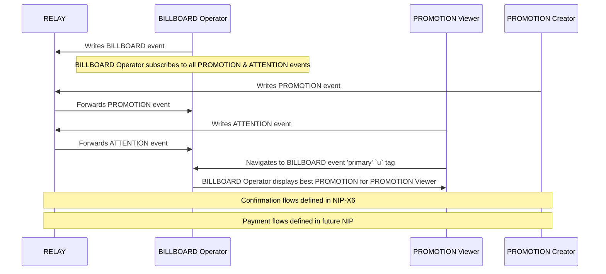

# NIP-X1 - PROMO Protocol - Core
`draft` `mandatory`

## Abstract
NIP-X1 defines the core PROMO Protocol for content promotion on Nostr, establishing standardized event kinds and communication patterns between participants. The protocol establishes a market-driven system connecting PROMOTION Creators who wish to promote content with PROMOTION Viewers who are willing to view it, facilitated by BILLBOARD OPERATORS. This foundation enables a transparent, decentralized alternative to traditional advertising systems while preserving Nostr's core principles of user sovereignty and decentralization.

> For a user-friendly overview of the protocol and its benefits, see the [README.md](./README.md).

## Protocol Components

### NEW EVENT KINDS
- **kind:38088**: BILLBOARD event
- **kind:38188**: PROMOTION event
- **kind:38888**: ATTENTION event

### NEW TAGS
- `b` - pubkey of trusted BILLBOARD Operator
- `sats_per_second` - unit of account for payment calculation per second of viewing time
- `duration` - amount of time BILLBOARD Operator must verify PROMOTION VIEWER viewed PROMOTION
- `max_duration` - maximum allowed viewing duration for a PROMOTION or ATTENTION event in seconds
- `min_duration` - minimum required viewing duration for a PROMOTION or ATTENTION event in seconds
- `interval` - how often the BILLBOARD Operator tries to match PROMOTION Viewers to PROMOTIONS
- `fee` - BILLBOARD Operator service fee expressed as percentage
- `min_fee` - minimum service fee in sats that BILLBOARD Operator will accept regardless of percentage calculation
- `nip` - list of nips the BILLBOARD Operator has implemented to indicate PROMO Protocol compatibility
## Key Components

### Protocol Participants
- **RELAY**: Standard Nostr relay that propagate events between participants
- **PROMOTION Creators**: Nostr identity that publishes PROMOTION events
- **PROMOTION Viewer**: Nostr identity that publishes ATTENTION events
- **BILLBOARD Operator**: Nostr identity that PROMOTION Creators and PROMOTION Viewers signal they trust

> For detailed information about participant roles and responsibilities, see the [README.md](./README.md#who-are-the-main-actors-in-the-promo-protocol).

## Event Specifications

### BILLBOARD Event
```json
{
    "kind": 38088,
    "pubkey": "<BILLBOARD_OPERATOR_pubkey>",
    "tags": [
        ["d", "<BILLBOARD_pubkey>"]
        ["b", "<BILLBOARD_pubkey>"]
        ["max_duration", "<value>", "seconds"],
        ["min_duration", "<value>", "seconds"],
        ["interval", "<value>", "seconds"],
        ["fee", "<value>", "percent"],
        ["min_fee", "<value>", "sats"],
        ["u", "<url>", "primary"],
        ["u", "<url>", "backup"],
        ["nip", "X1"]
    ]
}
```

#### Required Tags
- `interval`: Update frequency in seconds - how often the BILLBOARD updates PROMOTION matching
- `fee`: BILLBOARD commission (percentage) - payment the BILLBOARD takes for services
- `min_fee`: Minimum commission in sats - floor value for BILLBOARD fees regardless of percentage
- `u`: List of BILLBOARD endpoint URLs - service endpoints where PROMOTION Viewers can view PROMOTIONS
- `nip`: List of PROMO Protocol implemented NIP versions - indicates which protocol features are supported

#### Optional Tags
- `max_duration`: Maximum allowed view duration - upper limit on how long PROMOTIONS can be
- `min_duration`: Minimum allowed view duration - lower limit on how long PROMOTIONS must be


### PROMOTION Event
```json
{
    "kind": 38188,
    "pubkey": "<PROMOTION_CREATOR_pubkey>",
    "tags": [
        ["d", "<BILLBOARD_pubkey>"]
        ["e", "<note_id>"],
        ["duration", "<value>", "seconds"],
        ["sats_per_second", "<value>"],
        ["b", "<BILLBOARD_pubkey>", "<relay_url>"]
    ]
}
```

#### Required Tags:
- `e`: ID of note to promote
- `duration`: Required view duration in seconds
- `sats_per_second`: Payment rate in sats per second
- `b`: List of trusted BILLBOARD_OPERATOR_pubkey and relay

### ATTENTION Event
```json
{
    "kind": 38888,
    "pubkey": "<PROMOTION_VIEWER_pubkey>",
    "tags": [
        ["d", "<BILLBOARD_pubkey>"]
        ["max_duration", "<value>", "seconds"],
        ["sats_per_second", "<value>"],
        ["b", "<BILLBOARD_pubkey>", "<relay_url>"]
    ]
}
```

#### Required Tags:
- `sats_per_second`: Payment rate in sats per second
- `b`: List of trusted BILLBOARD_OPERATOR_pubkey and relay

#### Optional Tags:
- `max_duration`: Maximum viewing duration in seconds

## PROMO Protocol Behavior

### PROMOTION Lifecycle
- PROMOTIONS are initiated by PROMOTION Creators
- A PROMOTION remains active until one of:
  1. The PROMOTION CREATOR publishes a kind:5 event referencing the PROMOTION event ID
  2. The BILLBOARD OPERATOR terminates the PROMOTION based on its criteria
- BILLBOARD OPERATORS MUST:
  - Monitor for kind:5 events referencing active PROMOTIONS
  - Remove PROMOTIONS immediately upon detecting valid deletion events

### BILLBOARD Requirements
- MUST validate all duration values against configured limits
- MUST reject PROMOTIONS where PROMOTION sats_per_second < ATTENTION sats_per_second
- MUST attempt BILLBOARD OPERATOR URLs in specified order
- MUST operate on specified relays according to read/write designation
- MUST honor fee structure specified in configuration

### Client Requirements
- MUST publish events to BILLBOARD OPERATOR's write/both relays
- MUST monitor BILLBOARD OPERATOR's read/both relays
- MUST respect BILLBOARD OPERATOR's minimum duration requirements
- MUST include valid BILLBOARD_OPERATOR_pubkey in events

## Flow Diagram


### Trust Model
- Trust is established when PROMOTION Creators and PROMOTION Viewers include a BILLBOARD_OPERATOR_pubkey in their `b` tags
- The decision to trust a BILLBOARD OPERATOR is made independently by each participant
- Each participant is sovereign in choosing which BILLBOARD OPERATORS to trust
- Multiple BILLBOARD OPERATORS can be trusted simultaneously via multiple `b` tags
- No central BILLBOARD authority required

> For information about how trust is established in practice and its benefits, see the [README.md](./README.md#how-is-trust-established).

### Basic Workflow

1. **BILLBOARD**: BILLBOARD OPERATORS `write` BILLBOARD(kind:38088) event(s) to RELAY LIST(kind:10002)
2. **PROMOTION**: PROMOTION CREATOR `write` PROMOTION(kind:38188) event(s) to RELAY LIST(kind:10002)
3. **ATTENTION**: PROMOTION Viewers `write` ATTENTION(kind:38888) event(s) to RELAY LIST(kind:10002)
4. **DISPLAY**: BILLBOARD OPERATOR displays 'best' PROMOTION event to PROMOTION VIEWER

## References
- [NIP-65](https://github.com/nostr-protocol/nips/blob/master/65.md): Relay List Metadata - defines kind:10002
- [NIP-09](https://github.com/nostr-protocol/nips/blob/master/09.md): Event Deletion - defines kind:5
- [NIP-X6](link-when-available): PROMO Protocol Confirmation Flows
- Future NIP: PROMO Protocol Payment Flows (to be defined)

> For a complete overview of the protocol ecosystem and related NIPs, see the [README.md](./README.md#technical-specifications--documentation).