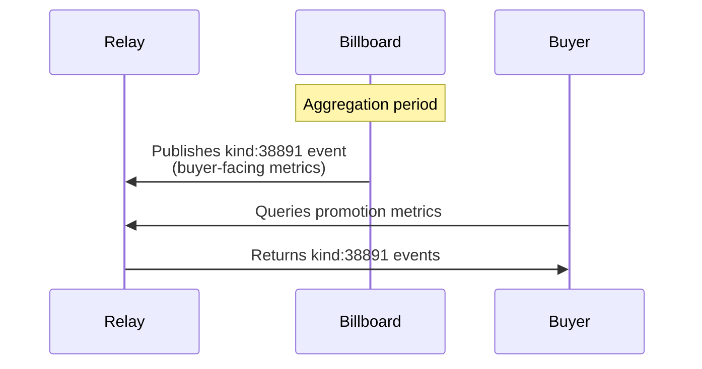

# NIP-XX - BILLBOARD METRICS
`draft mandatory`

## Abstract
NIP-XX defines a standardized event kind and structure for reporting and querying anonymized metrics related to billboard operations in the Promoted Note Network. These metrics enable transparency for promotion buyers while preserving seller privacy.

## Protocol Components

### NEW EVENT KINDS
- **kind:38891**: Billboard buyer-facing anonymous metrics (public)

## Key Components

### Metric Categories
- **Buyer-Facing Aggregates**: Provides anonymized metrics for promotion performance

### Event Schema Implementation
- **kind:38891**: Provides buyer-facing anonymized metrics
  - Public data for promotion performance
  - No seller-identifiable information

## Event Specifications

### Buyer-Facing Metrics Event
Event kind:38891 providing anonymized metrics for buyers

```json
{
    "kind": 38891,
    "pubkey": "<billboard_pubkey>",
    "content": "{JSON metrics object}",
    "created_at": UNIX_TIMESTAMP,
    "tags": [
        ["e", "<buyer_event_id>"],
        ["p", "<buyer_pubkey>"],
        ["period", "<timeframe>", "hourly|daily|total"],
        ["start", "<period_start_timestamp>"],
        ["end", "<period_end_timestamp>"]
    ]
}
```

#### Required Tags
- `e`: Event ID of the buyer's kind:18888 promotion request
- `p`: Pubkey of the buyer who created the promotion
- `period`: Timeframe of the aggregation

#### Optional Tags
- `start`: Start timestamp of the aggregation period
- `end`: End timestamp of the aggregation period

#### Content Format (Example)
```json
{
    "impressions": {
        "total": 42,
        "complete_views": 38,
        "incomplete_views": 4,
        "unique_viewers": 35
    },
    "engagement": {
        "clicks": 12,
        "shares": 3,
        "reactions": 8,
        "replies": 2,
        "zaps": 5,
        "engagement_rate": 0.714
    },
    "performance": {
        "completion_rate": 0.905,
        "avg_view_duration": 25.3,
        "cost_per_impression": 250,
        "cost_per_engagement": 875,
        "total_spent": 10500
    },
    "distribution": {
        "hourly_pattern": [2, 5, 8, 10, 7, 4, 3, 2, 1],
        "geographical": {
            "regions": ["anonymous"]
        }
    }
}
```

## Protocol Behavior

### Authorized Publishers
- ONLY billboard operators (identified by their pubkey) are authorized to publish metric events
- Metric events MUST be signed by the billboard pubkey referenced in the associated kind:18888 events
- Clients and relays SHOULD reject metric events not signed by the appropriate billboard

### Privacy Requirements
- Billboards MUST NOT include seller pubkeys in buyer-facing metrics
- Billboards MUST NOT provide data that could be used to identify individual sellers
- Billboards MUST ensure minimum thresholds (e.g., n≥5) before reporting subgroup metrics
- Aggregated metrics MUST be constructed to prevent de-anonymization through correlation attacks

### Metric Recording and Reporting
- Billboards MUST create kind:38891 events at regular intervals for active promotions
- Aggregate metrics SHOULD be updated at intervals defined by billboard operators
- Metric events MAY be published with expiration policies

### Billboard Requirements
- MUST create accurate metrics that reflect actual promotion performance
- MUST publish anonymized buyer-facing metrics for all active promotions
- MUST respect seller privacy in all metrics reporting
- MAY implement anti-fraud measures to detect invalid activities
- MAY provide additional custom metrics beyond the standard schema

### Client Requirements
- Buyer clients SHOULD subscribe to kind:38891 events for their promotions
- ALL clients MUST respect the privacy boundaries between sellers and buyers

## Metric Query Methods

### For Buyers
Buyers can query anonymized metrics using standard Nostr filters:
- Filter for kind:38891 with specific promotion e-tag
- Filter for kind:38891 with buyer's p-tag

### For Billboards
Billboards should implement database systems to:
- Track all metrics efficiently
- Generate aggregate reports
- Detect anomalous patterns
- Maintain audit trails

## Integration with Basic Protocol
This NIP extends the basic protocol defined in NIP-X1 by adding metric capabilities to the existing roles:

- **Billboard Operators**: Gain ability to record, analyze, and report on promotion performance
- **Buyers**: Gain visibility into promotion effectiveness through anonymized metrics

## Recommended Implementation Practices
Billboard operators should:
1. Track metrics internally using their preferred database structure
2. Implement reasonable retention policies for sensitive metric data
3. Publish aggregated metrics regularly to provide timely feedback
4. Use defensive programming to prevent metric manipulation
5. Establish clear data policies communicated to both buyers and sellers

## Flow Diagram

