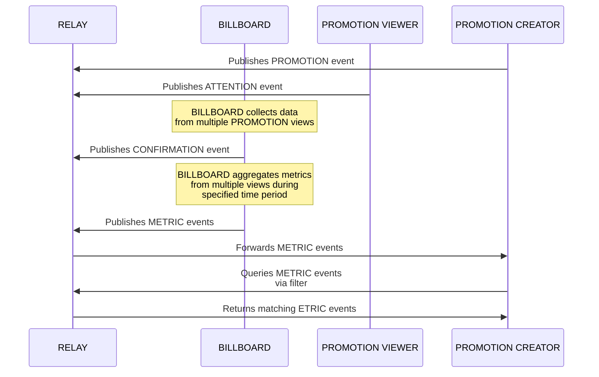

# NIP-X2 - BILLBOARD METRICS
`draft` `optional`

## Abstract
NIP-X2 defines standardized event kinds and structures for reporting and querying anonymized metrics related to BILLBOARD operations on the PROMO Protocol. These metrics provide PROMOTERS with transparency regarding promotion performance while preserving PROMOTION VIEWER privacy through careful anonymization. By establishing consistent reporting standards, this NIP enables data-driven decision making while maintaining the protocol's commitment to privacy and decentralization.

## Protocol Components

### NEW EVENT KINDS
- **kind:38588**: BILLBOARD METRICS - PROMOTER-facing anonymous metrics event

## Key Components

### Metric Categories
- **PROMOTER-Facing Aggregates**: Provides anonymized metrics for PROMOTION performance

### Event Schema Implementation
- **kind:38588**: Provides PROMOTER-facing anonymized metrics
  - Public data for PROMOTION performance
  - No PROMOTION VIEWER-identifiable information

## Event Specifications

### PROMOTER-Facing Metrics Event
Event kind:38588 providing anonymized metrics for PROMOTERS

```json
{
    "kind": 38588,
    "pubkey": "<BILLBOARD_pubkey>",
    "tags": [
        ["e", "<PROMOTER_event_id>"],
        ["p", "<PROMOTER_pubkey>"],
        ["period", "<timeframe>", "hourly|daily|total"],
        ["start", "<period_start_timestamp>"],
        ["end", "<period_end_timestamp>"]
    ]
}
```

#### Required Tags
- `e`: Event ID of the PROMOTER's kind:38188 PROMOTION request - identifies which PROMOTION these metrics apply to
- `p`: Pubkey of the PROMOTER who created the PROMOTION - identifies which PROMOTER these metrics apply to
- `period`: Timeframe of the aggregation (hourly|daily|total) - indicates the time period covered by these metrics

#### Optional Tags
- `start`: Start timestamp of the aggregation period - UNIX timestamp marking when this reporting period began
- `end`: End timestamp of the aggregation period - UNIX timestamp marking when this reporting period ended

#### Content Format (Example)
```json
{
    "impressions": {
        "total": 42,
        "complete_views": 38,
        "incomplete_views": 4,
        "unique_viewers": 35
    },
    "performance": {
        "completion_rate": 0.905,
        "avg_view_duration": 25.3,
        "cost_per_impression": 250,
        "cost_per_engagement": 875,
        "total_spent": 10500
    },
}
```

## Protocol Behavior

### Authorized Publishers
- ONLY BILLBOARD OPERATORS (identified by their pubkey) are authorized to publish metric events
- Metric events MUST be signed by the BILLBOARD pubkey referenced in the associated kind:38188 events
- Clients and relays SHOULD reject metric events not signed by the appropriate BILLBOARD

### Privacy Requirements
- BILLBOARDs MUST NOT include PROMOTION VIEWER pubkeys in PROMOTER-facing metrics
- BILLBOARDs MUST NOT provide data that could be used to identify individual PROMOTION Viewers
- BILLBOARDs MUST ensure minimum thresholds (e.g., n≥5) before reporting subgroup metrics
- Aggregated metrics MUST be constructed to prevent de-anonymization through correlation attacks

### Metric Recording and Reporting
- BILLBOARDs MUST create kind:38588 events at regular intervals for active PROMOTIONS
- Aggregate metrics SHOULD be updated at intervals defined by BILLBOARD OPERATORS
- Metric events MAY be published with expiration policies

### BILLBOARD Requirements
- MUST create accurate metrics that reflect actual PROMOTION performance
- MUST publish anonymized PROMOTER-facing metrics for all active PROMOTIONS
- MUST respect PROMOTION VIEWER privacy in all metrics reporting
- MAY implement anti-fraud measures to detect invalid activities
- MAY provide additional custom metrics beyond the standard schema

### Client Requirements
- PROMOTER clients SHOULD subscribe to kind:38588 events for their PROMOTIONS
- ALL clients MUST respect the privacy boundaries between PROMOTERS and PROMOTION Viewers

## Metric Query Methods

### For PROMOTERS
PROMOTERS can query anonymized metrics using standard Nostr filters:
- Filter for kind:38588 with specific PROMOTION e-tag
- Filter for kind:38588 with PROMOTER's p-tag

### For BILLBOARDs
BILLBOARDs should implement database systems to:
- Track all metrics efficiently
- Generate aggregate reports
- Detect anomalous patterns
- Maintain audit trails

## Integration with Basic Protocol
This NIP extends the basic protocol defined in [NIP-X1](./NIP-X1.md) by adding metric capabilities to the existing roles:

- **BILLBOARD OPERATORS**: Gain ability to record, analyze, and report on PROMOTION performance
- **PROMOTERS**: Gain visibility into PROMOTION effectiveness through anonymized metrics

## Recommended Implementation Practices
BILLBOARD OPERATORS should:
1. Track metrics internally using their preferred database structure
2. Implement reasonable retention policies for sensitive metric data
3. Publish aggregated metrics regularly to provide timely feedback
4. Use defensive programming to prevent metric manipulation
5. Establish clear data policies communicated to both PROMOTERS and PROMOTION Viewers

## Flow Diagram
