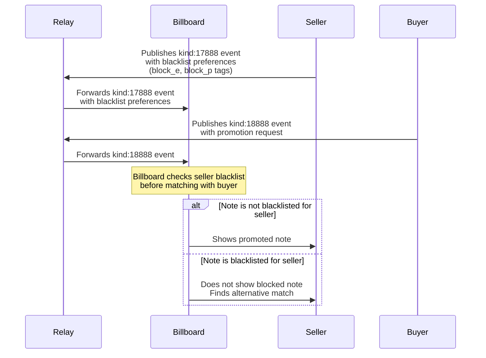

# NIP-X3 - SELLER PREFERENCES
`draft optional`

## Abstract
NIP-X3 defines a standardized mechanism for content viewers (sellers) to express preferences about which promoted notes they do not wish to view. This enhancement allows sellers to blacklist (explicitly block) specific notes or pubkeys, giving them greater control over their viewing experience while maintaining the decentralized nature of the Promoted Note Network.

## Protocol Components

### NEW TAGS FOR KIND:17888
- `block_e` - Blacklist a specific note event ID
- `block_p` - Blacklist a specific pubkey (buyer/creator)

## Key Components

### Preference Types
- **Note-Level Preferences**: Blacklist specific note event IDs
- **Pubkey-Level Preferences**: Blacklist content from specific pubkeys

### Implementation Approach
This NIP extends the existing kind:17888 seller event with additional tags to express content blocking preferences.

## Enhanced Event Specifications

### Seller Event with Preferences
Extended kind:17888 from sellers setting view parameters and blocking preferences

```json
{
    "kind": 17888,
    "pubkey": "<seller_pubkey>",
    "content": "",
    "created_at": UNIX_TIMESTAMP,
    "tags": [
        ["max_duration", "<value>", "seconds"],
        ["sats_per_second", "<value>"],
        ["b", "<billboard_pubkey>", "<relay_url>"],
        ["block_e", "<note_event_id>"],
        ["block_p", "<pubkey>"]
    ]
}
```

#### Existing Required Tags (from NIP-X1)
- `sats_per_second`: Required payment per view
- `b`: Accepted billboard pubkey and relay

#### Existing Optional Tags (from NIP-X1)
- `max_duration`: Maximum viewing duration

#### New Optional Preference Tags
- `block_e`: Event ID of a blacklisted note (can appear multiple times)
- `block_p`: Pubkey of a blacklisted content creator (can appear multiple times)

## Protocol Behavior

### Preference Evaluation Rules
1. **Default Allow**: All notes are implicitly allowed unless explicitly blocked
2. **Most Specific First**: Note-level blacklists take precedence over pubkey-level blacklists
3. **Blacklist Priority**: If a note is blacklisted, it must not be shown regardless of other factors

### Billboard Requirements
- MUST respect all seller blacklist preferences when matching promotions
- MUST NOT show a blacklisted note to a seller under any circumstances
- MUST NOT show notes from blacklisted pubkeys to a seller
- MUST propagate preference changes immediately when new kind:17888 events are detected
- MAY cache seller preferences for performance optimization

### Client Requirements
- SHOULD provide user-friendly interfaces for managing blacklists
- SHOULD allow sellers to easily add notes to blacklist
- SHOULD allow sellers to easily add pubkeys to blacklist
- MAY suggest blacklist entries based on previous seller behavior

## Preference Update Lifecycle
- Sellers can update preferences by publishing new kind:17888 events
- Billboards MUST use the most recent valid kind:17888 event for a seller
- Preference changes take effect as soon as the billboard processes the new event
- Previous preferences are completely replaced by new kind:17888 events

## Example Scenarios

### Scenario 1: Blacklist Specific Notes
A seller who wants to block specific objectionable notes:
```json
{
    "kind": 17888,
    "tags": [
        ["sats_per_second", "5"],
        ["b", "<billboard_pubkey>", "<relay_url>"],
        ["block_e", "<objectionable_note_1>"],
        ["block_e", "<objectionable_note_2>"]
    ]
}
```

### Scenario 2: Blacklist Specific Creators
A seller who doesn't want to see content from certain creators:
```json
{
    "kind": 17888,
    "tags": [
        ["sats_per_second", "7"],
        ["b", "<billboard_pubkey>", "<relay_url>"],
        ["block_p", "<annoying_creator_1>"],
        ["block_p", "<annoying_creator_2>"]
    ]
}
```

### Scenario 3: Mixed Blacklist Preferences
A seller with mixed blacklist preferences:
```json
{
    "kind": 17888,
    "tags": [
        ["sats_per_second", "7"],
        ["b", "<billboard_pubkey>", "<relay_url>"],
        ["block_p", "<annoying_creator>"],
        ["block_e", "<specific_bad_note>"]
    ]
}
```

## Flow Diagram


## Integration with Existing NIPs
This NIP extends NIP-X1 by enhancing the seller event kind:17888 with blacklist capabilities. It remains fully compatible with the metrics framework defined in NIP-X2, as billboard operators will only match allowable promotions based on seller preferences.

## Privacy Considerations
- Seller blacklist preferences are public, as they are published in Nostr events
- Billboards SHOULD NOT reveal detailed blacklist information in metrics reporting
- Aggregated metrics MAY include overall matching rates without identifying specific blacklist patterns
