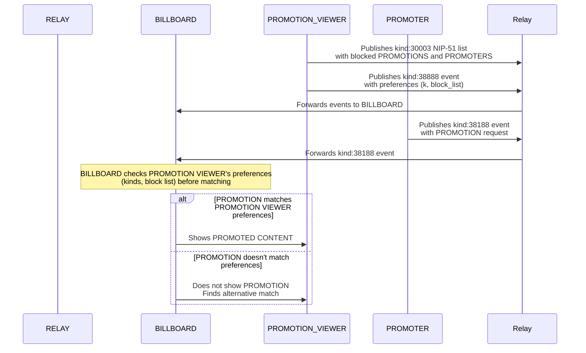

# NIP-X3 - PROMOTION VIEWER BLOCK LIST
`draft` `optional`

## Abstract
NIP-X3 defines a standardized mechanism for PROMOTION Viewers to express preferences about which PROMOTIONS they do not wish to view within the PROMO Protocol. This enhancement allows PROMOTION Viewers to block specific PROMOTIONS via event ID or specific PROMOTERS via their pubkey using an addressable NIP-51 list, giving them greater control over their experience. By implementing content filtering capabilities, this NIP strengthens user sovereignty while maintaining the decentralized nature of the protocol.

## Protocol Components

### NEW TAGS FOR KIND:38888
- `block_list` - Event ID of a NIP-51 list (kind:30003) containing blocked PROMOTIONS and PROMOTERS
- `k` - Specifies event kinds the PROMOTION VIEWER is willing to view as PROMOTED CONTENT

## Key Components

### Preference Types
- **PROMOTION-Level Preferences**: Block specific PROMOTION event IDs using `e` tags in the [NIP-51](https://github.com/nostr-protocol/nips/blob/master/51.md) list
- **PROMOTER-Level Preferences**: Block PROMOTIONS from specific pubkeys using `p` tags in the [NIP-51](https://github.com/nostr-protocol/nips/blob/master/51.md) list
- **Kind Preferences**: Filter by event kinds the PROMOTION VIEWER is willing to view

### Implementation Approach
This NIP extends the existing kind:38888 PROMOTION VIEWER event from [NIP-X1](./NIP-X1.md) with additional tags to express content blocking preferences and content type preferences. The block list is implemented as an addressable [NIP-51](https://github.com/nostr-protocol/nips/blob/master/51.md) list.

## Enhanced Event Specifications

### Blocked PROMOTIONS List (NIP-51)
A parameterized replaceable list of kind:30003 containing blocked PROMOTION event IDs and PROMOTER pubkeys as defined in [NIP-51](https://github.com/nostr-protocol/nips/blob/master/51.md):

```json
{
  "kind": 30003,
  "pubkey": "<PROMOTION_VIEWER_pubkey>",
  "created_at": 1677647210,
  "tags": [
    ["d", "<BILLBOARD_pubkey>"],
    ["e", "<objectionable_promotion_1>"],
    ["e", "<objectionable_promotion_2>"],
    ["e", "<objectionable_promotion_3>"],
    ["p", "<objectionable_promoter_1>"],
    ["p", "<objectionable_promoter_2>"],
    ["t", "<topic>"],
    ["t", "<topic>"],
    ["summary", "PROMO Protocol Block List"]
  ],
  "content": "",
  "id": "<list_event_id>",
  "sig": "<signature>"
}
```

### ATTENTION Event with Preferences
Extended kind:38888 from PROMOTION Viewers setting view parameters and referencing the block list:

```json
{
  "kind": 38888,
  "pubkey": "<PROMOTION_VIEWER_pubkey>",
  "created_at": 1677647250,
  "tags": [
    ["d", "<BILLBOARD_pubkey>"],
    ["sats_per_second", "5"],
    ["b", "<BILLBOARD_pubkey>", "<relay_url>"],
    ["block_list", "<list_event_id>"],
    ["k", "22"],
    ["k", "20"]
  ],
  "content": "",
  "id": "<PROMOTION_VIEWER_preferences_id>",
  "sig": "<signature>"
}
```

#### Existing Required Tags (from NIP-X1)
- `sats_per_second`: Required payment per view - minimum payment the PROMOTION VIEWER will accept
- `b`: Accepted BILLBOARD pubkey and relay - BILLBOARD operators the PROMOTION VIEWER trusts

#### Existing Optional Tags (from NIP-X1)
- `max_duration`: Maximum viewing duration - upper limit on how long the PROMOTION VIEWER will watch

#### New Optional Preference Tags
- `block_list`: Event ID of a NIP-51 list (kind:30003) containing the PROMOTION VIEWER's block list - specifies content the PROMOTION VIEWER refuses to see
- `k`: Event kinds the PROMOTION VIEWER is willing to view as PROMOTED CONTENT - can appear multiple times to specify multiple acceptable content types
  - Example: `["k", "22"]` indicates willingness to view kind:22 short vertical video ([NIP-71](https://github.
  com/nostr-protocol/nips/blob/master/71.md))
  - Example: `["k", "20"]` indicates willingness to view kind:20 picture events ([NIP-68](https://github.com/
  nostr-protocol/nips/blob/master/68.md))

## Protocol Behavior

### Preference Evaluation Rules
1. **Addressable Block List**: Block list is maintained as an addressable NIP-51 list
2. **Default Allow**: All PROMOTIONS are implicitly allowed unless explicitly blocked
3. **Kind Filtering**: Promoted content must be of a kind specified in a `k` tag (if any `k` tags are present)
4. **Most Specific First**: PROMOTION-level block lists take precedence over PROMOTER-level block lists
5. **Block List Priority**: If a PROMOTION is blocked, it must not be shown regardless of other factors

### BILLBOARD Requirements
- MUST fetch and parse the [NIP-51](https://github.com/nostr-protocol/nips/blob/master/51.md) list referenced by `block_list` to determine blocked PROMOTIONS
- MUST respect all PROMOTION VIEWER block list preferences when matching PROMOTIONS
- MUST NOT show a blocked PROMOTION to a PROMOTION VIEWER under any circumstances
- MUST NOT show PROMOTIONS from blocked PROMOTER pubkeys to a PROMOTION VIEWER
- MUST only show PROMOTED CONTENT of kinds specified in `k` tags (if present)
- MUST propagate preference changes immediately when a new block list is detected
- MAY cache PROMOTION VIEWER preferences for performance optimization

### Client Requirements
- SHOULD provide user-friendly interfaces for managing the PROMOTION block list
- SHOULD allow PROMOTION Viewers to easily add PROMOTION event IDs to their block list
- SHOULD allow PROMOTION Viewers to easily add PROMOTER pubkeys to their block list
- SHOULD allow PROMOTION Viewers to specify which kinds of content they wish to see promoted
- SHOULD update the [NIP-51](https://github.com/nostr-protocol/nips/blob/master/51.md) list when block list changes are made
- MAY suggest block list entries based on previous PROMOTION VIEWER behavior

## Preference Update Lifecycle
1. To update preferences, PROMOTION Viewers:
   - Publish a new or updated [NIP-51](https://github.com/nostr-protocol/nips/blob/master/51.md) list (kind:30003) with blocked PROMOTIONS
   - Update their kind:38888 event with the new list ID if needed
2. BILLBOARDs MUST use the most recent valid kind:38888 event for a PROMOTION VIEWER
3. BILLBOARDs MUST use the most recent valid [NIP-51](https://github.com/nostr-protocol/nips/blob/master/51.md) list referenced by the PROMOTION VIEWER
4. Preference changes take effect as soon as the BILLBOARD processes the new events

## Flow Diagram


## Integration with Existing NIPs
This NIP extends [NIP-X1](./NIP-X1.md) by enhancing the PROMOTION VIEWER event kind:38888 with PROMOTION block list and content type preference capabilities. It leverages [NIP-51](https://github.com/nostr-protocol/nips/blob/master/51.md) lists to provide a scalable and maintainable block list. It remains fully compatible with the metrics framework defined in [NIP-X2](./NIP-X2.md), as BILLBOARD OPERATORS will only match allowable PROMOTIONS based on PROMOTION VIEWER preferences.

## Future Extensions
A future NIP may define a mechanism for BILLBOARD-specific block lists, allowing PROMOTION Viewers to maintain different blocking preferences for different BILLBOARDs by using the BILLBOARD pubkey as the `d` tag value.

## Privacy Considerations
- PROMOTION VIEWER PROMOTION block list preferences are public, as they are published in Nostr events
- BILLBOARDs SHOULD NOT reveal detailed block list information in metrics reporting
- Aggregated metrics MAY include overall matching rates without identifying specific block list patterns