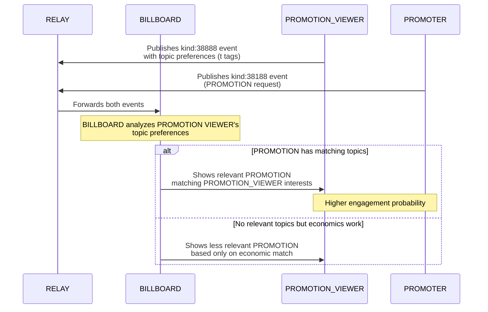

# NIP-X4 - PROMOTION VIEWER PREFERRED TOPICS

`draft` `optional`

## Abstract
NIP-X4 defines a standardized mechanism for PROMOTION VIEWERS to express content interests using the standard Nostr topic tag within the PROMO Protocol. By enhancing the PROMOTION VIEWER event (kind:38888) with topic tags, BILLBOARD OPERATORS can more effectively match relevant PROMOTIONS with interested PROMOTION VIEWERS. This improvement increases content relevance for PROMOTION VIEWERS while enabling higher engagement rates for PROMOTERS, creating a more efficient marketplace based on content preferences rather than economic factors alone.

## Motivation

In the current PROMOTED NOTES system ([NIP-X1](./NIP-X1.md)), PROMOTION VIEWERS have no standardized way to signal content preferences, leading to random or purely economic-based content matching. This NIP introduces content relevance as a matching criterion, enabling:

1. Better PROMOTION VIEWER experience through relevant content
2. Improved engagement rates for PROMOTERS
3. More efficient marketplace operation
4. Enhanced value proposition for all participants

## Implementation

### NEW TAGS FOR KIND:38888
- `t` - Topic tag indicating content categories the PROMOTION VIEWER is interested in (can appear multiple times)

### Topic Tags in PROMOTION VIEWER Events

This NIP extends kind:38888 events to include the standard Nostr topic tag (`t`). No new tags are introduced, maintaining compatibility with existing Nostr conventions.

```json
{
  "kind": 38888,
  "pubkey": "<PROMOTION_VIEWER_pubkey>",
  "tags": [
    ["max_duration", "<value>", "seconds"],
    ["sats_per_second", "<value>"],
    ["b", "<BILLBOARD_pubkey>", "<relay_url>"],
    ["t", "technology"],
    ["t", "bitcoin"],
    ["t", "programming"]
  ]
}
```

### BILLBOARD Matching Behavior

BILLBOARDs implementing this NIP SHOULD:

1. Extract and index topic tags from both promoted notes and PROMOTION VIEWER events
2. Implement case-insensitive topic matching (e.g., "bitcoin" matches "Bitcoin")
3. Prioritize PROMOTIONS with topics matching PROMOTION VIEWER interests when multiple valid matches exist
4. Balance topic relevance with economic factors (bid/ask matching, fees)
5. Continue honoring block list preferences from [NIP-X3](./NIP-X3.md) if implemented

### Integration with NIP-51 Interest Sets

BILLBOARDs MAY additionally consult a PROMOTION VIEWER's Interest sets (kind:30015) defined in NIP-51 for enhanced matching, but MUST primarily rely on topics explicitly included in kind:38888 events as these represent the current active interests in the PROMOTION context.

## Technical Details

### Topic Matching Algorithms

BILLBOARD OPERATORS have implementation flexibility but SHOULD consider:

1. **Exact Matching**: Direct topic-to-topic comparison (recommended baseline)
2. **Hierarchical Matching**: Recognizing topic hierarchies (e.g., "cryptocurrency" is related to "bitcoin")
3. **Semantic Matching**: Limited fuzzy matching of closely related terms

Regardless of the matching algorithm used, BILLBOARDs MUST document their approach.

### Performance Considerations

For efficient implementation:

1. Topics SHOULD be indexed for fast lookup
2. Topic matching SHOULD be pre-computed where possible
3. Caching strategies SHOULD be employed for frequent matches
4. BILLBOARD OPERATORS SHOULD establish reasonable limits on the number of topic tags they process

### Topic Standardization

While this NIP does not mandate a specific topic taxonomy, BILLBOARD OPERATORS are encouraged to:

1. Normalize topics to lowercase during matching
2. Strip special characters and spaces
3. Consider providing suggested topic lists to clients
4. Develop industry conventions around common topics

## Client Implementation Guidance

Client developers SHOULD:

1. Provide intuitive interfaces for adding and removing topic tags
2. Suggest common or trending topics from the broader Nostr ecosystem
3. Allow easy discovery of content categories
4. Automatically suggest topics based on user behavior (optional)
5. Display current topic preferences clearly to users

## Examples

### Basic Topic Preferences

```json
{
  "kind": 38888,
  "tags": [
    ["sats_per_second", "5"],
    ["b", "<BILLBOARD_pubkey>", "<relay_url>"],
    ["t", "bitcoin"],
    ["t", "lightning"]
  ]
}
```

### Combined with Block List Preferences

```json
{
  "kind": 38888,
  "tags": [
    ["sats_per_second", "6"],
    ["b", "<BILLBOARD_pubkey>", "<relay_url>"],
    ["t", "art"],
    ["t", "nft"],
    ["global_block_list", "<block_list_event_id>"]
  ]
}
```

## Flow Diagram


## Benefits and Outcomes

- **For PROMOTION VIEWERS**: More engaging and relevant content viewing experience
- **For PROMOTERS**: Better targeting and higher engagement rates
- **For BILLBOARDs**: Enhanced matching capability and value proposition
- **For Ecosystem**: More efficient marketplace with quality-based incentives

## Compatibility

This NIP is fully compatible with:
- [NIP-X1](./NIP-X1.md) (Basic Protocol)
- [NIP-X2](./NIP-X2.md) (BILLBOARD Metrics)
- [NIP-X3](./NIP-X3.md) (PROMOTION VIEWER Block List)
- [NIP-51](https://github.com/nostr-protocol/nips/blob/master/51.md) (Lists, for complementary Interest sets)

BILLBOARDs that do not implement this NIP will ignore topic tags and continue functioning with basic economic matching as defined in [NIP-X1](./NIP-X1.md).

## References

1. [NIP-X1](./NIP-X1.md): Basic Protocol for Promoted Notes
2. [NIP-X2](./NIP-X2.md): BILLBOARD Metrics
3. [NIP-X3](./NIP-X3.md): PROMOTION VIEWER Block List
4. [NIP-51](https://github.com/nostr-protocol/nips/blob/master/51.md): Lists

## Authors

*[To be completed]*