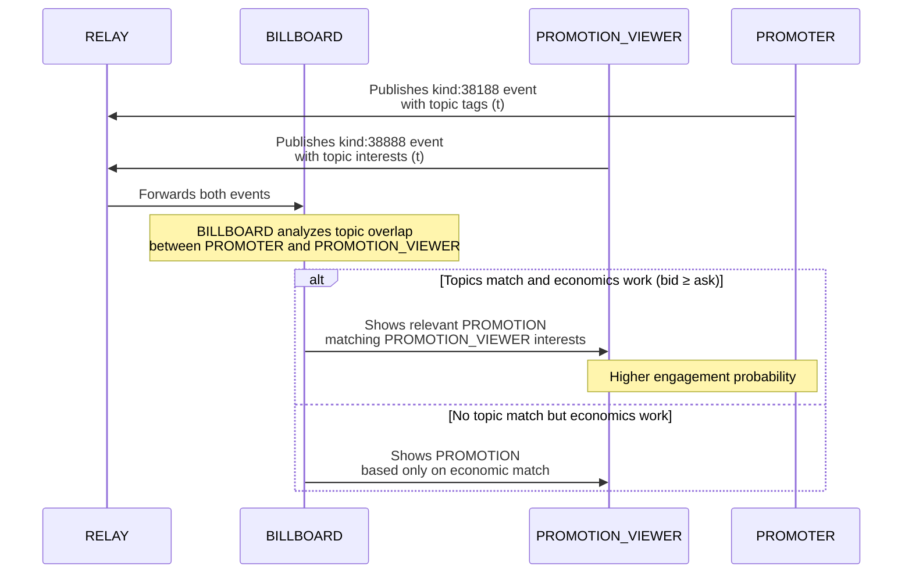

# NIP-X5 - PROMOTION PREFERRED TOPICS

`draft` `optional`

## Abstract
NIP-X5 defines a standardized mechanism for PROMOTERS to specify content topics for their PROMOTIONS using the standard Nostr topic tag within the PROMO Protocol. By enhancing the PROMOTER event (kind:38188) with topic tags, this NIP complements NIP-X4 to create a bidirectional topic matching system between PROMOTERS and PROMOTION Viewers. This enhancement improves content relevance and engagement rates, creating a more efficient marketplace where participants can connect based on shared interests rather than economic considerations alone.

## Motivation

While [NIP-X4](./NIP-X4.md) enables PROMOTION Viewers to express content interests, PROMOTERS currently have no standardized way to categorize their promoted content. This NIP creates a bidirectional topic matching system that:

1. Increases PROMOTION relevance and effectiveness
2. Improves conversion and engagement rates
3. Enables content-based targeting without compromising privacy
4. Creates a more efficient marketplace with better PROMOTER-PROMOTION VIEWER matching

## Implementation

### NEW TAGS FOR KIND:38188
- `t` - Topic tag indicating content categories of the PROMOTION (can appear multiple times)

### Topic Tags in PROMOTER Events

This NIP extends kind:38188 events to include the standard Nostr topic tag (`t`). No new tags are introduced, maintaining compatibility with existing Nostr conventions.

```json
{
  "kind": 38188,
  "pubkey": "<PROMOTER_pubkey>",
  "tags": [
    ["e", "<note_id>"],
    ["duration", "<value>", "seconds"],
    ["sats_per_second", "<value>"],
    ["b", "<BILLBOARD_pubkey>", "<relay_url>"],
    ["t", "bitcoin"],
    ["t", "lightning"],
    ["t", "nostr"]
  ]
}
```

### BILLBOARD Matching Behavior

BILLBOARDs implementing this NIP SHOULD:

1. Extract topic tags from both PROMOTER (kind:38188) and PROMOTION VIEWER (kind:38888) events
2. Prioritize matches where PROMOTER and PROMOTION VIEWER topics overlap
3. Implement case-insensitive topic matching (e.g., "bitcoin" matches "Bitcoin")
4. Consider topic matching as a significant factor in the PROMOTION selection algorithm
5. Continue honoring all economic constraints (bid ≥ ask) as defined in [NIP-X1](./NIP-X1.md)
6. Respect PROMOTION VIEWER block list preferences from [NIP-X3](./NIP-X3.md) if implemented

### Content-Based Matching Algorithm

When both [NIP-X4](./NIP-X4.md) and [NIP-X5](./NIP-X5.md) are implemented, BILLBOARDs SHOULD:

1. First filter PROMOTIONS based on economic criteria (bid ≥ ask)
2. Then prioritize PROMOTIONS with topic overlap between PROMOTER and PROMOTION VIEWER
3. Use the number of matching topics as a weighting factor
4. For PROMOTIONS with equal topic matches, prioritize by economic value

## Technical Details

### Topic Inheritance

BILLBOARDs SHOULD automatically extract topics from the promoted note content when possible, but explicitly tagged topics in the kind:38188 event take precedence. This allows PROMOTERS to specify the most relevant topics even when the note content covers multiple subjects.

### Performance Considerations

To maintain system efficiency:

1. BILLBOARDs SHOULD limit the number of topic tags processed per event (recommended: 10)
2. Topic matching SHOULD be optimized through indexing and caching
3. BILLBOARDs MAY implement topic normalization for improved matching

### Topic Standardization

While this NIP does not mandate a specific topic taxonomy, BILLBOARD OPERATORS are encouraged to:

1. Normalize topics to lowercase during matching
2. Strip special characters and spaces
3. Consider providing suggested topic lists to clients
4. Follow emerging conventions around common topics in the Nostr ecosystem

## Client Implementation Guidance

Client developers SHOULD:

1. Provide intuitive interfaces for PROMOTERS to add topic tags to PROMOTIONS
2. Suggest popular or trending topics
3. Auto-extract potential topics from the note being promoted
4. Allow PROMOTERS to see topic matching statistics in their metrics
5. Educate PROMOTERS on effective topic selection for better targeting

## Examples

### Basic Topic Specification

```json
{
  "kind": 38188,
  "tags": [
    ["e", "<note_id>"],
    ["duration", "30", "seconds"],
    ["sats_per_second", "10"],
    ["b", "<BILLBOARD_pubkey>", "<relay_url>"],
    ["t", "bitcoin"],
    ["t", "technology"]
  ]
}
```

### Technical Article PROMOTION

```json
{
  "kind": 38188,
  "tags": [
    ["e", "<note_id>"],
    ["duration", "45", "seconds"],
    ["sats_per_second", "15"],
    ["b", "<BILLBOARD_pubkey>", "<relay_url>"],
    ["t", "programming"],
    ["t", "nostr"],
    ["t", "development"]
  ]
}
```

## Benefits and Outcomes

- **For PROMOTERS**: Improved targeting and higher engagement rates
- **For PROMOTION Viewers**: More relevant content matching their interests
- **For BILLBOARDs**: Enhanced matching capabilities and value proposition
- **For Ecosystem**: More efficient marketplace with relevance-based incentives

## Integration with Existing NIPs

This NIP complements [NIP-X4](./NIP-X4.md) to create a complete topic-based matching system. Together, they enable:

1. Bidirectional content relevance matching
2. Topic-based marketplace optimization
3. Enhanced user experience for all participants

BILLBOARDs that implement both NIPs can provide significantly improved matching services.

## Compatibility

This NIP is fully compatible with:
- [NIP-X1](./NIP-X1.md) (Basic Protocol for PROMOTED NOTES)
- [NIP-X2](./NIP-X2.md) (BILLBOARD Metrics)
- [NIP-X3](./NIP-X3.md) (PROMOTION VIEWER Block List)
- [NIP-X4](./NIP-X4.md) (PROMOTION VIEWER Preferred Topics)

BILLBOARDs that do not implement this NIP will ignore PROMOTER topic tags and continue functioning with basic economic matching as defined in NIP-X1.

## Flow Diagram


## References

1. [NIP-X1](./NIP-X1.md): Basic Protocol for PROMOTED NOTES
2. [NIP-X2](./NIP-X2.md): BILLBOARD Metrics 
3. [NIP-X3](./NIP-X3.md): PROMOTION VIEWER Block List
4. [NIP-X4](./NIP-X4.md): PROMOTION VIEWER Preferred Topics