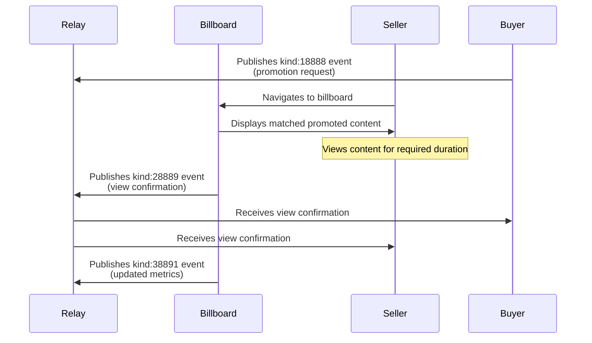

# NIP-X6 - BILLBOARD CONFIRMATION

`draft` `optional`

## Abstract
NIP-X6 defines a standardized event kind and structure for billboards to publish when confirming that a seller has successfully viewed promoted content. These confirmation events serve as the official record of completed promotional views, enabling transparent verification and reliable metrics within the Promoted Notes ecosystem.

## Protocol Components

### NEW EVENT KINDS
- **kind:28889**: Billboard view confirmation event

## Key Components

### View Confirmation Properties
- **Verification Record**: Immutable proof that a specific seller viewed a specific promotion
- **Audit Trail**: Transparent verification path for all marketplace participants
- **Metrics Source**: Primary data source for analytics and reporting

### Event Schema Implementation
- **kind:28889**: Published by billboard when view requirements are met
  - Links buyer promotion, seller, and actual viewing details
  - Provides verification timestamps for calculating viewing duration

## Event Specifications

### View Confirmation Event
Event kind:28889 confirming a successful promotional view

```json
{
    "kind": 28889,
    "pubkey": "<billboard_pubkey>",
    "content": "",
    "created_at": UNIX_TIMESTAMP,
    "tags": [
        ["e", "<buyer_event_id>", "<buyer_relay_url>"],
        ["p", "<buyer_pubkey>"],
        ["p", "<seller_pubkey>"],
        ["started_at", "<timestamp>"],
        ["completed_at", "<timestamp>"]
    ]
}
```

#### Required Tags
- `e`: Event ID of the buyer's kind:18888 promotion request
- `p`: First occurrence is buyer pubkey, second is seller pubkey
- `started_at`: Timestamp when viewing began
- `completed_at`: Timestamp when viewing was completed

## Protocol Behavior

### View Confirmation Lifecycle
1. Seller engages with promoted content on billboard
2. Billboard tracks viewing start and completion timestamps
3. When view requirements are met, billboard publishes kind:28889 confirmation event
4. Buyer, seller, and billboard all retain record of completed view
5. Actual viewing duration can be calculated as (completed_at - started_at)

### Billboard Requirements
- MUST only publish view confirmations for genuinely completed views
- MUST include all required fields with accurate data
- MUST verify that viewing duration (completed_at - started_at) ≥ requested duration from the original promotion
- MUST publish confirmation events promptly after view completion

### Privacy Considerations
- View confirmation events are public and link buyer and seller pubkeys
- Billboards MUST NOT include payment or other sensitive information
- Sellers SHOULD be aware that their viewing activity becomes public

## Integration with Existing NIPs

This NIP extends the existing protocol defined in NIP-X1 by adding the missing verification component:

- **NIP-X1 Integration**: Confirms successful completion of the basic protocol flow
- **NIP-X2 Integration**: Provides source data for the metrics defined in NIP-X2
- **NIP-X3/X4/X5 Integration**: Fully compatible with preference and topic matching NIPs

## Flow Diagram


## Example Implementation

### Basic View Confirmation
```json
{
    "kind": 28889,
    "pubkey": "<billboard_pubkey>",
    "created_at": 1718734510,
    "tags": [
        ["e", "abcdef123456789", "wss://relay.example.com"],
        ["p", "buyer123pubkey"],
        ["p", "seller456pubkey"],
        ["started_at", "1718734470"],
        ["completed_at", "1718734502"]
    ]
}
```

## Client Requirements
- Buyer clients SHOULD track received view confirmations for verification
- Seller clients SHOULD track received view confirmations for activity records
- All clients SHOULD calculate viewing duration as (completed_at - started_at)
- Clients SHOULD verify viewing duration against required duration from original promotion
- All clients SHOULD verify that view confirmation events are properly signed by the billboard
- Clients MAY implement filters to query view confirmations by pubkey or date ranges

## Benefits for Ecosystem
1. Provides transparent verification of promotional views
2. Creates clear audit trails for completed views with minimal data
3. Enables accurate metrics and reporting
4. Establishes trust between buyers, sellers, and billboards
5. Keeps event payload minimal while maintaining all necessary information
