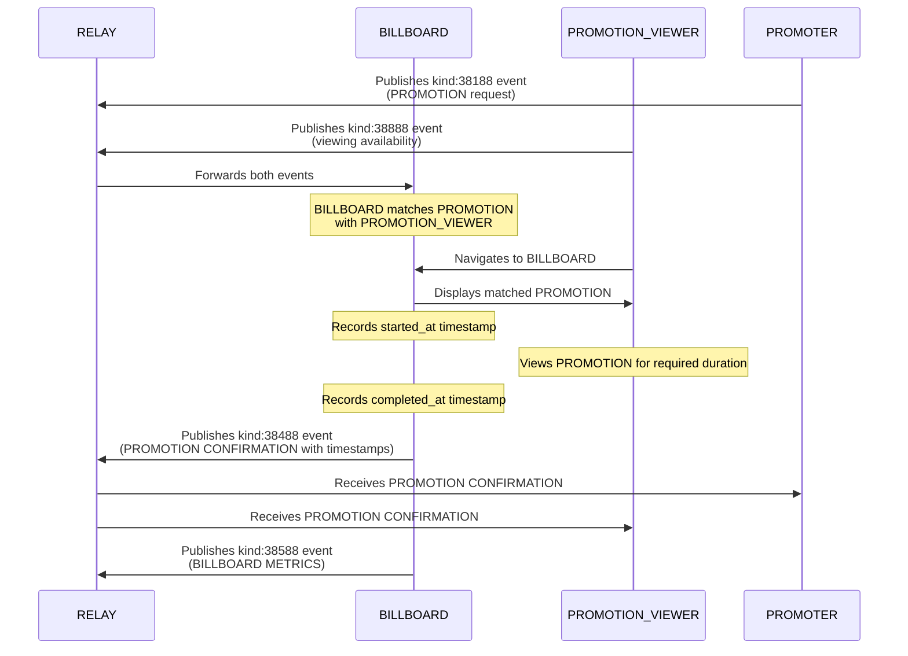

# NIP-X6 - BILLBOARD PROMOTION CONFIRMATION

`draft` `optional`

## Abstract
NIP-X6 defines a standardized event kind and structure for BILLBOARDs to publish when confirming that a PROMOTION VIEWER has successfully viewed promoted content within the PROMO Protocol. These confirmation events serve as the official record of completed promotional views, enabling transparent verification between all marketplace participants. By providing immutable proof of content viewing with precise timestamps, this NIP establishes trust in the protocol's economic model while supporting accurate metrics and reporting capabilities.

## Protocol Components

### NEW EVENT KINDS
- **kind:38488**: BILLBOARD PROMOTION CONFIRMATION event - published when a PROMOTION is successfully viewed

## Key Components

### View Confirmation Properties
- **Verification Record**: Immutable proof that a specific PROMOTION VIEWER viewed a specific PROMOTION
- **Audit Trail**: Transparent verification path for all marketplace participants
- **Metrics Source**: Primary data source for analytics and reporting

### Event Schema Implementation
- **kind:38488**: Published by BILLBOARD when view requirements are met
  - Links buyer PROMOTION, seller, and actual viewing details
  - Provides verification timestamps for calculating viewing duration

## Event Specifications

### View Confirmation Event
Event kind:38488 confirming a successful promotional view

```json
{
    "kind": 38488,
    "pubkey": "<BILLBOARD_pubkey>",
    "tags": [
        ["e", "<PROMOTION_event_id>", "<PROMOTER_relay_url>"],
        ["p", "<PROMOTER_pubkey>"],
        ["p", "<PROMOTION_VIEWER_pubkey>"],
        ["started_at", "<timestamp>"],
        ["completed_at", "<timestamp>"]
    ]
}
```

#### Required Tags
- `e`: Event ID of the PROMOTER's kind:38188 PROMOTION request - identifies which PROMOTION was viewed
- `p`: First occurrence is PROMOTER pubkey, second is PROMOTION VIEWER pubkey - identifies participants in the verified view
- `started_at`: Timestamp when viewing began - UNIX timestamp marking the start of the viewing session
- `completed_at`: Timestamp when viewing was completed - UNIX timestamp marking when viewing requirements were met

## Protocol Behavior

### View Confirmation Lifecycle
1. PROMOTION VIEWER engages with PROMOTION on BILLBOARD
2. BILLBOARD tracks viewing start and completion timestamps
3. When PROMOTION view requirements are met, BILLBOARD publishes kind:38488 PROMOTION CONFIRMATION
4. PROMOTER, PROMOTION VIEWER, and BILLBOARD all retain record of PROMOTION CONFIRMATION
5. Actual viewing duration can be calculated as (completed_at - started_at)

### BILLBOARD Requirements
- MUST only publish PROMOTION CONFIRMATION for genuinely completed views
- MUST include all required fields with accurate data
- MUST verify that viewing duration (completed_at - started_at) ≥ requested duration from the original PROMOTION
- MUST publish PROMOTION CONFIRMATION promptly after view completion

### Privacy Considerations
- PROMOTION CONFIRMATION events are public and link PROMOTER and PROMOTION VIEWER pubkeys
- BILLBOARDs MUST NOT include payment or other sensitive information
- PROMOTION VIEWERS SHOULD be aware that their viewing activity becomes public

## Integration with Existing NIPs

This NIP extends the existing protocol defined in NIP-X1 by adding the missing verification component:

- **NIP-X1 Integration**: Confirms successful completion of the basic protocol flow
- **NIP-X2 Integration**: Provides source data for the metrics defined in NIP-X2
- **NIP-X3/X4/X5 Integration**: Fully compatible with preference and topic matching NIPs

## Flow Diagram


## Example Implementation

### Basic View Confirmation
```json
{
    "kind": 38488,
    "pubkey": "<BILLBOARD_pubkey>",
    "created_at": 1718734510,
    "tags": [
        ["e", "abcdef123456789", "wss://relay.example.com"],
        ["p", "PROMOTER_pubkey"],
        ["p", "PROMOTION_VIEWER_pubkey"],
        ["started_at", "1718734470"],
        ["completed_at", "1718734502"]
    ]
}
```

## Client Requirements
- PROMOTER clients SHOULD track received view confirmations for verification
- PROMOTION VIEWER clients SHOULD track received view confirmations for activity records
- All clients SHOULD calculate viewing duration as (completed_at - started_at)
- Clients SHOULD verify viewing duration against required duration from original PROMOTION
- All clients SHOULD verify that view confirmation events are properly signed by the BILLBOARD
- Clients MAY implement filters to query view confirmations by pubkey or date ranges

## Benefits for Ecosystem
1. Provides transparent verification of promotional views
2. Creates clear audit trails for completed views with minimal data
3. Enables accurate metrics and reporting
4. Establishes trust between PROMOTERS, PROMOTION VIEWERS, and BILLBOARDs
5. Keeps event payload minimal while maintaining all necessary information
