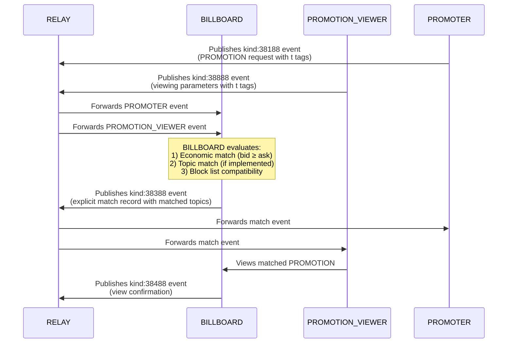

# NIP-X7 - PROMOTION MATCH

`draft` `optional`

## Abstract
NIP-X7 defines a standardized event kind (38388) and structure for BILLBOARDs to publish when creating a match between a PROMOTION and a PROMOTION VIEWER within the [PROMO Protocol](./README.md). These match events represent an intermediate step in the protocol workflow, occurring after initial PROMOTION requests and viewing availability signals, but before actual content viewing and confirmation. By providing an explicit, transparent record of the match decision, including economic terms, content parameters, and optional topic relevance factors, the protocol enhances transparency in the matching process and enables better tracking, analysis, and optimization of the content PROMOTION ecosystem.

## Protocol Components

### NEW EVENT KINDS
- **kind:38388**: PROMOTION MATCH

## Key Components

### Match Event Properties
- **Connection Record**: Links a specific PROMOTION with a specific PROMOTION VIEWER
- **Match Timestamp**: Records when the match was created
- **Match Parameters**: Includes the economic and content parameters of the match
- **Topic Matching**: Optional record of which topics were used for matching
- **Expiration**: Optional expiration time for the match

## Event Specifications

### Match Event
Event kind:38388 creating a match between PROMOTER PROMOTION and PROMOTION VIEWER

```json
{
    "kind": 38388,
    "pubkey": "<BILLBOARD_pubkey>",
    "tags": [
        ["e", "<PROMOTER_event_id>", "<PROMOTER_relay_url>"],
        ["p", "<PROMOTER_pubkey>"],
        ["p", "<PROMOTION_VIEWER_pubkey>"],
        ["sats_per_second", "<value>"],
        ["duration", "<value>", "seconds"],
        ["t", "<matched_topic>"],
        ["t", "<matched_topic>"],
        ["expiration", "<unix_timestamp>"]
    ]
}
```

#### Required Tags
- `e`: Event ID of PROMOTION event
- `p`: First occurrence is PROMOTER pubkey, second is PROMOTION VIEWER pubkey
- `sats_per_second`: Agreed payment rate for the match
- `duration`: Required viewing duration

#### Optional Tags
- `t`: Topic that was used for matching (can appear multiple times)
- `expiration`: Unix timestamp after which this match is no longer valid (as defined in [NIP-40](https://github.com/nostr-protocol/nips/blob/master/40.md))

## Protocol Behavior

### Match Lifecycle
1. BILLBOARD identifies potential PROMOTION VIEWER(s) for a PROMOTION
2. BILLBOARD evaluates economic match (bid ≥ ask)
3. BILLBOARD evaluates topic match (if implemented from [NIP-X4](./NIP-X4.md) and [NIP-X5](./NIP-X5.md))
4. BILLBOARD publishes kind:38388 match event
5. Match remains valid until:
   - PROMOTION VIEWER completes the view (resulting in kind:38488 confirmation)
   - Match expires (if expiration timestamp is reached)
   - BILLBOARD publishes a kind:5 event referencing the match

### BILLBOARD Requirements
- MUST verify economic compatibility before creating match
- MUST respect PROMOTION VIEWER preferences ([NIP-X3](./NIP-X3.md)) if implemented
- SHOULD consider topic relevance ([NIP-X4](./NIP-X4.md)/[NIP-X5](./NIP-X5.md)) if implemented
- SHOULD include `t` tags for matched topics when topic matching was used
- MUST specify a reasonable expiration time if the match is time-limited

### Client Requirements
- PROMOTION VIEWER clients MAY subscribe to kind:38388 events referencing their pubkey
- PROMOTION VIEWER clients MAY display pending matches to users
- Client implementations SHOULD verify match validity before processing
- Client implementations MAY display matched topics to provide transparency

## Integration with Existing NIPs

This NIP complements the existing protocol by adding an explicit matching event:

- **[NIP-X1](./NIP-X1.md) Integration**: Creates explicit record of the match implied in the basic protocol
- **[NIP-X4](./NIP-X4.md)/[NIP-X5](./NIP-X5.md) Integration**: Records which topics were used for matching from PROMOTION VIEWER and PROMOTER preferences
- **[NIP-X6](./NIP-X6.md) Connection**: Precedes the view confirmation events defined in [NIP-X6](./NIP-X6.md)
- **[NIP-40](https://github.com/nostr-protocol/nips/blob/master/40.md) Integration**: Uses the standard expiration tag for time-limited events

## Flow Diagram


## Example Implementation

### Basic Match Event
```json
{
    "kind": 38388,
    "pubkey": "BILLBOARD_pubkey",
    "created_at": 1718734400,
    "tags": [
        ["e", "abcdef123456789", "wss://relay.example.com"],
        ["p", "PROMOTER_pubkey"],
        ["p", "PROMOTION_VIEWER_pubkey"],
        ["sats_per_second", "10"],
        ["duration", "30", "seconds"],
        ["t", "bitcoin"],
        ["t", "nostr"],
        ["expiration", "1718738000"]
    ]
}
```

## Benefits for Ecosystem
1. Creates explicit record of PROMOTER-PROMOTION VIEWER matches
2. Enables better tracking of PROMOTION flow
3. Allows PROMOTION Viewers to see pending match opportunities
4. Provides transparency around topic-based matching
5. Creates foundation for advanced matching algorithms
6. Helps optimize topic selection by recording successful matches

## Compatibility
This NIP is fully compatible with:
- [NIP-X1](./NIP-X1.md) (Basic Protocol for Promoted Notes)
- [NIP-X2](./NIP-X2.md) (BILLBOARD Metrics)
- [NIP-X3](./NIP-X3.md) (PROMOTION VIEWER Preferences)
- [NIP-X4](./NIP-X4.md) (PROMOTION VIEWER Interests)
- [NIP-X5](./NIP-X5.md) (PROMOTER Topic Preferences)
- [NIP-X6](./NIP-X6.md) (BILLBOARD Confirmation)
- [NIP-40](https://github.com/nostr-protocol/nips/blob/master/40.md) (Expiration Timestamp)