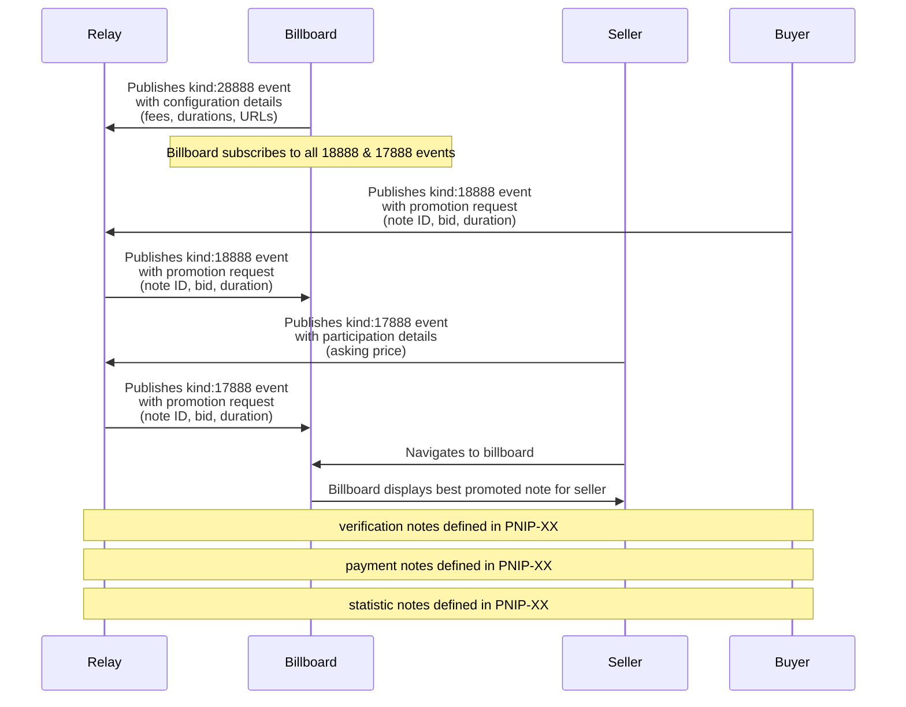

# PNIP-01 - PROMOTED NOTE NETWORK - BASIC PROTOCOL
`draft mandatory`

## Abstract
PNIP-01 defines a decentralized protocol for content promotion on Nostr. The protocol establishes a market-driven system connecting content promoters (buyers), content viewers (sellers), and verification nodes (billboards).

## Protocol Components

### NEW TAGS

- b - the pubkey of a billboard

### Event Kinds
- 28888: Billboard Configuration
- 18888: Buyer Event
- 17888: Seller Event

### Roles
- **Buyer**: An npub publishing promotion requests
- **Seller**: An npub viewing promoted content for payment
- **Billboard**: A verification node managing promotions and payments

### Trust Model
- Buyers specify trusted billboards in promotion requests
- Sellers specify accepted billboards in participation events
- Trust relationships are sovereign and market-driven
- No central billboard authority required

## Event Specifications

### Billboard Configuration
Event kind:28888 defining billboard operating parameters

```json
{
    "kind": 28888,
    "pubkey": "<billboard_pubkey>",
    "content": "{optional: billboard name}",
    "created_at": UNIX_TIMESTAMP,
    "tags": [
        ["max_duration", "<value>", "seconds"],
        ["min_duration", "<value>", "seconds"],
        ["interval", "<value>", "seconds"],
        ["fee", "<value>", "percent"],
        ["min_fee", "<value>", "sats"],
        ["u", "<url>", "primary"],
        ["u", "<url>", "backup"],
        ["r", "<relay_url>", "read"],
        ["r", "<relay_url>", "write"],
        ["r", "<relay_url>", "both"],
        ["pnips", "1", ...]
    ]
}
```

#### Required Tags
- `interval`: Update frequency in seconds
- `fee`: Billboard commission (percent or fixed sats)
- `u`: Billboard endpoint URLs
- `r`: Operating relay URLs
- `pnips`: Implemented PNIP versions

#### Optional Tags
- `max_duration`: Maximum allowed view duration
- `min_duration`: Minimum allowed view duration
- `min_fee`: Minimum commission in sats

### Buyer Event
Event kind:18888 from buyers requesting note promotion

```json
{
    "kind": 18888,
    "pubkey": "<buyer_pubkey>",
    "content": "",
    "created_at": UNIX_TIMESTAMP,
    "tags": [
        ["e", "<note_id>"],
        ["duration", "<value>", "seconds"],
        ["bid", "<value>", "sats"],
        ["b", "<billboard_pubkey>", "<relay_url>"]
    ]
}
```

#### Required Tags
- `e`: ID of note to promote
- `duration`: Required view duration
- `bid`: Payment amount per view
- `b`: Trusted billboard pubkey and relay

### Seller Event
Event kind:17888 from sellers setting view parameters

```json
{
    "kind": 17888,
    "pubkey": "<seller_pubkey>",
    "content": "",
    "created_at": UNIX_TIMESTAMP,
    "tags": [
        ["max_duration", "<value>", "seconds"],
        ["ask", "<value>", "sats"],
        ["b", "<billboard_pubkey>", "<relay_url>"]
    ]
}
```

#### Required Tags
- `ask`: Required payment per view
- `b`: Accepted billboard pubkey and relay

#### Optional Tags
- `max_duration`: Maximum viewing duration

## Protocol Behavior

### Promotion Lifecycle
- Promotions are initiated when buyers publish kind:18888 events
- A promotion remains active until one of:
  1. The buyer publishes a kind:5 event referencing the promotion event ID
  2. The billboard terminates the promotion based on its criteria
- Billboards MUST:
  - Monitor for kind:5 events referencing active promotions
  - Remove promotions immediately upon detecting valid deletion events

### Billboard Requirements
- MUST validate all duration values against configured limits
- MUST reject promotions where bid < ask
- MUST attempt billboard URLs in specified order
- MUST operate on specified relays according to read/write designation
- MUST honor fee structure specified in configuration

### Client Requirements
- SHOULD publish events to billboard's write/both relays
- SHOULD monitor billboard's read/both relays
- MUST respect billboard's minimum duration requirements
- MUST include valid billboard pubkey in events

## Future Specifications
- Verification protocol defined in separate PNIP
- Content moderation defined in separate PNIP
- Payment protocol defined in separate PNIP

## Flow Diagram


## Key Components

### Protocol Participants
- **Relay**: Standard Nostr relay servers that propagate events between participants
- **Buyers**: Nostr pubkeys that publish kind:18888 events to promote specific notes
- **Sellers**: Nostr pubkeys that publish kind:17888 events to signal availability for viewing promoted content
- **Billboards**: Verification nodes that publish kind:28888 events, match buyers with sellers, and validate content viewing

### Event Schema Implementation
- **kind:28888**: Defines billboard operational parameters
  - Fee structure (percentage or fixed amount)
  - Duration constraints (minimum/maximum viewing time)
  - Update interval (frequency of promotion rotation)
  - Service endpoints (primary/backup URLs)
  - Relay preferences (read/write specifications)

- **kind:18888**: Defines buyer promotion parameters
  - Target note ID (event to be promoted)
  - Bid amount (payment offered per view)
  - Duration requirement (viewing time needed)
  - Trusted billboard specification (pubkey and relay)

- **kind:17888**: Defines seller viewing parameters
  - Asking price (payment required per view)
  - Maximum duration (upper limit on viewing time)
  - Accepted billboard specification (pubkey and relay)

### Economic Architecture
- Market-driven pricing mechanism with no central rate setting
- Direct peer-to-peer economic relationship between buyers and sellers
- Billboard fee structure clearly defined in kind:28888 events
- All monetary values denominated in satoshis for consistency
- Billboards only match when bid ≥ ask + billboard_fee

### Trust Framework
- Decentralized trust model with no central authority
- Explicit pubkey-based billboard selection by both buyers and sellers
- Self-sovereign trust relationships maintained by individual participants
- Trust signals propagated through successful transaction history
- Market incentives naturally align with honest operation