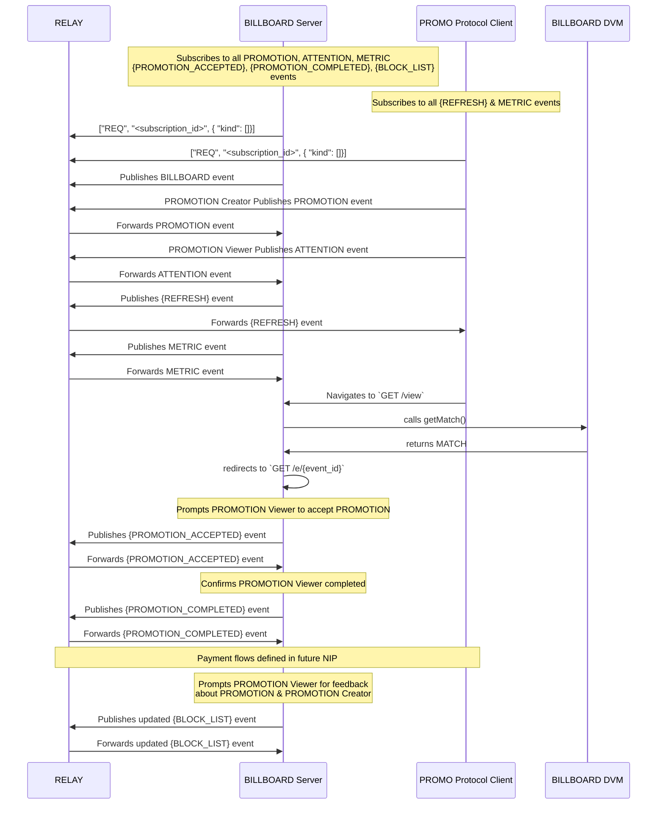

# PROMO Protocol

## Table of Contents
- [What is the PROMO Protocol?](#what-is-the-promo-protocol)
- [Why is this better than centralized advertising?](#why-is-this-better-than-centralized-advertising)
- [Who are the main actors in the PROMO Protocol?](#who-are-the-main-actors-in-the-promo-protocol)
- [How does the complete promotion workflow function?](#how-does-the-complete-promotion-workflow-function)
- [How does it work?](#how-does-it-work)
- [What's the economic model?](#whats-the-economic-model)
- [How is trust established?](#how-is-trust-established)

<!-- User Participation Sections -->
- [How do I participate as a PROMOTION CREATOR?](#how-do-i-participate-as-a-promotion-creator)
- [How do I participate as a PROMOTION VIEWER?](#how-do-i-participate-as-a-promotion-viewer)
- [How do I run a BILLBOARD?](#how-do-i-run-a-billboard)

<!-- Matching Process Sections -->
- [How are PROMOTION Creators and PROMOTION Viewers matched?](#how-are-promotion-creators-and-promotion-viewers-matched)
- [How does topic-based matching work between PROMOTION Creators and PROMOTION Viewers?](#how-does-topic-based-matching-work-between-promotion-creators-and-promotion-viewers)
- [What information is included in a promotion match?](#what-information-is-included-in-a-promotion-match)
- [What happens after a PROMOTION match is created?](#what-happens-after-a-promotion-match-is-created)

<!-- Content & Preferences Sections -->
- [Content Preferences and Filtering](#content-preferences-and-filtering)
- [How do I filter the PROMOTIONS I see?](#how-do-i-filter-the-promotions-i-see)
- [What types of content can I choose to see?](#what-types-of-content-can-i-choose-to-see)
- [How do PROMOTION VIEWER block lists work?](#how-do-promotion-viewer-block-lists-work)

<!-- Technical Operation Sections -->
- [How do PROMOTIONS begin and end?](#how-do-promotions-begin-and-end)
- [How are PROMOTION views verified?](#how-are-promotion-views-verified)
- [How do PROMOTION Creators access and interpret their campaign analytics?](#how-do-promotion-creators-access-and-interpret-their-campaign-analytics)
- [Technical Specifications & Documentation](#technical-specifications--documentation)

<!-- Relay Operation Sections -->
- [How do I choose relays for promotions?](#how-do-i-choose-relays-for-promotions)
- [What are the relay requirements for BILLBOARDs?](#what-are-the-relay-requirements-for-billboards)
- [How is relay availability handled?](#how-is-relay-availability-handled)

## What is the PROMO Protocol?

A decentralized framework enabling paid content promotion within the Nostr ecosystem. By establishing standardized communication methods for promotional content, the protocol creates new economic opportunities while preserving Nostr's core principles of decentralization and privacy.

> For detailed technical specifications, see [NIP-X1](./NIP-X1.md).

### Key Features
- Pay-per-view content promotion system
- Satoshi-based payment infrastructure 
- Market-driven pricing mechanism
- User-controlled content filtering and preferences

## Why is this better than centralized advertising?

The PROMO Protocol offers significant advantages over centralized advertising platforms:

- **Direct Value Exchange**: Users are directly compensated for their attention rather than having their data harvested and monetized by third parties
- **Privacy-Preserving**: No centralized tracking of user behavior or personal data collection
- **User Control**: PROMOTION Viewers have complete control over what types of content they see
- **Transparent Economics**: All economic transactions are visible on the Nostr network, creating fair market dynamics
- **Permissionless Innovation**: Anyone can build clients, BILLBOARDs, or tools on top of the protocol
- **Self-Sovereign Identity**: Users maintain control of their identity through their Nostr keys
- **Censorship Resistance**: No central authority can remove promotions that meet protocol standards

This approach creates a more equitable advertising ecosystem where all participants benefit directly from their contributions, whether creating, viewing, or facilitating promotional content.

## Who are the main actors in the PROMO Protocol?

The PROMO Protocol ecosystem consists of three primary actors, each with distinct roles:

1. **PROMOTION Creators**: Entities seeking to promote content within the Nostr ecosystem
   - Create and fund promotional campaigns
   - Set bid prices they're willing to pay for viewer attention
   - Define target audiences through topic tagging
   - Publish kind:38188 events with promotion requests

2. **PROMOTION Viewers**: Individual Nostr users who opt-in to viewing promotional content
   - Receive satoshis for viewing promotions
   - Set their minimum ask price for viewing content
   - Define content preferences and blocklists
   - Publish kind:38888 events indicating viewing availability

3. **BILLBOARD Operators**: Infrastructure providers that connect PROMOTION Creators with PROMOTION Viewers
   - Match compatible PROMOTION Creators and VIEWERS
   - Verify promotion viewing
   - Facilitate payment transactions
   - Provide analytics and reporting
   - Publish kind:38088 match events and confirmation events

> For detailed event specifications and protocol requirements, see [NIP-X1](./NIP-X1.md#event-specifications).

These actors interact through standardized Nostr events to create a decentralized promotional content marketplace where attention is fairly valued and compensated.

## How does the complete promotion workflow function?

Each step in this workflow is recorded through standardized Nostr events, creating a transparent and auditable promotion ecosystem. The MATCH events serve as the critical link between initial requests and final confirmations, providing clarity on how promotional content is distributed.

## How does it work?

The PROMO Protocol operates through standardized Nostr event kinds that enable communication between the primary actors:

1. **Promotion Creation**: PROMOTION Creators create kind:38188 events containing:
   - The content to be promoted (typically a Nostr note ID)
   - Maximum bid price (in satoshis per second)
   - Minimum viewing duration
   - Topic tags for targeting
   - Campaign parameters (budget, timeframe, etc.)

2. **Viewer Availability**: PROMOTION Viewers publish kind:38888 events with:
   - Minimum ask price (in satoshis per second)
   - Content preferences (topic tags)
   - Kind preferences (types of notes they're willing to see)
   - Block lists (content or promoters they wish to avoid)

> For detailed event schemas and required tags, see [NIP-X1](./NIP-X1.md#event-schema-implementation).

3. **Matching Process**: BILLBOARDs monitor both event kinds and create matches when:
   - A PROMOTION CREATOR's bid meets or exceeds a VIEWER's ask
   - Content preferences align (when applicable)
   - VIEWER's block lists don't exclude the promotion
   - The match is recorded in a kind:38088 event

4. **Content Delivery**: BILLBOARDs present the matched promotion to the VIEWER within their client interface.

5. **Verification**: BILLBOARDs verify the promotion was viewed for the required duration.

6. **Confirmation**: A kind:38088 confirmation event is published, creating a permanent record of the successful view.

7. **Payment**: Satoshis flow from the PROMOTION CREATOR to the VIEWER (and potentially the BILLBOARD as a service fee).

This event-based architecture ensures all interactions are transparent, verifiable, and occur without requiring trust between participants.

## What's the economic model?

The PROMO Protocol implements a market-driven economic model with direct value exchange:

### Core Economic Principles

- **Bidirectional Price Setting**: PROMOTION Creators set maximum bids, VIEWERS set minimum asks
- **Pay-Per-Second**: Compensation is calculated based on actual viewing time
- **Market Price Discovery**: Natural equilibrium emerges based on supply and demand
- **Service Fees**: BILLBOARDs may charge fees for facilitating matches and verifying views
- **Micropayments**: Satoshi-based payments enable economical small-value transactions

### Economic Flows

1. **PROMOTION CREATOR Deposits**: PROMOTION Creators fund campaigns with satoshis allocated for promotion
2. **View Compensation**: VIEWERS earn satoshis for each verified view
3. **BILLBOARD Revenue**: Service providers earn fees from successful matches
4. **Payment Channels**: Lightning Network or other payment technologies enable efficient transactions

### Price Factors

- **Content Quality**: High-quality promotions likely command more engagement
- **Audience Specificity**: Targeted audiences with specific interests may command premium rates
- **Time Sensitivity**: Urgent promotions may set higher bids to ensure distribution
- **Market Competition**: Standard supply and demand dynamics influence pricing

This economic model creates a self-regulating marketplace that properly values attention without requiring centralized intermediaries.

## How is trust established?

Trust in the PROMO Protocol is established through:

### Cryptographic Verification

- **Digital Signatures**: All events are cryptographically signed using Nostr keys
- **Immutable Records**: Published events create a permanent public record of all transactions
- **Verification Events**: Kind:38488 events provide proof of completed views

### Transparent Operation

- **Open Protocol**: All protocol operations are transparent and auditable
- **Public Events**: Promotion requests, matches, and confirmations are publicly visible
- **Verifiable Payments**: Payment flows can be cryptographically verified

### Reputation Systems

- **Historical Performance**: Actors build reputation through consistent honest behavior
- **Public Profiles**: PROMOTION Creators and BILLBOARDs can be identified by their public keys
- **Community Feedback**: The Nostr ecosystem provides natural feedback mechanisms

### Economic Incentives

- **Aligned Interests**: All participants benefit from honest operation
- **Service Competition**: Multiple BILLBOARDs compete on reliability and fairness
- **Instant Payments**: Real-time compensation reduces counterparty risk

By combining cryptographic verification with economic incentives and transparent operation, the PROMO Protocol minimizes the need for trust between parties.

## How do I participate as a PROMOTION CREATOR?

To participate as a PROMOTION CREATOR in the PROMO Protocol:

### Getting Started

1. **Set Up a Nostr Identity**: Create or use an existing Nostr keypair
2. **Choose a PROMOTION CREATOR Client**: Use a client application that supports the PROMO Protocol
3. **Fund Your Account**: Add satoshis to your client's wallet for promotion funding

### Creating Promotions

1. **Select Content**: Choose the Nostr note or content you want to promote
2. **Define Parameters**:
   - Set your maximum bid (satoshis per second)
   - Specify minimum viewing duration
   - Set campaign budget and timeframe
   - Add relevant topic tags to reach your target audience

3. **Publish the Promotion**: Your client will create and publish a kind:38188 event

### Managing Campaigns

1. **Monitor Performance**: Track how many VIEWERS are seeing your promotion
2. **Adjust Parameters**: Modify your bid or targeting as needed
3. **View Analytics**: Analyze which audiences engage best with your content
4. **Manage Budget**: Add funds or adjust spending rates as necessary

### Best Practices

- Start with a competitive bid to establish visibility
- Use specific topic tags to reach relevant audiences
- Create engaging content worth promoting
- Analyze performance data to optimize future promotions
- Build a reputation as a quality promoter

By following these steps, you can effectively promote your content to interested audiences while maintaining full control over your promotional strategy.

## How do I participate as a PROMOTION VIEWER?

To participate as a PROMOTION VIEWER and earn satoshis:

### Getting Started

1. **Set Up a Nostr Identity**: Create or use an existing Nostr keypair
2. **Choose a Compatible Client**: Use a client application that supports viewing PROMO Protocol content
3. **Configure a Lightning Wallet**: Connect a Lightning wallet to receive payments

### Setting Your Preferences

1. **Set Your Ask Price**: Determine minimum satoshis per second you'll accept
2. **Define Content Preferences**:
   - Select topics you're interested in seeing
   - Set which kinds of notes you're willing to view
   - Create block lists for content you don't want to see

3. **Publish Availability**: Your client will create and publish a kind:38888 event

### Viewing Promotions

1. **Receive Matches**: BILLBOARDs will match you with compatible promotions
2. **View Content**: Promotions will appear in your client interface
3. **Earn Satoshis**: Get paid for each verified view
4. **Manage Earnings**: Transfer satoshis to your preferred wallet

### Best Practices

- Set a reasonable ask price to maximize earning opportunities
- Update your topic interests to match what you genuinely want to see
- Use reputable clients with good BILLBOARD connections
- Provide genuine attention to maintain ecosystem health
- Adjust preferences based on the quality of promotions you receive

By participating as a PROMOTION VIEWER, you monetize your attention directly while maintaining control over what content you see.

## How do I run a BILLBOARD?

Running a BILLBOARD is a technical undertaking that enables you to facilitate the PROMO Protocol marketplace:

### Technical Requirements

1. **Nostr Relay Infrastructure**: Ability to monitor and publish Nostr events
2. **Payment Processing**: Lightning Network node or other payment channel capability
3. **Matching Algorithm**: Software to match PROMOTION Creators and VIEWERS based on protocol rules
4. **Verification System**: Mechanisms to verify promotion viewing time
5. **Analytics Platform**: Tools to provide insights to PROMOTION Creators and VIEWERS

> For detailed BILLBOARD requirements and protocol behavior, see [NIP-X1](./NIP-X1.md#billboard-requirements).

### Implementation Steps

1. **Set Up Infrastructure**:
   - Deploy Nostr relay listeners for BILLBOARD, PROMOTION an ATTENTION events
   - Implement a matching engine based on protocol specifications
   - Configure payment channels for satoshi transfers
   - Create verification mechanisms for viewing confirmation

2. **Establish Policies**:
   - Define fee structure for your BILLBOARD services
   - Establish content guidelines and moderation policies
   - Implement topic matching algorithms
   - Set up fraud prevention mechanisms

3. **Launch Operations**:
   - Begin identifying and matching compatible promotions and viewers
   - Publish MATCH events
   - Verify views and publish CONFIRMATION events
   - Process payments between parties

### Monetization Options

- Percentage fee on successful matches
- Flat fee per match or confirmation
- Premium services for enhanced analytics or targeting
- Value-added services for PROMOTION Creators or VIEWERS

### Best Practices

- Prioritize accurate verification to build trust
- Implement fair matching algorithms
- Provide transparent analytics to all parties
- Maintain competitive fee structures
- Continuously improve topic matching relevance

Running a BILLBOARD requires technical expertise but offers opportunities to earn fees while facilitating the decentralized promotion ecosystem.

## How are PROMOTION Creators and PROMOTION Viewers matched?

The PROMO Protocol includes an explicit matching process where BILLBOARDs create standardized match events (kind:38088) to transparently record when a PROMOTION CREATOR's promotion is matched with a PROMOTION VIEWER:

- **Match Events**: BILLBOARDs publish kind:38088 events that create a transparent record of matching decisions
- **Economic Compatibility**: BILLBOARDs verify that the PROMOTION CREATOR's bid meets or exceeds the PROMOTION VIEWER's ask
- **Topic Relevance**: When supported, BILLBOARDs consider topic overlap between PROMOTION Creators and PROMOTION Viewers
- **Content Preferences**: BILLBOARDs respect PROMOTION VIEWER kind preferences and block lists
- **Explicit Record**: Match events provide a transparent audit trail of how promotions are distributed

This matching step occurs after promotion requests and viewing availability signals, but before actual content viewing and confirmation, creating an explicit record of the matching decision.

## How does topic-based matching work between PROMOTION Creators and PROMOTION Viewers?

The PROMO Protocol includes a bidirectional topic matching system that connects PROMOTION Creators and PROMOTION Viewers based on shared interests:

- **Topic Tags**: Both PROMOTION Creators and PROMOTION Viewers can specify content topics using standard Nostr `t` tags
- **PROMOTION VIEWER Topics**: In ATTENTION events, PROMOTION Viewers include topics they're interested in seeing
- **PROMOTION CREATOR Topics**: In PROMOTION events, PROMOTION Creators specify topics relevant to their promoted content
- **Bidirectional Matching**: BILLBOARDs prioritize matches where PROMOTION CREATOR and PROMOTION VIEWER topics overlap
- **Matching Algorithm**: BILLBOARDs first filter by economic criteria (bid ≥ ask), then prioritize by topic overlap
- **Topic Weighting**: Matches with more overlapping topics receive higher priority
- **Default Behavior**: BILLBOARDs can still match based purely on economics when no topic overlap exists

### Benefits:
- PROMOTION Viewers see more relevant content aligned with their interests
- PROMOTION Creators achieve higher engagement rates by reaching interested audiences
- The marketplace becomes more efficient with content relevance as a matching factor
- Quality-based incentives improve the overall ecosystem

### Example:
1. A PROMOTION VIEWER indicates interest in `["t", "bitcoin"]` and `["t", "lightning"]`
2. A PROMOTION CREATOR tags their content with `["t", "bitcoin"]` and `["t", "nostr"]`
3. The BILLBOARD identifies "bitcoin" as a matching topic and prioritizes this match over others
4. The PROMOTION VIEWER receives relevant content about bitcoin
5. The PROMOTION CREATOR achieves higher engagement by reaching an interested viewer

All topic matching is case-insensitive and BILLBOARDs may implement additional algorithms like semantic matching or topic hierarchies to further improve relevance.

## What information is included in a promotion match?

Match events (kind:38088) contain key information about the promotion arrangement:

- **Connection Record**: Links the specific PROMOTION with a specific PROMOTION VIEWER
- **Economic Parameters**: The agreed sats_per_second rate and required viewing duration
- **Topic Information**: Which topics were used for matching (when applicable)
- **Expiration**: Optional timestamp after which the match is no longer valid
- **Timestamps**: When the match was created

This comprehensive record provides transparency to all marketplace participants about the terms under which content is being promoted, enabling better tracking, analysis, and optimization of the content promotion ecosystem.

## What happens after a PROMOTION match is created?

After a match is created, several possible outcomes can occur:

- **Content Viewing**: The PROMOTION VIEWER sees the promoted content for the required duration, resulting in a successful view
- **View Confirmation**: The BILLBOARD publishes a kind:38088 confirmation event after successful viewing
- **Expiration**: If the match has an expiration time and the PROMOTION VIEWER does not view the content before that time, the match becomes invalid
- **Cancellation**: The BILLBOARD can publish a kind:5 event to explicitly cancel a match if necessary

Match events remain valid until one of these terminal states is reached. This well-defined lifecycle ensures that all participants have clear expectations about the status of promotions and viewing opportunities.

## Content Preferences and Filtering

The PROMO Protocol empowers PROMOTION Viewers with comprehensive content filtering capabilities:

### Content Control Mechanisms

- **Topic-Based Filtering**: Select specific topics of interest
- **Kind Filtering**: Choose which types of Nostr notes to view
- **Block Lists**: Exclude specific content, PROMOTION Creators, or categories
- **Minimum Bid Thresholds**: Set economic minimums for your attention
- **Content Rating Filters**: Filter based on content maturity ratings

### Implementation Approach

Content preferences are primarily expressed through kind:38888 events, where PROMOTION Viewers specify their requirements using standardized tags:

- Topic preferences use `["t", "topic"]` tags
- Block lists use `["b", "pubkey"]` or `["b", "word"]` tags
- Kind preferences use `["k", "kind"]` tags
- Minimum ask uses the `{"min_sat_per_second": X}` field

These preferences are honored by BILLBOARDs when creating matches, ensuring VIEWERS only see content aligned with their stated preferences.

### Benefits of Preference Control

- Personalized promotion experience
- Reduced exposure to unwanted content
- Higher-quality matches between PROMOTION Creators and VIEWERS
- Better economic outcomes for all participants
- Enhanced overall ecosystem satisfaction

This preference-based system ensures that attention is directed to relevant content, improving the effectiveness of promotions while respecting viewer autonomy.

## How do I filter the PROMOTIONS I see?

As a PROMOTION VIEWER, you have multiple filtering options to control the promotional content you see:

### Setting Topic Preferences

1. **Select Interests**: Choose specific topics you want to see promotions about
   - In your client, add topics using the `["t", "topic"]` tag format
   - The more specific your topics, the more relevant your promotions
   - BILLBOARDs will prioritize promotions matching your stated interests

2. **Update Regularly**: Adjust your interests as they evolve over time

### Using Block Lists

1. **Block by Pubkey**: Exclude specific PROMOTION Creators you don't wish to see
   - Block using `["b", "pubkey"]` tags
   - Some clients may offer a simple "block" button

2. **Block by Content**: Filter out specific words or phrases
   - Block using `["b", "word"]` tags
   - Some clients may offer content category blocking

### Economic Filtering

1. **Set Minimum Ask**: Require higher compensation for your attention
   - Increase your `min_sat_per_second` value
   - This naturally filters out lower-value promotions

2. **Time-Based Filters**: Set maximum viewing duration requirements

### Implementation in Clients

Most client applications will provide user-friendly interfaces for:
- Selecting topics of interest
- Managing block lists
- Setting economic parameters
- Reviewing and adjusting filter settings

By actively managing these preferences, you maintain control over your promotional content experience while still earning satoshis for your attention.

## What types of content can I choose to see?

The PROMO Protocol allows PROMOTION Viewers to specify exactly what types of content they're willing to view:

### Content Type Filtering

1. **Nostr Kind Filtering**: Choose which event kinds you're willing to see
   - Kind 1: Standard notes/posts
   - Kind 30023: Long-form content
   - Other kinds as they become promotable
   - Specify using `["k", "kind"]` tags in your preferences

2. **Media Type Preferences**:
   - Text-only content
   - Image content
   - Video content
   - Audio content
   - Specify using media-specific tags

3. **Content Category Preferences**:
   - Commercial promotions
   - Educational content
   - Entertainment
   - News/information
   - Specify using category tags

### Content Maturity Filtering

1. **Maturity Ratings**: Filter based on content appropriateness
   - Family-friendly
   - General audience
   - Mature audiences
   - Specify using rating tags

2. **Sensitive Content**: Opt in or out of potentially sensitive topics
   - Political content
   - Financial products
   - Adult themes
   - Specify using content sensitivity tags

### Language Preferences

- Filter promotions by language
- Specify preferred languages using language tags
- Exclude languages you don't understand

The PROMO Protocol's flexible tagging system allows PROMOTION Viewers to create highly specific content preferences, ensuring they only see promotions that align with their interests and comfort levels.

## How do PROMOTION VIEWER block lists work?

Block lists give PROMOTION Viewers precise control over what content they never want to see. These are implemented through NIP-51 lists (kind:30003) referenced in ATTENTION events:

### Block List Types

1. **PROMOTION-Level Blocks**:
   - Block specific PROMOTION event IDs
   - Implemented using `["e", "<objectionable_promotion>"]` tags in NIP-51 list
   - Once blocked, that specific promotion will never be shown

2. **PROMOTER-Level Blocks**:
   - Block all content from specific PROMOTERS by their pubkeys
   - Implemented using `["p", "<objectionable_promoter>"]` tags in NIP-51 list
   - Prevents seeing any promotions from blocked PROMOTERS

### Implementation

1. **Block List Creation**:
   - PROMOTION Viewers create a kind:30003 NIP-51 list
   - List uses `["d", "<BILLBOARD_pubkey>"]` as identifier
   - Can contain multiple `e` and `p` tags for different blocks

2. **Block List Reference**:
   - ATTENTION events (kind:38888) reference the block list
   - Uses `block_list` tag with block list event ID
   - BILLBOARDs fetch and honor referenced block lists

### Block List Behavior

1. **Default Allow**:
   - All PROMOTIONS are implicitly allowed unless explicitly blocked
   - Block list acts as an exclusion mechanism

2. **Priority Rules**:
   - PROMOTION-level blocks take precedence
   - PROMOTER-level blocks apply to all their PROMOTIONS
   - BILLBOARDs MUST NOT show blocked content under any circumstances

### Privacy Considerations

- Block lists are public Nostr events
- Consider using separate identities for different content preferences
- Block list changes are immediately effective
- BILLBOARDs MUST NOT reveal block list details in metrics

### Client Support

- Most clients provide user-friendly block interfaces
- Clients SHOULD make blocking actions simple
- Some clients support block list import/export
- Clients MAY suggest blocks based on user behavior

Block lists are essential for ensuring PROMOTION Viewers maintain control over their content experience while participating in the promotional ecosystem.

## How do PROMOTIONS begin and end?

PROMOTIONS in the PROMO Protocol have well-defined lifecycle stages:

### Promotion Creation and Activation

1. **Promotion Definition**:
   - PROMOTION CREATOR creates a kind:38188 event
   - Includes content to promote, bid price, and parameters
   - Signed with the PROMOTION CREATOR's private key

2. **Activation Requirements**:
   - Valid signature verification
   - Sufficient funds available for promotion
   - Compliant with protocol standards
   - Publication to sufficient relays

3. **Active Status**:
   - Promotion becomes eligible for matching
   - BILLBOARDs begin considering it for VIEWERS
   - Appears in the active promotion pool

### Promotion Conclusion

Promotions can end through several mechanisms:

1. **Natural Completion**:
   - Budget exhaustion (all allocated satoshis spent)
   - Time-based expiration (if specified in event)
   - View count reached (if maximum views specified)

2. **Manual Termination**:
   - PROMOTION CREATOR publishes a kind:5 event referencing the promotion
   - Explicitly ends the promotion before natural completion
   - Remaining budget is returned or held based on client policy

3. **Forced Termination**:
   - Protocol violations detected
   - Payment failures
   - BILLBOARD policy enforcement

### State Transitions

1. **Created**: Initial publication but not yet active
2. **Active**: Available for matching with VIEWERS
3. **Paused**: Temporarily unavailable (if supported)
4. **Completed**: Naturally ended based on parameters
5. **Terminated**: Explicitly ended through kind:5 event

### Handling Promotion Endings

- BILLBOARDs stop creating matches for ended promotions
- Active matches may still be honored depending on BILLBOARD policy
- Analytics remain available for completed promotions
- Some clients support promotion renewal or duplication

This well-defined lifecycle ensures predictable behavior for all parties while allowing flexibility in how promotions are managed.

## How are PROMOTION views verified?

The PROMO Protocol implements several mechanisms to verify genuine promotion viewing:

### Verification Methods

1. **Time-Based Verification**:
   - Measures actual viewing duration
   - Compares against required minimum viewing time
   - Accounts for active window/tab status
   - Tracks user engagement signals

2. **Engagement Verification**:
   - Some BILLBOARDs monitor scrolling, mouse movement, or other indicators
   - Ensures genuine human attention rather than automated viewing
   - Balances privacy with verification needs

3. **Client-Side Attestation**:
   - Client software confirms content was rendered
   - Reports viewing completion to BILLBOARD
   - May include cryptographic proofs of viewing

4. **Consensus Verification**:
   - Multiple verification methods combined
   - Reduces reliance on any single verification approach
   - Improves resistance to verification fraud

### Verification Process

1. **Display Initiation**: Promotion is shown to the VIEWER
2. **Viewing Time Tracking**: BILLBOARD monitors viewing duration
3. **Engagement Monitoring**: Optional tracking of interaction signals
4. **Threshold Confirmation**: Verification when required time is reached
5. **Confirmation Publication**: kind:38088 event published

### Fraud Prevention

- Viewing patterns analysis to detect automated viewing
- Rate limiting to prevent excessive earnings from single viewers
- Reputation-based systems for clients and viewers
- Cryptographic attestation where appropriate

### Privacy Considerations

- Minimal data collection for verification purposes
- Transparency about verification methods used
- No persistent tracking across sessions

This balanced approach ensures that PROMOTION Creators receive genuine attention for their satoshis while respecting VIEWER privacy and creating a sustainable ecosystem.

## How do PROMOTION Creators access and interpret their campaign analytics?

PROMOTION Creators gain access to comprehensive analytics to measure and optimize their promotional campaigns:

### Available Analytics

1. **Performance Metrics**:
   - Views completed (with verification)
   - View completion rate
   - Average viewing time
   - Engagement indicators (when available)
   - Cost per view

2. **Audience Insights**:
   - Topic overlap success rates
   - Viewer preference patterns
   - Geographic distribution (if shared by viewers)
   - Time-of-day performance

3. **Economic Analytics**:
   - Satoshis spent per time period
   - Average cost per view
   - Budget utilization rate
   - ROI indicators (when conversion tracking is implemented)

4. **Comparative Analytics**:
   - Performance against similar promotions
   - Historical campaign comparisons
   - Market benchmark data (when available)

### Accessing Analytics

1. **Client Dashboards**: Most PROMOTION CREATOR clients provide built-in analytics interfaces
2. **Data Export**: Options to export raw data for external analysis
3. **API Access**: Some platforms offer API access to analytics data
4. **Real-Time Monitoring**: Live view of current campaign performance

### Interpreting Results

1. **Key Performance Indicators**:
   - View completion rates above market average indicate engaging content
   - High topic match rates suggest effective targeting
   - Consistent viewing time indicates content relevance
   - Cost per view trends show market dynamics

2. **Optimization Insights**:
   - Topic targeting effectiveness
   - Bid price optimization opportunities
   - Content engagement patterns
   - Viewing time distribution

3. **Strategic Applications**:
   - A/B testing different promotions
   - Budget allocation optimization
   - Target audience refinement
   - Bid strategy adjustments

This comprehensive analytics ecosystem enables PROMOTION Creators to continuously improve their promotion strategy while maximizing the value received for their satoshis.

## Technical Specifications & Documentation

### NIP List
- [NIP-X1](./NIP-X1.md): PROMO Protocol - Core protocol specifications and event definitions
- [NIP-X2](./NIP-X2.md): BILLBOARD METRICS
- [NIP-X3](./NIP-X3.md): PROMOTION VIEWER BLOCK LIST
- [NIP-X4](./NIP-X4.md): PROMOTION VIEWER PREFERRED TOPICS
- [NIP-X5](./NIP-X5.md): PROMOTION PREFERRED TOPICS
- [NIP-X6](./NIP-X6.md): BILLBOARD PROMOTION CONFIRMATION
- [NIP-X7](./NIP-X7.md): PROMOTION MATCH

> For a complete technical overview of the protocol, including event schemas, requirements, and behavior, refer to [NIP-X1](./NIP-X1.md).

## How do I choose relays for promotions?

When selecting relays for PROMO Protocol participation, consider:

### Selection Criteria

1. **BILLBOARD Support**:
   - Choose relays that your trusted BILLBOARDs are monitoring
   - Verify relay URLs listed in BILLBOARD kind:38088 events
   - Prioritize relays with consistent uptime and performance

2. **Protocol Compatibility**:
   - Ensure relays support all required event kinds (38088, 38188, 38888)
   - Check for any relay-specific event or content restrictions
   - Verify support for required NIP implementations

3. **Geographic Distribution**:
   - Use geographically distributed relays for better availability
   - Consider latency requirements for real-time interactions
   - Balance between local and global relay coverage

### Best Practices

- Maintain connections to multiple relays for redundancy
- Monitor relay performance and availability
- Update relay lists based on BILLBOARD recommendations
- Share relay experiences with the community

## What are the relay requirements for BILLBOARDs?

BILLBOARDs have specific relay requirements to ensure reliable protocol operation:

### Operational Requirements

1. **Event Handling**:
   - Must support all PROMO Protocol event kinds
   - Must handle high-frequency event publishing
   - Must maintain reasonable event retention periods

2. **Performance Requirements**:
   - Low latency for real-time event propagation
   - Sufficient bandwidth for promotion content
   - Stable connections for continuous operation

3. **Availability Requirements**:
   - High uptime for consistent service
   - Load balancing capabilities
   - Backup relay configurations

### Implementation Guidelines

1. **Primary Relays**:
   - Listed in BILLBOARD kind:38088 events
   - Monitored continuously for availability
   - Used for critical protocol operations

2. **Backup Relays**:
   - Provide failover capabilities
   - Sync with primary relay content
   - Ready for immediate activation

3. **Relay Policies**:
   - Clear event retention policies
   - Transparent fee structures
   - Published performance metrics

## How is relay availability handled?

The PROMO Protocol implements several strategies to ensure continuous operation despite relay issues:

### Availability Mechanisms

1. **Multi-Relay Operation**:
   - Events published to multiple relays
   - Parallel monitoring of multiple relays
   - Automatic failover between relays

2. **Health Monitoring**:
   - Active relay connection monitoring
   - Performance metric tracking
   - Automated availability alerts

3. **Redundancy Strategies**:
   - Geographic relay distribution
   - Load balancing across relays
   - Backup relay activation

### Handling Relay Issues

1. **Connection Problems**:
   - Automatic reconnection attempts
   - Fallback to backup relays
   - Grace periods for temporary outages

2. **Data Consistency**:
   - Event verification across relays
   - Conflict resolution procedures
   - Data synchronization methods

3. **Recovery Procedures**:
   - Automated state recovery
   - Event replay mechanisms
   - Clear failure communication

### Best Practices

- Implement automatic relay failover
- Monitor relay health proactively
- Maintain updated relay lists
- Document relay selection criteria
- Share relay performance data

This distributed approach ensures the protocol remains operational even when individual relays experience issues, maintaining a reliable promotion ecosystem for all participants.