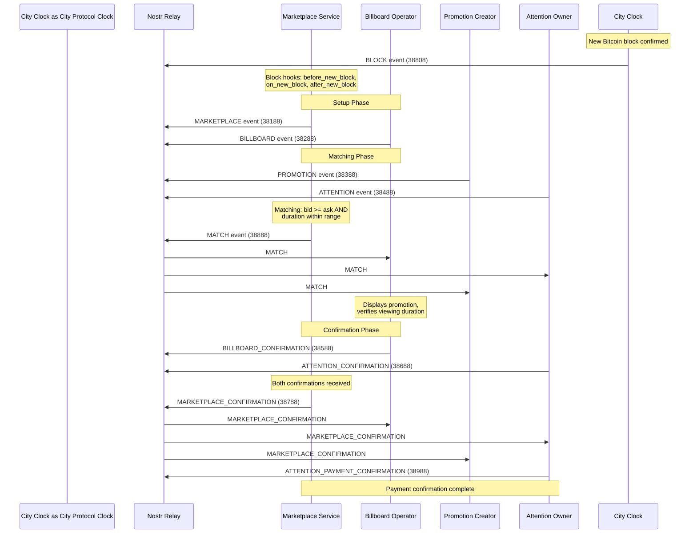

# Event Flow: Block Event to Marketplace Confirmation

This document illustrates the complete event flow in the ATTN Protocol, from the foundational BLOCK event through to final MARKETPLACE_CONFIRMATION settlement.

## Overview

The ATTN Protocol flow begins with Bitcoin block events (kind 38808) published by City Protocol that synchronize all marketplace operations. All events include block height tags for deterministic state snapshots per block.

## Event Flow Diagram

## Flow Phases

### Setup & Matching

**BLOCK events (38808)** from City Protocol trigger block synchronization hooks in marketplace services (`before_new_block`, `on_new_block`, `after_new_block`).

**MARKETPLACE (38188)** and **BILLBOARD (38288)** events establish marketplace infrastructure. These can be published before or after block events.

**PROMOTION (38388)** and **ATTENTION (38488)** events represent supply and demand. Marketplace services create **MATCH (38888)** events when:
- `bid >= ask` (price compatibility)
- Promotion duration falls within attention owner's min/max range

### Confirmation Chain

The confirmation chain creates an auditable settlement trail:

- **BILLBOARD_CONFIRMATION (38588)**: Billboard operator verifies promotion was viewed for required duration
- **ATTENTION_CONFIRMATION (38688)**: Attention owner confirms receipt and payment
- **MARKETPLACE_CONFIRMATION (38788)**: Final settlement event published after both confirmations are received, includes `sats_settled` and `payout_breakdown`
- **ATTENTION_PAYMENT_CONFIRMATION (38988)**: Attention owner attestation of payment receipt with `sats_received` and optional `payment_proof`

All confirmation events reference previous events via `e` tags and include coordinates via `a` tags, creating a complete audit trail.

## Related Documentation

- **[ATTN-01 Specification](#attn-01---attn-protocol---core)**: Complete event schemas, tag specifications, and requirements
- **[Protocol User Guide](#attn-protocol-1)**: User-facing documentation and workflow examples
- **[Framework Hooks](../../framework/HOOKS.md)**: Hook execution order and lifecycle stages

