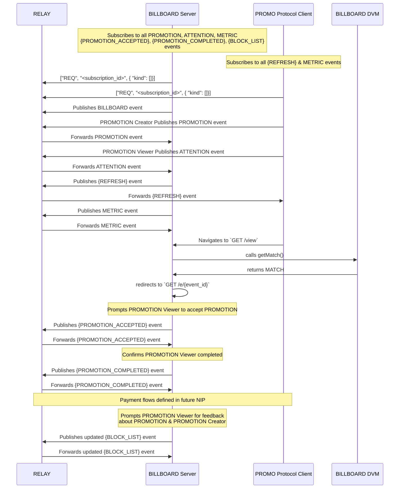
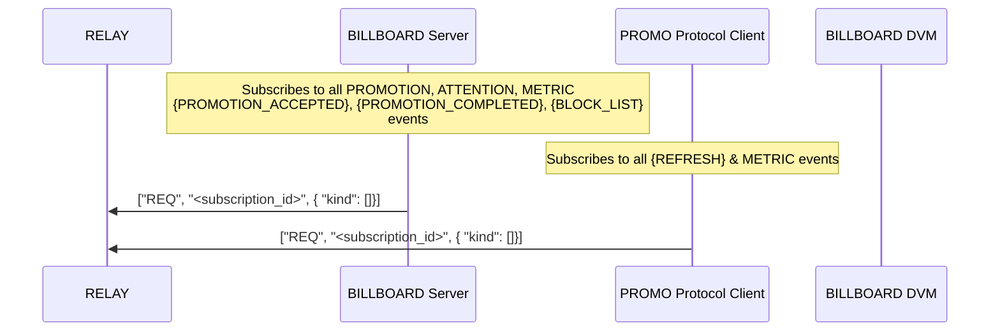
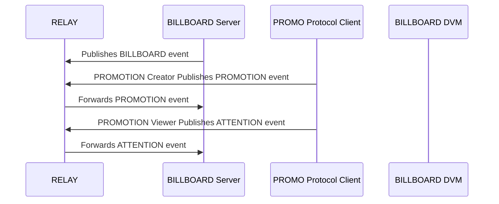
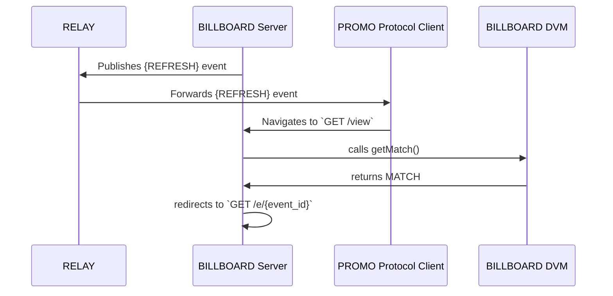
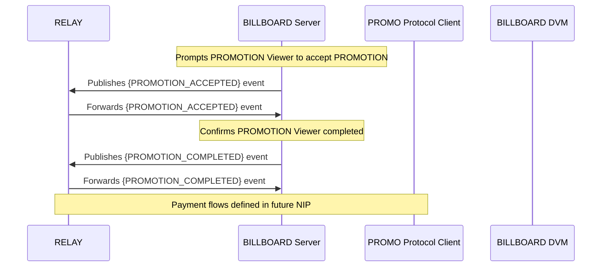
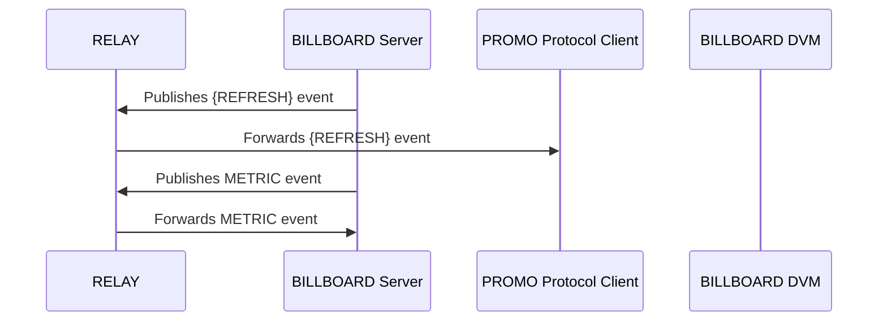
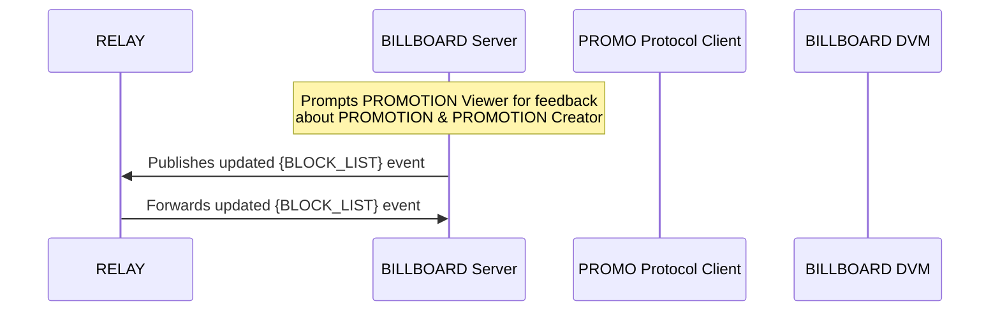

# WORKFLOW

```mermaid
sequenceDiagram
    participant RELAY
    participant BILLBOARD Server
    participant PROMO Protocol Client
    participant BILLBOARD DVM
    
    Note over BILLBOARD Server: Subscribes to all PROMOTION, ATTENTION, METRIC <br/>{PROMOTION_ACCEPTED}, {PROMOTION_COMPLETED}, {BLOCK_LIST}<br/>events
    Note over PROMO Protocol Client: Subscribes to all {REFRESH} & METRIC events
    BILLBOARD Server->>RELAY: ["REQ", "<subscription_id>", { "kind": []}]
    PROMO Protocol Client->>RELAY: ["REQ", "<subscription_id>", { "kind": []}]
    BILLBOARD Server->>RELAY: Publishes BILLBOARD event 
    PROMO Protocol Client->>RELAY: PROMOTION Creator Publishes PROMOTION event
    RELAY->>BILLBOARD Server: Forwards PROMOTION event
    PROMO Protocol Client->>RELAY: PROMOTION Viewer Publishes ATTENTION event
    RELAY->>BILLBOARD Server: Forwards ATTENTION event
    BILLBOARD Server->>RELAY: Publishes {REFRESH} event
    RELAY->>PROMO Protocol Client: Forwards {REFRESH} event
    BILLBOARD Server->>RELAY: Publishes METRIC event
    RELAY->>BILLBOARD Server: Forwards METRIC event
    PROMO Protocol Client->>BILLBOARD Server: Navigates to `GET /view`
    BILLBOARD Server->>BILLBOARD DVM: calls getMatch()
    BILLBOARD DVM->>BILLBOARD Server: returns MATCH
    BILLBOARD Server->>BILLBOARD Server: redirects to `GET /e/{event_id}`
    Note over BILLBOARD Server: Prompts PROMOTION Viewer to accept PROMOTION
    BILLBOARD Server->>RELAY: Publishes {PROMOTION_ACCEPTED} event
    RELAY->>BILLBOARD Server: Forwards {PROMOTION_ACCEPTED} event
    Note over BILLBOARD Server: Confirms PROMOTION Viewer completed
    BILLBOARD Server->>RELAY: Publishes {PROMOTION_COMPLETED} event
    RELAY->>BILLBOARD Server: Forwards {PROMOTION_COMPLETED} event
    Note over RELAY,PROMO Protocol Client: Payment flows defined in future NIP
    Note over BILLBOARD Server: Prompts PROMOTION Viewer for feedback<br/> about PROMOTION & PROMOTION Creator
    BILLBOARD Server->>RELAY: Publishes updated {BLOCK_LIST} event
    RELAY->>BILLBOARD Server: Forwards updated {BLOCK_LIST} event
```

# Workflow - Step 1

```mermaid
sequenceDiagram
    participant RELAY
    participant BILLBOARD Server
    participant PROMO Protocol Client
    participant BILLBOARD DVM
    %% workflow 1
    Note over BILLBOARD Server: Subscribes to all PROMOTION, ATTENTION, METRIC <br/>{PROMOTION_ACCEPTED}, {PROMOTION_COMPLETED}, {BLOCK_LIST}<br/>events
    Note over PROMO Protocol Client: Subscribes to all {REFRESH} & METRIC events
    BILLBOARD Server->>RELAY: ["REQ", "<subscription_id>", { "kind": []}]
    PROMO Protocol Client->>RELAY: ["REQ", "<subscription_id>", { "kind": []}]
```

---

# Workflow - Step 2

```mermaid
sequenceDiagram
    participant RELAY
    participant BILLBOARD Server
    participant PROMO Protocol Client
    participant BILLBOARD DVM
    
    BILLBOARD Server->>RELAY: Publishes BILLBOARD event 
    PROMO Protocol Client->>RELAY: PROMOTION Creator Publishes PROMOTION event
    RELAY->>BILLBOARD Server: Forwards PROMOTION event
    PROMO Protocol Client->>RELAY: PROMOTION Viewer Publishes ATTENTION event
    RELAY->>BILLBOARD Server: Forwards ATTENTION event
```

---

# Workflow - Step 3

```mermaid
sequenceDiagram
   participant RELAY
   participant BILLBOARD Server
   participant PROMO Protocol Client
   participant BILLBOARD DVM
    
   BILLBOARD Server->>RELAY: Publishes {REFRESH} event
   RELAY->>PROMO Protocol Client: Forwards {REFRESH} event
   PROMO Protocol Client->>BILLBOARD Server: Navigates to `GET /view`
   BILLBOARD Server->>BILLBOARD DVM: calls getMatch()
   BILLBOARD DVM->>BILLBOARD Server: returns MATCH
   BILLBOARD Server->>BILLBOARD Server: redirects to `GET /e/{event_id}`
```
---

# Workflow - Step 4.a

```mermaid
sequenceDiagram
   participant RELAY
   participant BILLBOARD Server
   participant PROMO Protocol Client
   participant BILLBOARD DVM

   Note over BILLBOARD Server: Prompts PROMOTION Viewer to accept PROMOTION

   BILLBOARD Server->>RELAY: Publishes {PROMOTION_ACCEPTED} event
   RELAY->>BILLBOARD Server: Forwards {PROMOTION_ACCEPTED} event
   Note over BILLBOARD Server: Confirms PROMOTION Viewer completed
   BILLBOARD Server->>RELAY: Publishes {PROMOTION_COMPLETED} event
   RELAY->>BILLBOARD Server: Forwards {PROMOTION_COMPLETED} event
   Note over RELAY,PROMO Protocol Client: Payment flows defined in future NIP
```
---

# Workflow - Step 4.b

```mermaid
sequenceDiagram
   participant RELAY
   participant BILLBOARD Server
   participant PROMO Protocol Client
   participant BILLBOARD DVM
   
   
BILLBOARD Server->>RELAY: Publishes {REFRESH} event
   RELAY->>PROMO Protocol Client: Forwards {REFRESH} event
   BILLBOARD Server->>RELAY: Publishes METRIC event
   RELAY->>BILLBOARD Server: Forwards METRIC event
```
---

# Workflow - Step 5

```mermaid
sequenceDiagram
   participant RELAY
   participant BILLBOARD Server
   participant PROMO Protocol Client
   participant BILLBOARD DVM
   
   Note over BILLBOARD Server: Prompts PROMOTION Viewer for feedback<br/> about PROMOTION & PROMOTION Creator
   BILLBOARD Server->>RELAY: Publishes updated {BLOCK_LIST} event
   RELAY->>BILLBOARD Server: Forwards updated {BLOCK_LIST} event
```
---