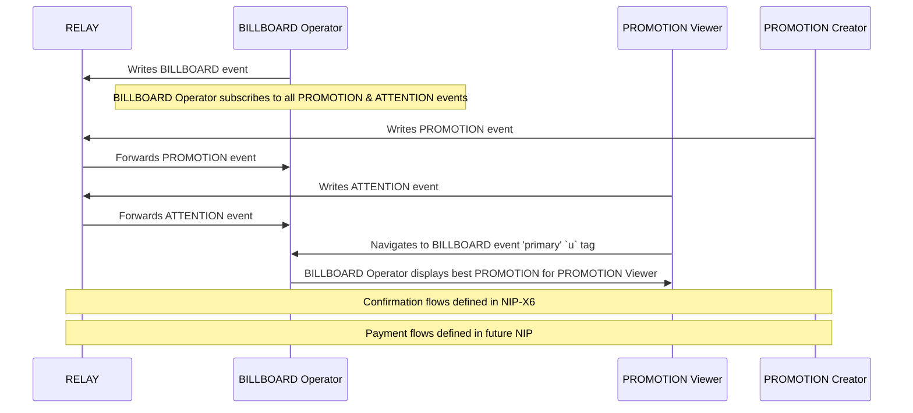

# NIP-X1 - PROMO Protocol - Core
`draft` `mandatory`

## Abstract
NIP-X1 defines the core PROMO Protocol for content promotion on Nostr, establishing standardized event kinds and communication patterns between participants. The protocol establishes a market-driven system connecting PROMOTION Creators who wish to promote content with PROMOTION Viewers who are willing to view it, facilitated by BILLBOARD OPERATORS. This foundation enables a transparent, decentralized alternative to traditional advertising systems while preserving Nostr's core principles of user sovereignty and decentralization.

> For a user-friendly overview of the protocol and its benefits, see the [README.md](./README.md).

## Protocol Components
### Protocol Participants
- **RELAY**: Standard Nostr relay that propagate events between participants
- **PROMOTION Creators**: Nostr identity that publishes PROMOTION events
- **PROMOTION Viewer**: Nostr identity that publishes ATTENTION events
- **BILLBOARD Operator**: Nostr identity that PROMOTION Creators and PROMOTION Viewers signal they trust via trusted BILLBOAD list []()
- **BROKER**: Nostr identity that publishes MATCH events

### NEW EVENT KINDS
- **kind:38088**: BILLBOARD Announcement Event
- **kind:28888**: BILLBOARD REFRESH Event
- **kind:38188**: PROMOTION Event
- **kind:38888**: ATTENTION Event
- **kind:38388**: MATCH Event
- **kind:38488**: PROMOTION ACCEPTANCE Event
- **kind:38588**: PROMOTION COMPLETION Event
- **kind:38688**: PROMOTION REJECTTION Event

### EXISTING EVENT KINDS
- **kind:30000**: Trusted BILLBOARD list
- **kind:30003**: Blocked PROMO list

> For detailed information about participant roles and responsibilities, see the [README.md](./README.md#who-are-the-main-actors-in-the-promo-protocol).

## Event Specifications

### BILLBOARD Event
```json
{
    "kind": 38088,
    "pubkey": "<BILLBOARD_operator_pubkey>", // Operator of more than one BILLBOARD
    "created_at": <unix_timestamp>,
    "content": "",
    "tags": [
        // required
        ["d", "<BILLBOARD_pubkey"], // Pubkey for individual BILLBOARD
        ["k", "1"],
        ["k", "20"],
        ["k", "21"],
        ["k", "22"],
        ["name", "<value>"],
        ["u", "<url>", "primary"],
        // optional
        ["description", "<value>"]
        ["max_duration", "<value>"],
        ["min_duration", "<value>"],
        ["interval", "<value>", "seconds"],
        ["u", "<url>", "backup"],
        ["image", "<value>"]
        
    ]
}
```

#### Required Tags
- `d`: Pubkey for individual BILLBOARD
- `k`: List of supported promoted event kinds (1, 20, 21, 22)
- `interval`: Update frequency in seconds - how often the BILLBOARD updates PROMOTION matching
- `u`: List of BILLBOARD endpoint URLs - service endpoints where PROMOTION Viewers can view PROMOTIONS
- `nip`: List of PROMO Protocol implemented NIP versions - indicates which protocol features are supported

#### Optional Tags
- `u`:
- `billboard_url`:
- `name`:
- `description`:
- `image`: 
- `max_duration`: Maximum allowed view duration - upper limit on how long PROMOTIONS can be
- `min_duration`: Minimum allowed view duration - lower limit on how long PROMOTIONS must be

### BILLBOARD REFRESH Event
```json
{
    "kind": 28888,
    "pubkey": "<BILLBOARD_pubkey>",
    "created_at": <unix_timestamp>,
    "content": "<metrics>",
    "tags": [
        ["d", "<BILLBOARD_pubkey>"]
        // BILLBOARD event
        ["a", "kind:<32-bytes lowercase hex of a pubkey>:<d tag value>"],
        ["p", "<BILLBOARD_pubkey>"],
        ["billboard_id", "<BILLBOARD_EVENT_ID>"], // BILLBOARD_ANNOUNCTMENT_EVENT_ID
        ["billboard_pubkey", "<BILLBOARD_pubkey>"]   
    ]
}
```

#### CONTENT
```json
{
  "all_time": {
    "attention": {
      "count": 100,
      "total_seconds": 1000,
      "sats_per_second_average": 100,
      "sats_per_second_max": 100,
      "sats_per_second_min": 100
    },
    "promotion": {
      "count": 100,
      "total_seconds": 1000,
      "sats_per_second_average": 100,
      "sats_per_second_max": 100,
      "sats_per_second_min": 100
    },
    "match": {
      "count": 100
    }
  },
  "last_interval": {
    "attention": {
      "count": 100,
      "total_seconds": 1000,
      "sats_per_second_average": 100,
      "sats_per_second_max": 100,
      "sats_per_second_min": 100
    },
    "promotion": {
      "count": 100,
      "total_seconds": 1000,
      "sats_per_second_average": 100,
      "sats_per_second_max": 100,
      "sats_per_second_min": 100
    },
    "match": {
      "count": 100
    }
  }
}
```

#### Required Tags:
- `d`: BILLBOARD pubkey that the metrics are for
- `a`: Events involed witht the REFRESH event
- `p`: Pubkeys involved in the REFRESH event
- `billboard_id`: ID of BILLBOARD event
- `billboard_pubkey`: Pubkey of BILLBOARD event

### PROMOTION Event
```json
{
    "kind": 38188,
    "pubkey": "<PROMOTION_CREATOR_pubkey>",
    "created_at": <unix_timestamp>,
    "content": "",
    "tags": [
        ["d", "<uuid>"]
        ["e", "<note_id>"],
        ["duration", "<value>", "seconds"],
        ["sats_per_second", "<value>"],
        ["billboard_pubkey", "<BILLBOARD_pubkey>"],
        // optional
        ["expiration", "<unix_timestamp>"],
    ]
}
```

#### Required Tags:
- `e`: ID of note to promote
- `duration`: Required view duration in seconds
- `sats_per_second`: Payment rate in sats per second

### ATTENTION Event
```json
{
    "kind": 38888,
    "pubkey": "<PROMOTION_VIEWER_pubkey>",
    "created_at": <unix_timestamp>,
    "content": "",
    "tags": [
        ["d", "<BILLBOARD_pubkey>"]
        // BILLBOARD event
        ["a", "kind:<32-bytes lowercase hex of a pubkey>:<d tag value>"],
        ["p", "<BILLBOARD_pubkey>"],
        ["billboard_id", "<BILLBOARD_EVENT_ID>"], // BILLBOARD_ANNOUNCTMENT_EVENT_ID
        ["billboard_pubkey", "<BILLBOARD_pubkey>"]
        // ATTENTION EVENT
        ["sats_per_second", "<value>"],
        ["k", "1"],
        ["k", "20"],
        ["k", "21"],
        ["k", "22"],
        // optional
        ["max_duration", "<value>", "seconds"],
        ["expiration", "<unix_timestamp>"],
    ]
}
```

#### Required Tags:
- `sats_per_second`: Payment rate in sats per second
- `k`: 

#### Optional Tags:
- `max_duration`: Maximum viewing duration in seconds
- `expiration`: Unix timestamp of ATTENTION expiration.

### Match Event
```json
{
    "kind": 38388,
    "pubkey": "<BROKER_pubkey>",
    "created_at": <unix_timestamp>,
    "content": "",
    "tags": [
         ["d", "<uuid>"],
        // Promoted Event
        ["e", "<32-bytes lowercase hex of the id of promoted event>", "<recommended relay URL, optional>", "<32-bytes lowercase hex of the author's pubkey, optional>"]
        // BILLBOARD_ANNOUNCTMENT_EVENT
        ["a", "kind:<32-bytes lowercase hex of a pubkey>:<d tag value>"],
        ["p", "<BILLBOARD_pubkey>"],
        ["billboard_id", "<BILLBOARD_EVENT_ID>"], // BILLBOARD_ANNOUNCTMENT_EVENT_ID
        ["billboard_pubkey", "<BILLBOARD_pubkey>"]
        // PROMOTION_EVENT
        ["a", "kind:<32-bytes lowercase hex of a pubkey>:<d tag value>"], 
        ["p", "<PROMOTION_Creator_pubkey>"],
        ["promotion_id", "<PROMOTION_EVENT_ID>"], // PROMOTION_EVENT_ID
        ["promotion_pubkey", "<PROMOTION_pubkey>"]
        // ATTENTION_EVENT
        ["a", "kind:<32-bytes lowercase hex of a pubkey>:<d tag value>"], 
        ["p", "<PROMOTION_Viewer_pubkey>"],
        ["attention_id", "<ATTENTION_EVENT_ID>"], // ATTENTION_EVENT_ID
        ["attention_pubkey", "<ATTENTION_pubkey>"]
        // MATCH_EVENT
        ["p", "<MATCHER_pubkey>"],
        ["sats_per_second", "<value>"],
        ["duration", "<value>"],
        // optional
        ["expiration", "<unix_timestamp>"],
    ]
}
```

#### Required Tags
- `d`: uuid
- `e`: ID of promoted envet
- `a`: Events involed witht the MATCH event
- `p`: Pubkeys involved in the MATCH event
- `billboard_id`: ID of BILLBOARD event
- `promotion_id`: ID of PROMOTION event
- `attention_id`: ID of ATTENTION event
- `billboard_pubkey`: Pubkey of BILLBOARD event
- `promotion_pubkey`: Pubkey of PROMOTION event
- `attention_pubkey`: Pubkey of ATTENTION event
- `sats_per_second`: Agreed payment rate for the match
- `duration`: Required viewing duration

#### Optional Tags
- `expiration`: Unix timestamp of MATCH expiration.

### PROMOTION ACCEPTANCE Event
```json
{
  "kind": 38488,
  "pubkey": "<PROMOTION_VIEWER_pubkey>",
  "created_at": <unix_timestamp>,
  "tags": [
     ["d", "<uuid>"],
    // Promoted Event
    ["e", "<32-bytes lowercase hex of the id of promoted event>", "<recommended relay URL, optional>", "<32-bytes lowercase hex of the author's pubkey, optional>"]
    // BILLBOARD
    ["a", "kind:<32-bytes lowercase hex of a pubkey>:<d tag value>"],
    ["p", "<BILLBOARD_pubkey>"],
    ["billboard_id", "<BILLBOARD_EVENT_ID>"],
    ["billboard_pubkey", "<BILLBOARD_pubkey>"],
    // PROMOTION
    ["a", "kind:<32-bytes lowercase hex of a pubkey>:<d tag value>"], 
    ["p", "<PROMOTION_Creator_pubkey>"],
    ["promotion_id", "<PROMOTION_EVENT_ID>"],
    ["promotion_pubkey", "<PROMOTION_pubkey>"],
    // ATTENTION
    ["a", "kind:<32-bytes lowercase hex of a pubkey>:<d tag value>"], 
    ["p", "<PROMOTION_Viewer_pubkey>"],
    ["attention_id", "<ATTENTION_EVENT_ID>"], 
    ["attention_pubkey", "<PROMOTION_VIEWER_pubkey>"],
    // MATCH
    ["a", "kind:<32-bytes lowercase hex of a pubkey>:<d tag value>"], 
    ["p", "<BROKER_pubkey>"],
    ["match_id", "<MATCH_EVENT_ID>"],
    ["broker_pubkey", "<BROKER_pubkey>"],
  ]
}
```

#### Required Tags
- `d`: uuid
- `e`: ID of promoted envet
- `a`: Events involed witht the MATCH event
- `p`: Pubkeys involved in the MATCH event
- `billboard_id`: ID of BILLBOARD event
- `promotion_id`: ID of PROMOTION event
- `attention_id`: ID of ATTENTION event
- `match_id`: ID of MATCH event
- `billboard_pubkey`: Pubkey of publisher of BILLBOARD event
- `promotion_pubkey`: Pubkey of publisher of PROMOTION event
- `attention_pubkey`: Pubkey of publisher of ATTENTION event
- `broker_pubkey`: Pubkey of publisher of MATCH event

### PROMOTION REJECTION Event
```json
{
  "kind": 38688,
  "pubkey": "<PROMOTION_VIEWER_pubkey>",
  "created_at": <unix_timestamp>,
  "tags": [
    ["d", "<uuid>"],
    // Promoted Event
    ["e", "<32-bytes lowercase hex of the id of promoted event>", "<recommended relay URL, optional>", "<32-bytes lowercase hex of the author's pubkey, optional>"]
    // BILLBOARD
    ["a", "kind:<32-bytes lowercase hex of a pubkey>:<d tag value>"],
    ["p", "<BILLBOARD_pubkey>"],
    ["billboard_id", "<BILLBOARD_EVENT_ID>"],
    ["billboard_pubkey", "<BILLBOARD_pubkey>"],
    // PROMOTION
    ["a", "kind:<32-bytes lowercase hex of a pubkey>:<d tag value>"], 
    ["p", "<PROMOTION_Creator_pubkey>"],
    ["promotion_id", "<PROMOTION_EVENT_ID>"],
    ["promotion_pubkey", "<PROMOTION_pubkey>"],
    // ATTENTION
    ["a", "kind:<32-bytes lowercase hex of a pubkey>:<d tag value>"], 
    ["p", "<PROMOTION_Viewer_pubkey>"],
    ["attention_id", "<ATTENTION_EVENT_ID>"], 
    ["attention_pubkey", "<PROMOTION_VIEWER_pubkey>"],
    // MATCH
    ["a", "kind:<32-bytes lowercase hex of a pubkey>:<d tag value>"], 
    ["p", "<BROKER_pubkey>"],
    ["match_id", "<MATCH_EVENT_ID>"],
    ["broker_pubkey", "<BROKER_pubkey>"],
  ]
}
```

#### Required Tags
- `d`: uuid
- `e`: ID of promoted envet
- `a`: Events involed witht the MATCH event
- `p`: Pubkeys involved in the MATCH event
- `billboard_id`: ID of BILLBOARD event
- `promotion_id`: ID of PROMOTION event
- `attention_id`: ID of ATTENTION event
- `match_id`: ID of MATCH event
- `billboard_pubkey`: Pubkey of publisher of BILLBOARD event
- `promotion_pubkey`: Pubkey of publisher of PROMOTION event
- `attention_pubkey`: Pubkey of publisher of ATTENTION event
- `broker_pubkey`: Pubkey of publisher of MATCH event

### PROMOTION COMPLETION Event
```json
{
  "kind": 38588,
  "pubkey": "<BILLBOARD_pubkey>",
  "created_at": <unix_timestamp>,
  "tags": [
    ["d", "<uuid>"],
    // Promoted Event
    ["e", "<32-bytes lowercase hex of the id of promoted event>", "<recommended relay URL, optional>", "<32-bytes lowercase hex of the author's pubkey, optional>"]
    // BILLBOARD
    ["a", "kind:<32-bytes lowercase hex of a pubkey>:<d tag value>"],
    ["p", "<BILLBOARD_pubkey>"],
    ["billboard_id", "<BILLBOARD_EVENT_ID>"],
    ["billboard_pubkey", "<BILLBOARD_pubkey>"]
    // PROMOTION
    ["a", "kind:<32-bytes lowercase hex of a pubkey>:<d tag value>"], 
    ["p", "<PROMOTION_Creator_pubkey>"],
    ["promotion_id", "<PROMOTION_EVENT_ID>"], 
    ["promotion_pubkey", "<PROMOTION_pubkey>"]
    // ATTENTION
    ["a", "kind:<32-bytes lowercase hex of a pubkey>:<d tag value>"], 
    ["p", "<PROMOTION_Viewer_pubkey>"],
    ["attention_id", "<ATTENTION_EVENT_ID>"], 
    ["attention_pubkey", "<PROMOTION_VIEWER_pubkey>"]
    // MATCH
    ["a", "kind:<32-bytes lowercase hex of a pubkey>:<d tag value>"], 
    ["p", "<BROKER_pubkey>"],
    ["match_id", "<MATCH_EVENT_ID>"], 
    ["BROKER_pubkey", "<BROKER_pubkey>"]
    // PROMOTION ACCEPTANCE
    ["a", "kind:<32-bytes lowercase hex of a pubkey>:<d tag value>"], 
    ["promotion_acceptance_id", "<PROMOTION_ACCEPTANCE_EVENT_ID>"],
    ["promotion_acceptance_pubkey", "<PROMOTION_VIEWER_pubkey>"],
  ]
}
```

#### Required Tags
- `d`: uuid
- `e`: ID of promoted envet
- `a`: Events involed witht the MATCH event
- `p`: Pubkeys involved in the MATCH event
- `billboard_id`: ID of BILLBOARD event
- `promotion_id`: ID of PROMOTION event
- `attention_id`: ID of ATTENTION event
- `match_id`: ID of MATCH event
- `promotion_acceptance_id`: ID of PROMOTION ACCEPTANCE event
- `billboard_pubkey`: Pubkey of publisher of BILLBOARD event
- `promotion_pubkey`: Pubkey of publisher of PROMOTION event
- `attention_pubkey`: Pubkey of publisher of ATTENTION event
- `broker_pubkey`: Pubkey of publisher of MATCH event
- `promotion_acceptance_pubkey`: Pubkey of publisher of PROMOTION ACCEPTANCE event

### TRUSTED BILLBOARD LIST EVENT
```json
{
  "kind": 30000,
  "pubkey": "<PROMOTION_VIEWER_pubkey | PROMOTION_CREATOR_pubkey | BROKER_pubkey> ",
  "created_at": <unix_timestamp>,
  "tags": [
    ["d", "promo-protocol:trusted-billboards"],
    ["title", ""],
    ["image", ""],
    ["description", ""],
    ["p", "<BILLBOARD_pubkey>", "<relay>"],
    ["p", "<BILLBOARD_pubkey>", "<relay>"],
  ]
}
```

#### Required Tags:
- `d`: 
- `p`: 

#### Optional Tags:
- `title`: 
- `image`: 
- `description`: 


### BLOCKED PROMO LIST EVENT
```json
{
  "kind": 30003,
  "pubkey": "<PROMOTION_VIEWER_pubkey | BROKER_pubkey> ",
  "created_at": <unix_timestamp>,
  "tags": [
    ["d", "promo-protocol:blocked-promo"],
    ["title", ""],
    ["image", ""],
    ["description", ""],
    ["p", "<PROMOTION_CREATOR_pubkey>", "<relay>"],
    ["p", "<PROMOTION_CREATOR_pubkey>", "<relay>"],
    ["e", "<PROMOTION_EVENT_ID>", "<relay>"],
    ["e", "<PROMOTION_EVENT_ID>", "<relay>"],
  ]
}
```

#### Required Tags:
- `d`: 
- `p`: 
or
- `e`:

#### Optional Tags:
- `title`: 
- `image`: 
- `description`: 

## PROMO Protocol Behavior

### PROMOTION Lifecycle
- PROMOTIONS are initiated by PROMOTION Creators
- A PROMOTION remains active until one of:
  1. The PROMOTION CREATOR publishes a kind:5 event referencing the PROMOTION event ID
  2. The BILLBOARD OPERATOR terminates the PROMOTION based on its criteria
- BILLBOARD OPERATORS MUST:
  - Monitor for kind:5 events referencing active PROMOTIONS
  - Remove PROMOTIONS immediately upon detecting valid deletion events

### BILLBOARD Requirements
- MUST validate all duration values against configured limits
- MUST reject PROMOTIONS where PROMOTION sats_per_second < ATTENTION sats_per_second
- MUST attempt BILLBOARD OPERATOR URLs in specified order
- MUST operate on specified relays according to read/write designation
- MUST honor fee structure specified in configuration

### Client Requirements
- MUST publish events to BILLBOARD OPERATOR's write/both relays
- MUST monitor BILLBOARD OPERATOR's read/both relays
- MUST respect BILLBOARD OPERATOR's minimum duration requirements
- MUST include valid BILLBOARD_OPERATOR_pubkey in events

## Flow Diagram


### Trust Model
- Trust is established when PROMOTION Creators and PROMOTION Viewers include a BILLBOARD_pubkey in trusted BILLBOARD list
- The decision to trust a BILLBOARD OPERATOR is made independently by each participant
- Each participant is sovereign in choosing which BILLBOARD OPERATORS to trust
- Multiple BILLBOARD OPERATORS can be trusted simultaneously via multiple `p` tags
- No central BILLBOARD authority required

> For information about how trust is established in practice and its benefits, see the [README.md](./README.md#how-is-trust-established).

### Basic Workflow

1. **BILLBOARD**: BILLBOARD OPERATORS `write` BILLBOARD(kind:38088) event(s) to RELAY LIST(kind:10002)
2. **PROMOTION**: PROMOTION CREATOR `write` PROMOTION(kind:38188) event(s) to RELAY LIST(kind:10002)
3. **ATTENTION**: PROMOTION Viewers `write` ATTENTION(kind:38888) event(s) to RELAY LIST(kind:10002)
4. **MATCH**: BROKERS `write` MATCH(kind:38388) event(s) to RELAY LIST(kind:10002)
4. **DISPLAY**: BILLBOARD displays promoted EVENT in PROMOTION event to PROMOTION VIEWER based on 'best' MATCH event

## References
- [NIP-65](https://github.com/nostr-protocol/nips/blob/master/65.md): Relay List Metadata - defines kind:10002
- [NIP-09](https://github.com/nostr-protocol/nips/blob/master/09.md): Event Deletion - defines kind:5
- [NIP-X6](link-when-available): PROMO Protocol Confirmation Flows
- Future NIP: PROMO Protocol Payment Flows (to be defined)

> For a complete overview of the protocol ecosystem and related NIPs, see the [README.md](./README.md#technical-specifications--documentation).