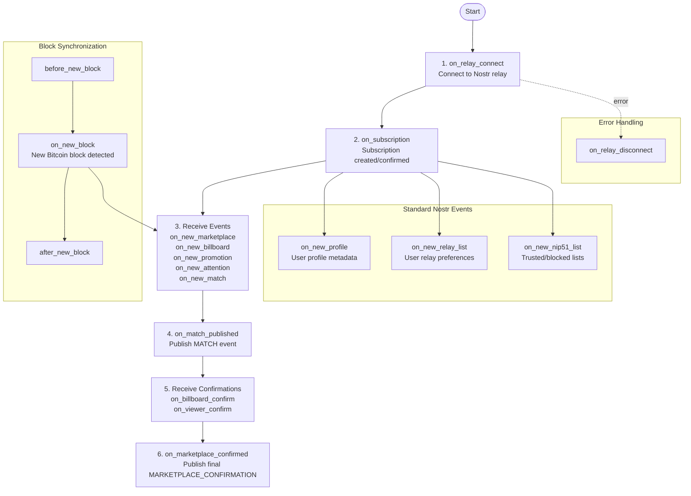

# attn-framework Lifecycle Hooks

## Ordered Lifecycle Sequence

The attn-framework follows a deterministic lifecycle sequence. Hooks fire in this order:

## Hook Categories

### 1. Infrastructure Hooks

Connection and subscription management:

- **on_relay_connect**: Nostr relay connected (event source/sink)
- **on_relay_disconnect**: Nostr relay disconnected
- **on_subscription**: Subscription created or confirmed (fires when REQ sent or EOSE received)

### 2. ATTN Protocol Event Hooks

Event reception and processing for the attention marketplace:

- **on_new_marketplace**: MARKETPLACE event received (kind 38188)
- **on_new_billboard**: BILLBOARD event received (kind 38288)
- **on_new_promotion**: PROMOTION event received (kind 38388)
- **on_new_attention**: ATTENTION event received (kind 38488)
- **on_new_match**: MATCH event received (kind 38888)
- **on_match_published**: MATCH event published (kind 38888) - backward compatibility hook with promotion/attention IDs
- **on_billboard_confirm**: Billboard confirmation received (kind 38588)
- **on_viewer_confirm**: Viewer confirmation received (kind 38688)
- **on_marketplace_confirmed**: Final MARKETPLACE_CONFIRMATION published (kind 38788)

### 3. Block Synchronization Hooks

Bitcoin block processing and synchronization:

- **before_new_block**: Fires before each BLOCK event (kind 38088) to prepare state
- **on_new_block**: BLOCK event received from trusted node services (kind 38088)
- **after_new_block**: Fires after block processing completes (kind 38088)

### 4. Standard Nostr Event Hooks

Standard Nostr protocol events for enhanced functionality:

- **on_new_profile**: User profile metadata (kind 0)
- **on_new_relay_list**: User relay preferences (kind 10002)
- **on_new_nip51_list**: NIP-51 lists including trusted billboards, trusted marketplaces, blocked promotions, and blocked promoters (kind 30000)

### 5. Error & Health Hooks

Error handling and health monitoring:

- **on_relay_disconnect**: Nostr relay disconnected (implemented)

**Note**: The following hooks are defined in the framework but not currently emitted:

- **on_rate_limit**: Rate limit encountered (not implemented - hook exists but is never emitted)
- **on_health_change**: Health status changed (not implemented - hook exists but is never emitted)
- **on_block_gap_detected**: Block height gap detected (not implemented - hook exists but detection logic is not implemented; see TODO.md)

## Hook Execution Order

Hooks execute in registration order. Implementations register handlers that decide what to do when each hook fires. The framework provides the infrastructure; implementations provide the logic.

## Implementation Status

**Fully Implemented Hooks:**
- Infrastructure: `on_relay_connect`, `on_relay_disconnect`, `on_subscription`
- ATTN Protocol Events: `on_new_marketplace`, `on_new_billboard`, `on_new_promotion`, `on_new_attention`, `on_new_match`, `on_match_published`, `on_billboard_confirm`, `on_viewer_confirm`, `on_marketplace_confirmed`
- Block Synchronization: `before_new_block`, `on_new_block`, `after_new_block`
- Standard Nostr Events: `on_new_profile`, `on_new_relay_list`, `on_new_nip51_list`

**Defined but Not Emitted:**
- `on_rate_limit` - Hook registration available but never emitted
- `on_health_change` - Hook registration available but never emitted
- `on_block_gap_detected` - Hook registration available but detection logic not implemented (see TODO.md for implementation details)
