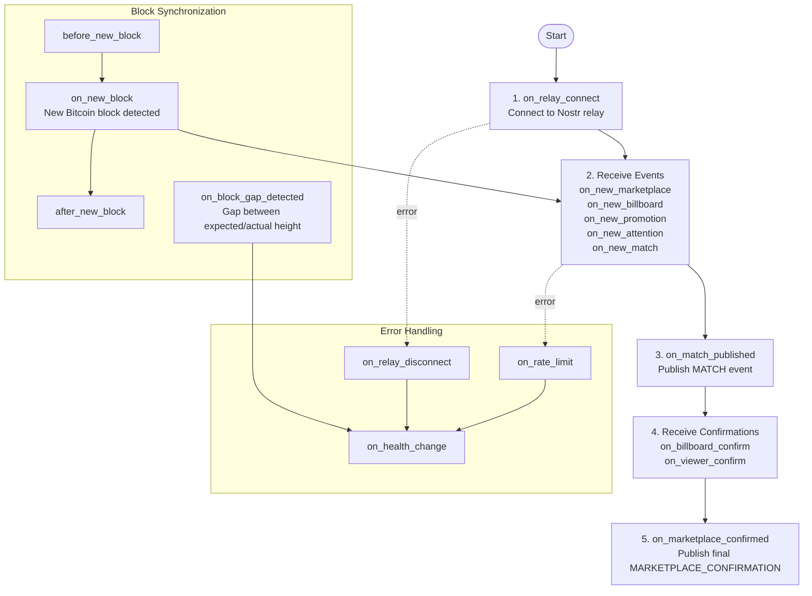

# attn-framework Lifecycle Hooks

## Ordered Lifecycle Sequence

The attn-framework follows a deterministic lifecycle sequence. Hooks fire in this order:

## Lifecycle Stages

### 1. Infrastructure Connection
- **on_relay_connect**: Nostr relay connected (event source/sink)

### 2. Event Reception
- **on_new_marketplace**: MARKETPLACE event received (kind 38188)
- **on_new_billboard**: BILLBOARD event received (kind 38288)
- **on_new_promotion**: PROMOTION event received (kind 38388)
- **on_new_attention**: ATTENTION event received (kind 38488)
- **on_new_match**: MATCH event received (kind 38888)
- **before_new_block**: Fires before each BLOCK event (kind 38088) to prepare state
- **on_new_block**: BLOCK event received from trusted node services (kind 38088)
- **after_new_block**: Fires after block processing completes (kind 38088)

### 3. Matching & Publication
- **on_match_published**: MATCH event published (kind 38888) - backward compatibility hook with promotion/attention IDs

### 4. Confirmation Reception
- **on_billboard_confirm**: Billboard confirmation received (kind 38588)
- **on_viewer_confirm**: Viewer confirmation received (kind 38688)

### 5. Final Settlement
- **on_marketplace_confirmed**: Final MARKETPLACE_CONFIRMATION published (kind 38788)

## Error & Health Hooks

These hooks can interrupt the normal flow at any stage:

- **on_relay_disconnect**: Nostr relay disconnected
- **on_rate_limit**: Rate limit encountered
- **on_block_gap_detected**: Block height gap detected
- **on_health_change**: Health status changed

## Hook Execution Order

Hooks execute in registration order. Implementations register handlers that decide what to do when each hook fires. The framework provides the infrastructure; implementations provide the logic.

