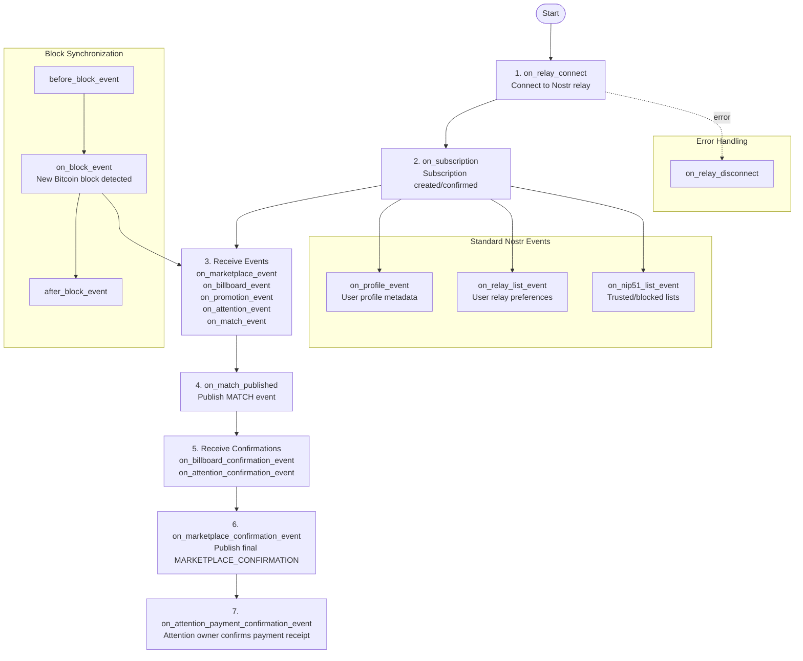

# attn-framework Lifecycle Hooks

## Ordered Lifecycle Sequence

The attn-framework follows a deterministic lifecycle sequence. Hooks fire in this order:

## Hook Categories

### 1. Infrastructure Hooks

Connection and subscription management:

- **on_relay_connect**: Nostr relay connected (event source/sink)
- **on_relay_disconnect**: Nostr relay disconnected
- **on_subscription**: Subscription created or confirmed (fires when REQ sent or EOSE received)

### 1.5. Identity Publishing Hooks

Identity event publishing:

- **on_profile_published**: Emitted after kind 0 (profile), kind 10002 (relay list), and optionally kind 3 (follow list) are published on connect. Provides event IDs and publish results for each relay.

### 2. ATTN Protocol Event Hooks

Event reception and processing for the attention marketplace. Each event type has before/on/after lifecycle hooks:

**Marketplace Events (kind 38188):**
- **before_marketplace_event**: Fires before marketplace event processing
- **on_marketplace_event**: MARKETPLACE event received
- **after_marketplace_event**: Fires after marketplace event processing

**Billboard Events (kind 38288):**
- **before_billboard_event**: Fires before billboard event processing
- **on_billboard_event**: BILLBOARD event received
- **after_billboard_event**: Fires after billboard event processing

**Promotion Events (kind 38388):**
- **before_promotion_event**: Fires before promotion event processing
- **on_promotion_event**: PROMOTION event received
- **after_promotion_event**: Fires after promotion event processing

**Attention Events (kind 38488):**
- **before_attention_event**: Fires before attention event processing
- **on_attention_event**: ATTENTION event received
- **after_attention_event**: Fires after attention event processing

**Match Events (kind 38888):**
- **before_match_event**: Fires before match event processing
- **on_match_event**: MATCH event received
- **after_match_event**: Fires after match event processing
- **on_match_published**: MATCH event published - backward compatibility hook with promotion/attention IDs

**Billboard Confirmation Events (kind 38588):**
- **before_billboard_confirmation_event**: Fires before billboard confirmation event processing
- **on_billboard_confirmation_event**: Billboard confirmation received
- **after_billboard_confirmation_event**: Fires after billboard confirmation event processing

**Attention Confirmation Events (kind 38688):**
- **before_attention_confirmation_event**: Fires before attention confirmation event processing
- **on_attention_confirmation_event**: Attention confirmation received
- **after_attention_confirmation_event**: Fires after attention confirmation event processing

**Marketplace Confirmation Events (kind 38788):**
- **before_marketplace_confirmation_event**: Fires before marketplace confirmation event processing
- **on_marketplace_confirmation_event**: Final MARKETPLACE_CONFIRMATION published
- **after_marketplace_confirmation_event**: Fires after marketplace confirmation event processing

**Attention Payment Confirmation Events (kind 38988):**
- **before_attention_payment_confirmation_event**: Fires before attention payment confirmation event processing
- **on_attention_payment_confirmation_event**: Attention payment confirmation received
- **after_attention_payment_confirmation_event**: Fires after attention payment confirmation event processing

### 3. Block Synchronization Hooks

Bitcoin block processing and synchronization:

- **before_block_event**: Fires before each BLOCK event (kind 38088) to prepare state
- **on_block_event**: BLOCK event received from trusted node services (kind 38088)
- **after_block_event**: Fires after block processing completes (kind 38088)

### 4. Standard Nostr Event Hooks

Standard Nostr protocol events for enhanced functionality. Each event type has before/on/after lifecycle hooks:

**Profile Events (kind 0):**
- **before_profile_event**: Fires before profile event processing
- **on_profile_event**: User profile metadata received
- **after_profile_event**: Fires after profile event processing

**Relay List Events (kind 10002):**
- **before_relay_list_event**: Fires before relay list event processing
- **on_relay_list_event**: User relay preferences received
- **after_relay_list_event**: Fires after relay list event processing

**NIP-51 List Events (kind 30000):**
- **before_nip51_list_event**: Fires before NIP-51 list event processing
- **on_nip51_list_event**: NIP-51 lists including trusted billboards, trusted marketplaces, blocked promotions, and blocked promoters
- **after_nip51_list_event**: Fires after NIP-51 list event processing

### 5. Error & Health Hooks

Error handling and health monitoring:

- **on_relay_disconnect**: Nostr relay disconnected (implemented)

**Note**: The following hooks are defined in the framework but not currently emitted:

- **on_rate_limit**: Rate limit encountered (not implemented - hook exists but is never emitted)
- **on_health_change**: Health status changed (not implemented - hook exists but is never emitted)
- **on_block_gap_detected**: Block height gap detected (not implemented - hook exists but detection logic is not implemented; see TODO.md)

## Hook Execution Order

Hooks execute in registration order. For each event type, the execution order is:
1. `before_*_event` hook fires (if handlers registered)
2. `on_*_event` hook fires
3. `after_*_event` hook fires (if handlers registered)

Implementations register handlers that decide what to do when each hook fires. The framework provides the infrastructure; implementations provide the logic.

## Implementation Status

**Fully Implemented Hooks:**
- Infrastructure: `on_relay_connect`, `on_relay_disconnect`, `on_subscription`
- Identity Publishing: `on_profile_published`
- ATTN Protocol Events (with before/after lifecycle):
  - `before_marketplace_event`, `on_marketplace_event`, `after_marketplace_event`
  - `before_billboard_event`, `on_billboard_event`, `after_billboard_event`
  - `before_promotion_event`, `on_promotion_event`, `after_promotion_event`
  - `before_attention_event`, `on_attention_event`, `after_attention_event`
  - `before_match_event`, `on_match_event`, `after_match_event`, `on_match_published`
  - `before_billboard_confirmation_event`, `on_billboard_confirmation_event`, `after_billboard_confirmation_event`
  - `before_attention_confirmation_event`, `on_attention_confirmation_event`, `after_attention_confirmation_event`
  - `before_marketplace_confirmation_event`, `on_marketplace_confirmation_event`, `after_marketplace_confirmation_event`
  - `before_attention_payment_confirmation_event`, `on_attention_payment_confirmation_event`, `after_attention_payment_confirmation_event`
- Block Synchronization: `before_block_event`, `on_block_event`, `after_block_event`
- Standard Nostr Events (with before/after lifecycle):
  - `before_profile_event`, `on_profile_event`, `after_profile_event`
  - `before_relay_list_event`, `on_relay_list_event`, `after_relay_list_event`
  - `before_nip51_list_event`, `on_nip51_list_event`, `after_nip51_list_event`

**Defined but Not Emitted:**
- `on_rate_limit` - Hook registration available but never emitted
- `on_health_change` - Hook registration available but never emitted
- `on_block_gap_detected` - Hook registration available but detection logic not implemented (see TODO.md for implementation details)
