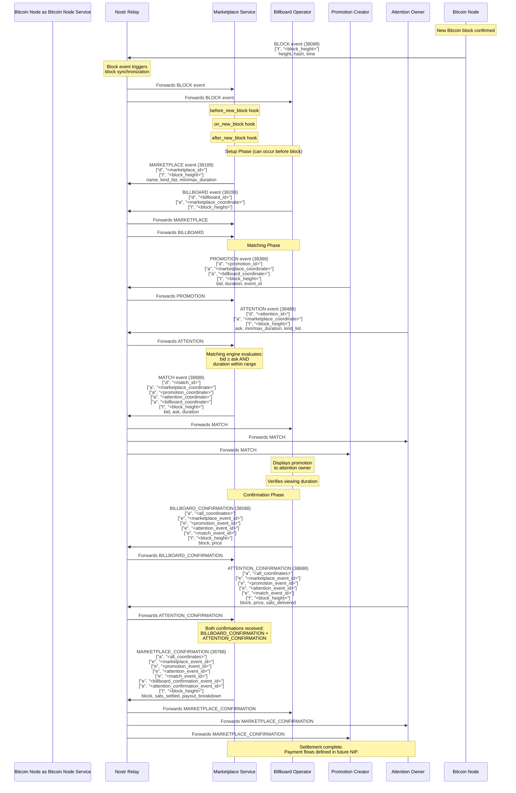

# Event Flow: Block Event to Marketplace Confirmation

This document illustrates the complete event flow in the ATTN Protocol, from the foundational BLOCK event through to final MARKETPLACE_CONFIRMATION settlement.

## Overview

The ATTN Protocol operates on a block-synchronized architecture where Bitcoin block events (kind 38088) establish the timing primitive for all marketplace operations. All events include a `["t", "<block_height>"]` tag for block-based filtering and synchronization.

## Complete Event Flow Diagram

## Flow Explanation

### 1. Block Synchronization (Foundation)

The **BLOCK event (38088)** is published by Bitcoin node services immediately after a new Bitcoin block is confirmed. This event:
- Contains block height, hash, and timestamp
- Includes `["t", "<block_height>"]` tag for filtering
- Triggers block synchronization hooks in marketplace services:
  - `before_new_block` - Prepare state
  - `on_new_block` - Process block event
  - `after_new_block` - Finalize block processing

All subsequent events reference this block height via their `["t", "<block_height>"]` tags, ensuring deterministic state snapshots per block.

### 2. Setup Phase

**MARKETPLACE (38188)** and **BILLBOARD (38288)** events establish the marketplace infrastructure:
- Marketplace defines parameters (min/max duration, supported event kinds)
- Billboard announces its presence within a marketplace
- These can be published before or after block events
- Billboard references marketplace via coordinate `["a", "<marketplace_coordinate>"]` tag

### 3. Matching Phase

**PROMOTION (38388)** and **ATTENTION (38488)** events represent supply and demand:
- Promotion creators publish bids (total satoshis for duration)
- Attention owners publish asks (total satoshis for duration)
- Both reference marketplace and include duration preferences

**MATCH (38888)** is created by marketplace services when:
- `bid ≥ ask` (price compatibility)
- Promotion duration falls within attention owner's min/max range
- All parties are linked via coordinate `["a", "..."]` tags

### 4. Confirmation Phase

The confirmation chain creates an auditable settlement trail:

1. **BILLBOARD_CONFIRMATION (38588)**: Billboard operator verifies the promotion was viewed for the required duration
   - References all previous events via `["e", "..."]` tags
   - Includes all coordinates via `["a", "..."]` tags

2. **ATTENTION_CONFIRMATION (38688)**: Attention owner confirms receipt and payment
   - References all previous events via `["e", "..."]` tags
   - Includes all coordinates via `["a", "..."]` tags
   - May include `sats_delivered` as proof

3. **MARKETPLACE_CONFIRMATION (38788)**: Final settlement event published after both confirmations are received
   - References all previous events including both confirmations via `["e", "..."]` tags
   - Includes `sats_settled` and `payout_breakdown` for transparency
   - Completes the event chain

## Key Event Kinds Reference

| Kind | Name | Published By | Purpose |
|------|------|-------------|---------|
| 38088 | BLOCK | Bitcoin node services | Timing primitive, block synchronization |
| 38188 | MARKETPLACE | Marketplace operators | Marketplace definition and parameters |
| 38288 | BILLBOARD | Billboard operators | Billboard announcement within marketplace |
| 38388 | PROMOTION | Promotion creators | Promotion request with bid and duration |
| 38488 | ATTENTION | Attention owners | Viewer availability with ask and duration range |
| 38888 | MATCH | Marketplace services | Match between promotion and attention |
| 38588 | BILLBOARD_CONFIRMATION | Billboard operators | Billboard attestation of successful view |
| 38688 | ATTENTION_CONFIRMATION | Attention owners | Attention owner attestation of receipt and payment |
| 38788 | MARKETPLACE_CONFIRMATION | Marketplace operators | Final settlement after both confirmations |

## Tag Structure

### Block Height Synchronization
All events include `["t", "<block_height>"]` tag for:
- Block-based filtering: `{ kinds: [38388], "#t": ["862626"] }`
- Deterministic state snapshots per block
- Synchronization across services

### Coordinate References (`a` tags)
Events reference related entities via coordinates:
- Format: `["a", "<kind>:<pubkey>:<identifier>"]`
- Example: `["a", "38188:<marketplace_pubkey>:marketplace_001"]`
- Links marketplace, billboard, promotion, attention, and match events

### Event References (`e` tags)
Confirmation events reference all previous events:
- BILLBOARD_CONFIRMATION references: marketplace, promotion, attention, match
- ATTENTION_CONFIRMATION references: marketplace, promotion, attention, match
- MARKETPLACE_CONFIRMATION references: all previous events including both confirmations

## Block-by-Block Snapshot Architecture

Each Bitcoin block represents a sealed snapshot of marketplace state:
- Events are grouped by block height
- No accumulation across blocks
- Each block is a complete, frozen moment
- Services process events per block for deterministic state

## Related Documentation

- **[ATTN-01 Specification](./ATTN-01.md)**: Complete event schemas, tag specifications, and requirements
- **[Protocol User Guide](./README.md)**: User-facing documentation and workflow examples
- **[Framework Hooks](../../framework/HOOKS.md)**: Hook execution order and lifecycle stages

