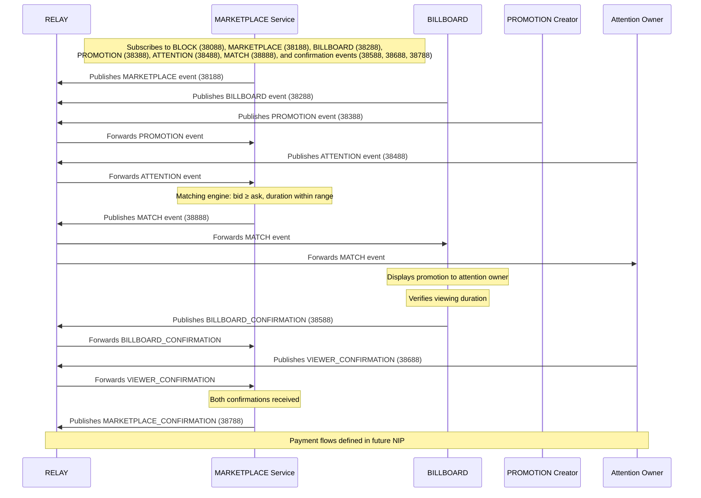

# ATTN Protocol

## Table of Contents
- [What is the ATTN Protocol?](#what-is-the-attn-protocol)
- [Why is this better than centralized advertising?](#why-is-this-better-than-centralized-advertising)
- [Who are the main actors in the ATTN Protocol?](#who-are-the-main-actors-in-the-attn-protocol)
- [How does the complete promotion workflow function?](#how-does-the-complete-promotion-workflow-function)
- [How does it work?](#how-does-it-work)
- [What's the economic model?](#whats-the-economic-model)
- [How is trust established?](#how-is-trust-established)

<!-- User Participation Sections -->
- [How do I participate as a PROMOTION CREATOR?](#how-do-i-participate-as-a-promotion-creator)
- [How do I participate as an Attention Owner?](#how-do-i-participate-as-an-attention-owner)
- [How do I run a BILLBOARD?](#how-do-i-run-a-billboard)

<!-- Matching Process Sections -->
- [How are PROMOTION Creators and Attention Owners matched?](#how-are-promotion-creators-and-attention-owners-matched)
- [How does topic-based matching work between PROMOTION Creators and Attention Owners?](#how-does-topic-based-matching-work-between-promotion-creators-and-attention-owners)
- [What information is included in a promotion match?](#what-information-is-included-in-a-promotion-match)
- [What happens after a PROMOTION match is created?](#what-happens-after-a-promotion-match-is-created)

<!-- Content & Preferences Sections -->
- [Content Preferences and Filtering](#content-preferences-and-filtering)
- [How do I filter the PROMOTIONS I see?](#how-do-i-filter-the-promotions-i-see)
- [What types of content can I choose to see?](#what-types-of-content-can-i-choose-to-see)
- [How do Attention Owner block lists work?](#how-do-attention-owner-block-lists-work)

<!-- Technical Operation Sections -->
- [How do PROMOTIONS begin and end?](#how-do-promotions-begin-and-end)
- [How are PROMOTION views verified?](#how-are-promotion-views-verified)
- [How do PROMOTION Creators access and interpret their campaign analytics?](#how-do-promotion-creators-access-and-interpret-their-campaign-analytics)
- [Technical Specifications & Documentation](#technical-specifications--documentation)

<!-- Relay Operation Sections -->
- [How do I choose relays for promotions?](#how-do-i-choose-relays-for-promotions)
- [What are the relay requirements for BILLBOARDs?](#what-are-the-relay-requirements-for-billboards)
- [How is relay availability handled?](#how-is-relay-availability-handled)

## What is the ATTN Protocol?

A decentralized framework enabling paid content promotion within the Nostr ecosystem. By establishing standardized communication methods for promotional content, the protocol creates new economic opportunities while preserving Nostr's core principles of decentralization and privacy.

It also functions as the Bitcoin-native attention interchange for block-synced marketplaces. Every Bridge heartbeat (kind 30078) announces a new block height, services react in lockstep, and marketplace state freezes so Cityscape snapshots remain truthful. Promotions, matches, confirmations, and payouts all ride Nostr events, which keeps independent services synchronized without trusting a central coordinator.

### Why it exists

- **Block-synchronized marketplaces**: Replace timestamp-based ad tech with deterministic block heights so Bridge, Billboard, and Brokerage never drift.
- **Sovereign payments**: All value settles over Bitcoin/Lightning—no subscriptions, no rent extraction, instant exit between blocks.
- **Composable services**: Because events are just Nostr kinds (38088–38888), anyone can build clients, billboards, or analytics without permission while still mapping to Reservoir/Aqueduct/Canal/Harbor flows.

> For detailed technical specifications, see [ATTN-01](./nips/ATTN-01.md).

### Key Features
- Pay-per-view content promotion system
- Satoshi-based payment infrastructure
- Market-driven pricing mechanism
- Bitcoin block height (`t` tag) baked into every event for deterministic timing
- User-controlled content filtering and preferences

## Why is this better than centralized advertising?

The ATTN Protocol offers significant advantages over centralized advertising platforms:

- **Direct Value Exchange**: Users are directly compensated for their attention rather than having their data harvested and monetized by third parties
- **Privacy-Preserving**: No centralized tracking of user behavior or personal data collection
- **User Control**: Attention Owners have complete control over what types of content they see
- **Transparent Economics**: All economic transactions are visible on the Nostr network, creating fair market dynamics
- **Permissionless Innovation**: Anyone can build clients, BILLBOARDs, or tools on top of the protocol
- **Self-Sovereign Identity**: Users maintain control of their identity through their Nostr keys
- **Censorship Resistance**: No central authority can remove promotions that meet protocol standards

This approach creates a more equitable advertising ecosystem where all participants benefit directly from their contributions, whether creating, viewing, or facilitating promotional content.

## Who are the main actors in the ATTN Protocol?

The ATTN Protocol ecosystem consists of four primary actors, each with distinct roles:

1. **PROMOTION Creators**: Entities seeking to promote content within the Nostr ecosystem
   - Create and fund promotional campaigns
   - Set total bid (satoshis for duration) they're willing to pay for attention owner attention
   - Select billboard and marketplace for promotion
   - Publish kind:38388 events with promotion requests

2. **Attention Owners**: Individual Nostr users who opt-in to viewing promotional content
   - Receive satoshis for viewing promotions
   - Set their minimum ask price for viewing content
   - Define content preferences and blocklists
   - Publish kind:38488 events indicating viewing availability

3. **BILLBOARD Operators**: Infrastructure providers that connect PROMOTION Creators with Attention Owners
   - Match compatible PROMOTION Creators and Attention Owners
   - Verify promotion viewing
   - Facilitate payment transactions
   - Provide analytics and reporting
   - Publish kind:38888 MATCH events and confirmation events (kind:38588, 38688, 38788)

4. **MARKETPLACE Operators**: Entities that define and operate attention marketplaces
   - Define marketplace parameters (min/max duration, supported event kinds)
   - Publish kind:38188 MARKETPLACE events
   - May operate BILLBOARDs within their marketplace

> For detailed event specifications and protocol requirements, see [ATTN-01](./nips/ATTN-01.md).

These actors interact through standardized Nostr events to create a decentralized promotional content marketplace where attention is fairly valued and compensated.

## How does the complete promotion workflow function?

Each step in this workflow is recorded through standardized Nostr events, creating a transparent and auditable promotion ecosystem. The MATCH events serve as the critical link between initial requests and final confirmations, providing clarity on how promotional content is distributed.

## How does it work?

The ATTN Protocol operates through standardized Nostr event kinds that enable communication between the primary actors:

1. **Marketplace Definition**: MARKETPLACE Operators publish kind:38188 events defining marketplace parameters (min/max duration, supported event kinds, relay lists).

2. **Billboard Announcement**: BILLBOARD Operators publish kind:38288 events announcing their billboard within a marketplace.

3. **Promotion Creation**: PROMOTION Creators create kind:38388 events containing:
   - The content to be promoted (via video coordinate `a` tag)
   - Total bid price (in satoshis for the duration)
   - Duration (in milliseconds)
   - Billboard and marketplace coordinates
   - All custom data stored in JSON content field

4. **Attention Owner Availability**: Attention Owners publish kind:38488 events with:
   - Total ask price (in satoshis for the duration)
   - Minimum and maximum duration preferences (in milliseconds)
   - Kind preferences (types of notes they're willing to see)
   - Block list coordinate (NIP-51 list reference via `a` tag)
   - All custom data stored in JSON content field

> For detailed event schemas and required tags, see [ATTN-01](./nips/ATTN-01.md).

5. **Matching Process**: MARKETPLACE services (or BILLBOARDs) monitor both event kinds and create matches when:
   - A PROMOTION CREATOR's bid meets or exceeds an Attention Owner's ask
   - Duration preferences align (promotion duration within attention owner's min/max range)
   - Attention Owner's block lists don't exclude the promotion
   - The match is recorded in a kind:38888 MATCH event

6. **Content Delivery**: BILLBOARDs present the matched promotion to the Attention Owner within their client interface.

7. **Verification**: BILLBOARDs verify the promotion was viewed for the required duration.

8. **Confirmations**: Three confirmation events are published:
   - BILLBOARD publishes kind:38588 BILLBOARD_CONFIRMATION event
   - Attention Owner publishes kind:38688 VIEWER_CONFIRMATION event
   - MARKETPLACE publishes kind:38788 MARKETPLACE_CONFIRMATION event after both confirmations received

9. **Payment**: Satoshis flow from the PROMOTION CREATOR to the Attention Owner (and potentially the BILLBOARD as a service fee).

This event-based architecture ensures all interactions are transparent, verifiable, and occur without requiring trust between participants.

## What's the economic model?

The ATTN Protocol implements a market-driven economic model with direct value exchange:

### Core Economic Principles

- **Bidirectional Price Setting**: PROMOTION Creators set total bid (satoshis for duration), Attention Owners set total ask (satoshis for duration)
- **Duration-Based Pricing**: Compensation is based on fixed duration (in milliseconds), not per-second rates
- **Market Price Discovery**: Natural equilibrium emerges based on supply and demand
- **Service Fees**: BILLBOARDs and MARKETPLACEs may charge fees for facilitating matches and verifying views
- **Micropayments**: Satoshi-based payments enable economical small-value transactions
- **Bitcoin-Native Timing**: All events include block height (`t` tag) for Bitcoin-synchronized operations

### Economic Flows

1. **PROMOTION CREATOR Deposits**: PROMOTION Creators fund campaigns with satoshis allocated for promotion
2. **View Compensation**: Attention Owners earn satoshis for each verified view
3. **BILLBOARD Revenue**: Service providers earn fees from successful matches
4. **Payment Channels**: Lightning Network or other payment technologies enable efficient transactions

### Price Factors

- **Content Quality**: High-quality promotions likely command more engagement
- **Audience Specificity**: Targeted audiences with specific interests may command premium rates
- **Time Sensitivity**: Urgent promotions may set higher bids to ensure distribution
- **Market Competition**: Standard supply and demand dynamics influence pricing

This economic model creates a self-regulating marketplace that properly values attention without requiring centralized intermediaries.

## How is trust established?

Trust in the ATTN Protocol is established through:

### Cryptographic Verification

- **Digital Signatures**: All events are cryptographically signed using Nostr keys
- **Immutable Records**: Published events create a permanent public record of all transactions
- **Confirmation Events**: Three confirmation event kinds (38488, 38588, 38688) provide proof of completed views
- **Event References**: All confirmations reference the original MATCH event via `e` tags

### Transparent Operation

- **Open Protocol**: All protocol operations are transparent and auditable
- **Public Events**: Promotion requests, matches, and confirmations are publicly visible
- **Verifiable Payments**: Payment flows can be cryptographically verified

### Reputation Systems

- **Historical Performance**: Actors build reputation through consistent honest behavior
- **Public Profiles**: PROMOTION Creators and BILLBOARDs can be identified by their public keys
- **Community Feedback**: The Nostr ecosystem provides natural feedback mechanisms

### Economic Incentives

- **Aligned Interests**: All participants benefit from honest operation
- **Service Competition**: Multiple BILLBOARDs compete on reliability and fairness
- **Instant Payments**: Real-time compensation reduces counterparty risk

By combining cryptographic verification with economic incentives and transparent operation, the ATTN Protocol minimizes the need for trust between parties.

## How do I participate as a PROMOTION CREATOR?

To participate as a PROMOTION CREATOR in the ATTN Protocol:

### Getting Started

1. **Set Up a Nostr Identity**: Create or use an existing Nostr keypair
2. **Choose a PROMOTION CREATOR Client**: Use a client application that supports the ATTN Protocol
3. **Fund Your Account**: Add satoshis to your client's wallet for promotion funding

### Creating Promotions

1. **Select Content**: Choose the content you want to promote (referenced via coordinate `a` tag, e.g., `34236:pubkey:id` for short videos)
2. **Define Parameters**:
   - Set your total bid (satoshis for the duration)
   - Specify duration in milliseconds
   - Select a marketplace and billboard (via coordinate `a` tags)
   - Set call-to-action text and URL
   - All parameters stored in JSON content field

3. **Publish the Promotion**: Your client will create and publish a kind:38388 event with block height in `t` tag

### Managing Campaigns

1. **Monitor Performance**: Track how many Attention Owners are seeing your promotion
2. **Adjust Parameters**: Modify your bid or targeting as needed
3. **View Analytics**: Analyze which audiences engage best with your content
4. **Manage Budget**: Add funds or adjust spending rates as necessary

### Best Practices

- Start with a competitive bid to establish visibility
- Select appropriate billboards and marketplaces for your content
- Create engaging content worth promoting
- Analyze performance data to optimize future promotions
- Build a reputation as a quality promoter

By following these steps, you can effectively promote your content to interested audiences while maintaining full control over your promotional strategy.

## How do I participate as an Attention Owner?

To participate as an Attention Owner and earn satoshis:

### Getting Started

1. **Set Up a Nostr Identity**: Create or use an existing Nostr keypair
2. **Choose a Compatible Client**: Use a client application that supports viewing ATTN Protocol content
3. **Configure a Lightning Wallet**: Connect a Lightning wallet to receive payments

### Setting Your Preferences

1. **Set Your Ask Price**: Determine total satoshis you'll accept for a duration
2. **Define Content Preferences**:
   - Set minimum and maximum duration (in milliseconds)
   - Select event kinds you're willing to view (kind_list in JSON content)
   - Create or reference NIP-51 block lists (kind 30000) using `org.attnprotocol:promotion:blocked` and `org.attnprotocol:promoter:blocked` identifiers
   - All preferences stored in JSON content field

3. **Publish Availability**: Your client will create and publish a kind:38488 event with block height in `t` tag

### Viewing Promotions

1. **Receive Matches**: BILLBOARDs will match you with compatible promotions
2. **View Content**: Promotions will appear in your client interface
3. **Earn Satoshis**: Get paid for each verified view
4. **Manage Earnings**: Transfer satoshis to your preferred wallet

### Best Practices

- Set a reasonable ask price to maximize earning opportunities
- Update your topic interests to match what you genuinely want to see
- Use reputable clients with good BILLBOARD connections
- Provide genuine attention to maintain ecosystem health
- Adjust preferences based on the quality of promotions you receive

By participating as an Attention Owner, you monetize your attention directly while maintaining control over what content you see.

## How do I run a BILLBOARD?

Running a BILLBOARD is a technical undertaking that enables you to facilitate the ATTN Protocol marketplace:

### Technical Requirements

1. **Nostr Relay Infrastructure**: Ability to monitor and publish Nostr events
2. **Payment Processing**: Lightning Network node or other payment channel capability
3. **Matching Algorithm**: Software to match PROMOTION Creators and Attention Owners based on protocol rules
4. **Verification System**: Mechanisms to verify promotion viewing time
5. **Analytics Platform**: Tools to provide insights to PROMOTION Creators and Attention Owners

> For detailed BILLBOARD requirements and protocol behavior, see [ATTN-01](./nips/ATTN-01.md).

### Implementation Steps

1. **Set Up Infrastructure**:
   - Deploy Nostr relay listeners for BLOCK (38088), MARKETPLACE (38188), BILLBOARD (38288), PROMOTION (38388), ATTENTION (38488), MATCH (38888), and confirmation events (38588, 38688, 38788)
   - Implement a matching engine based on protocol specifications (bid ≥ ask, duration within range)
   - Configure payment channels for satoshi transfers
   - Create verification mechanisms for viewing confirmation
   - Publish kind:38288 BILLBOARD event announcing your billboard

2. **Establish Policies**:
   - Define fee structure for your BILLBOARD services
   - Establish content guidelines and moderation policies
   - Implement topic matching algorithms
   - Set up fraud prevention mechanisms

3. **Launch Operations**:
   - Begin identifying and matching compatible promotions and attention owners
   - Publish kind:38888 MATCH events when matches are found
   - Verify views and publish kind:38588 BILLBOARD_CONFIRMATION events
   - Wait for kind:38688 VIEWER_CONFIRMATION events
   - Process payments between parties

### Monetization Options

- Percentage fee on successful matches
- Flat fee per match or confirmation
- Premium services for enhanced analytics or targeting
- Value-added services for PROMOTION Creators or Attention Owners

### Best Practices

- Prioritize accurate verification to build trust
- Implement fair matching algorithms
- Provide transparent analytics to all parties
- Maintain competitive fee structures
- Continuously improve topic matching relevance

Running a BILLBOARD requires technical expertise but offers opportunities to earn fees while facilitating the decentralized promotion ecosystem.

## How are PROMOTION Creators and Attention Owners matched?

The ATTN Protocol includes an explicit matching process where MARKETPLACE services (or BILLBOARDs) create standardized match events (kind:38888) to transparently record when a PROMOTION CREATOR's promotion is matched with an Attention Owner:

- **Match Events**: MARKETPLACE services publish kind:38888 MATCH events that create a transparent record of matching decisions
- **Economic Compatibility**: Services verify that the PROMOTION CREATOR's bid (total satoshis) meets or exceeds the Attention Owner's ask (total satoshis)
- **Duration Compatibility**: Services verify that the promotion duration falls within the attention owner's min_duration and max_duration range
- **Content Preferences**: Services respect Attention Owner kind preferences (kind_list) and block lists (referenced via coordinate `a` tag)
- **Explicit Record**: Match events include all coordinate references (`a` tags) linking marketplace, billboard, promotion, and attention events

This matching step occurs after promotion requests and viewing availability signals, but before actual content viewing and confirmation, creating an explicit record of the matching decision.

## How does topic-based matching work between PROMOTION Creators and Attention Owners?

**Note**: Topic-based matching is not currently specified in ATTN-01. The protocol focuses on economic matching (bid ≥ ask) and duration compatibility. Future protocol extensions may add topic matching capabilities.

Current matching criteria (per ATTN-01):
- **Economic Compatibility**: PROMOTION CREATOR's bid (total satoshis) meets or exceeds Attention Owner's ask (total satoshis)
- **Duration Compatibility**: Promotion duration falls within attention owner's min_duration and max_duration range
- **Kind Preferences**: Attention Owner's kind_list includes the kind of content being promoted
- **Block List Respect**: Attention Owner's block list (NIP-51 list) doesn't exclude the promotion or promoter

Future topic matching (if implemented):
- Would allow PROMOTION Creators and Attention Owners to specify content topics
- Would enable BILLBOARDs to prioritize matches with topic overlap
- Would improve content relevance and engagement rates
- Would require protocol extension to add topic fields to event schemas

## What information is included in a promotion match?

Match events (kind:38888) contain key information about the promotion arrangement:

- **Coordinate References**: Links via `a` tags to marketplace, billboard, promotion, and attention events
- **Economic Parameters**: The agreed bid and ask amounts (total satoshis) and duration (milliseconds)
- **Event References**: All pubkeys and IDs extracted from coordinate references
- **Kind and Relay Lists**: Event kinds and relay URLs from the attention event
- **Block Height**: Bitcoin block height in `t` tag for synchronization

All data is stored in the JSON content field, with tags used only for indexing and filtering. This comprehensive record provides transparency to all marketplace participants about the terms under which content is being promoted, enabling better tracking, analysis, and optimization of the content promotion ecosystem.

## What happens after a PROMOTION match is created?

After a match is created (kind:38888), the confirmation flow proceeds:

1. **Content Viewing**: The Attention Owner sees the promoted content for the required duration, resulting in a successful view

2. **BILLBOARD Confirmation**: The BILLBOARD publishes a kind:38588 BILLBOARD_CONFIRMATION event after successful viewing, including:
   - Block height as integer
   - References to match, promotion, attention, and marketplace events via `e` tags

3. **Attention Owner Confirmation**: The Attention Owner publishes a kind:38688 VIEWER_CONFIRMATION event confirming receipt, including:
   - Block height at confirmation
   - Satoshis received
   - References to match, promotion, attention, and marketplace events via `e` tags

4. **MARKETPLACE Confirmation**: The MARKETPLACE publishes a kind:38788 MARKETPLACE_CONFIRMATION event after both confirmations are received, including:
   - Block height at confirmation
   - Total satoshis settled
   - Payout breakdown (attention owner, billboard)
   - References to all previous events via `e` tags

This three-step confirmation process ensures all parties have verified the successful completion of the promotion view before final settlement.

## Content Preferences and Filtering

The ATTN Protocol empowers Attention Owners with comprehensive content filtering capabilities:

### Content Control Mechanisms

- **Topic-Based Filtering**: Select specific topics of interest
- **Kind Filtering**: Choose which types of Nostr notes to view
- **Block Lists**: Exclude specific content, PROMOTION Creators, or categories
- **Minimum Bid Thresholds**: Set economic minimums for your attention
- **Content Rating Filters**: Filter based on content maturity ratings

### Implementation Approach

Content preferences are primarily expressed through kind:38488 events, where Attention Owners specify their requirements:

- **JSON Content Fields**: All custom data stored in JSON content field:
  - `ask` (number): Total satoshis for duration
  - `min_duration` (number): Minimum duration in milliseconds
  - `max_duration` (number): Maximum duration in milliseconds
  - `kind_list` (array): Event kinds willing to view
  - `relay_list` (array): Preferred relay URLs

- **Tags for Indexing**:
  - `["t", "<block_height>"]`: Block height for filtering
  - `["a", "<marketplace_coordinate>"]`: Marketplace reference (format: `38188:pubkey:id`)
  - `["a", "<blocked_promotions_coordinate>"]`: Blocked promotions list reference (`30000:<attention_pubkey>:org.attnprotocol:promotion:blocked`)
  - `["a", "<blocked_promoters_coordinate>"]`: Blocked promoters list reference (`30000:<attention_pubkey>:org.attnprotocol:promoter:blocked`)
  - `["p", "<pubkey>"]`: Pubkeys for indexing
  - `["r", "<relay_url>"]`: Relay URLs for indexing
  - `["k", "<kind>"]`: Event kinds for indexing

These preferences are honored by BILLBOARDs when creating matches, ensuring Attention Owners only see content aligned with their stated preferences.

### Benefits of Preference Control

- Personalized promotion experience
- Reduced exposure to unwanted content
- Higher-quality matches between PROMOTION Creators and Attention Owners
- Better economic outcomes for all participants
- Enhanced overall ecosystem satisfaction

This preference-based system ensures that attention is directed to relevant content, improving the effectiveness of promotions while respecting attention owner autonomy.

## How do I filter the PROMOTIONS I see?

As an Attention Owner, you have multiple filtering options to control the promotional content you see:

### Setting Content Preferences

1. **Select Event Kinds**: Choose which event kinds you're willing to view
   - Specify in `kind_list` array in JSON content of ATTENTION event
   - Common kinds: 34236 (short videos), 1 (notes), 30023 (long-form)
   - MARKETPLACE services will only match promotions of these kinds

2. **Set Duration Range**: Define your preferred viewing duration
   - Set `min_duration` and `max_duration` in milliseconds
   - Only promotions within this range will be matched

### Using Block Lists

1. **Block by Pubkey**: Exclude specific PROMOTION Creators you don't wish to see
   - Block using `["b", "pubkey"]` tags
   - Some clients may offer a simple "block" button

2. **Block by Content**: Filter out specific words or phrases
   - Block using `["b", "word"]` tags
   - Some clients may offer content category blocking

### Economic Filtering

1. **Set Minimum Ask**: Require higher compensation for your attention
   - Increase your `ask` value (total satoshis for duration) in JSON content
   - This naturally filters out lower-value promotions

2. **Time-Based Filters**: Set maximum viewing duration requirements

### Implementation in Clients

Most client applications will provide user-friendly interfaces for:
- Selecting topics of interest
- Managing block lists
- Setting economic parameters
- Reviewing and adjusting filter settings

By actively managing these preferences, you maintain control over your promotional content experience while still earning satoshis for your attention.

## What types of content can I choose to see?

The ATTN Protocol allows Attention Owners to specify exactly what types of content they're willing to view:

### Content Type Filtering

1. **Nostr Kind Filtering**: Choose which event kinds you're willing to see
   - Kind 1: Standard notes/posts
   - Kind 30023: Long-form content
   - Other kinds as they become promotable
   - Specify using `["k", "kind"]` tags in your preferences

2. **Media Type Preferences**:
   - Text-only content
   - Image content
   - Video content
   - Audio content
   - Specify using media-specific tags

3. **Content Category Preferences**:
   - Commercial promotions
   - Educational content
   - Entertainment
   - News/information
   - Specify using category tags

### Content Maturity Filtering

1. **Maturity Ratings**: Filter based on content appropriateness
   - Family-friendly
   - General audience
   - Mature audiences
   - Specify using rating tags

2. **Sensitive Content**: Opt in or out of potentially sensitive topics
   - Political content
   - Financial products
   - Adult themes
   - Specify using content sensitivity tags

### Language Preferences

- Filter promotions by language
- Specify preferred languages using language tags
- Exclude languages you don't understand

The ATTN Protocol's flexible tagging system allows Attention Owners to create highly specific content preferences, ensuring they only see promotions that align with their interests and comfort levels.

## How do Attention Owner block lists work?

Block lists give Attention Owners precise control over what content they never want to see. ATTN standardizes on NIP-51 lists (kind:30000) with the `org.attnprotocol:<resource>:<action>` naming scheme so every client interprets preferences the same way.

### Block List Types

1. **Blocked Promotions (`org.attnprotocol:promotion:blocked`)**
   - References specific promotion coordinates via `a` tags (`38388:<promoter_pubkey>:<promotion_id>`)
   - Used when you never want to see a particular promotion again

2. **Blocked Promoters (`org.attnprotocol:promoter:blocked`)**
   - Uses `p` tags to block every promotion from a pubkey
   - Ideal for excluding entire advertisers

### Implementation

1. **List Creation**
   - Publish two kind:30000 events, one per list type, with the required `d` tag (`org.attnprotocol:promotion:blocked` / `org.attnprotocol:promoter:blocked`)
   - Lists can start empty; they still establish the coordinates ATTENTION events must reference

2. **List Reference**
   - ATTENTION events (kind:38488) include two `a` tags:
     - `["a", "30000:<attention_pubkey>:org.attnprotocol:promotion:blocked"]`
     - `["a", "30000:<attention_pubkey>:org.attnprotocol:promoter:blocked"]`
   - MARKETPLACE services and BILLBOARDs fetch these lists and honor the blocks during matching

### Block List Behavior

1. **Default Allow**
   - Promotions are shown unless explicitly blocked via either list

2. **Priority Rules**
   - Promotion-level blocks override every other consideration
   - Promoter-level blocks apply to all promotions from that pubkey
   - BILLBOARDs MUST NOT deliver content that appears on either list

### Privacy Considerations

- Lists are public, so consider alternate identities for specialized filters
- Updates propagate immediately once relays receive the new kind:30000 events
- BILLBOARD metrics should never leak an Attention Owner's block preferences

### Client Support

- Clients SHOULD expose simple UI for both lists and allow import/export
- Suggested blocks are optional; final authority always remains with the user

These interoperable NIP-51 lists preserve user sovereignty while keeping the protocol aligned with Bitcoin-native values.

## How do PROMOTIONS begin and end?

PROMOTIONS in the ATTN Protocol have well-defined lifecycle stages:

### Promotion Creation and Activation

1. **Promotion Definition**:
   - PROMOTION CREATOR creates a kind:38388 event
   - Includes content to promote (via video coordinate `a` tag), total bid (satoshis), and duration (milliseconds) in JSON content
   - References marketplace, billboard, and video via coordinate `a` tags
   - Includes block height in `t` tag
   - Signed with the PROMOTION CREATOR's private key

2. **Activation Requirements**:
   - Valid signature verification
   - Sufficient funds available for promotion
   - Compliant with protocol standards
   - Publication to sufficient relays

3. **Active Status**:
   - Promotion becomes eligible for matching
   - BILLBOARDs begin considering it for Attention Owners
   - Appears in the active promotion pool

### Promotion Conclusion

Promotions can end through several mechanisms:

1. **Natural Completion**:
   - Budget exhaustion (all allocated satoshis spent)
   - Time-based expiration (if specified in event)
   - View count reached (if maximum views specified)

2. **Manual Termination**:
   - PROMOTION CREATOR publishes a replaceable event (kind:38388) with updated status or publishes a kind:5 event referencing the promotion
   - Explicitly ends the promotion before natural completion
   - Remaining budget is returned or held based on client policy

3. **Forced Termination**:
   - Protocol violations detected
   - Payment failures
   - BILLBOARD policy enforcement

### State Transitions

1. **Created**: Initial publication but not yet active
2. **Active**: Available for matching with Attention Owners
3. **Paused**: Temporarily unavailable (if supported)
4. **Completed**: Naturally ended based on parameters
5. **Terminated**: Explicitly ended through kind:5 event

### Handling Promotion Endings

- BILLBOARDs stop creating matches for ended promotions
- Active matches may still be honored depending on BILLBOARD policy
- Analytics remain available for completed promotions
- Some clients support promotion renewal or duplication

This well-defined lifecycle ensures predictable behavior for all parties while allowing flexibility in how promotions are managed.

## How are PROMOTION views verified?

The ATTN Protocol implements several mechanisms to verify genuine promotion viewing:

### Verification Methods

1. **Time-Based Verification**:
   - Measures actual viewing duration
   - Compares against required minimum viewing time
   - Accounts for active window/tab status
   - Tracks user engagement signals

2. **Engagement Verification**:
   - Some BILLBOARDs monitor scrolling, mouse movement, or other indicators
   - Ensures genuine human attention rather than automated viewing
   - Balances privacy with verification needs

3. **Client-Side Attestation**:
   - Client software confirms content was rendered
   - Reports viewing completion to BILLBOARD
   - May include cryptographic proofs of viewing

4. **Consensus Verification**:
   - Multiple verification methods combined
   - Reduces reliance on any single verification approach
   - Improves resistance to verification fraud

### Verification Process

1. **Display Initiation**: Promotion is shown to the Attention Owner
2. **Viewing Time Tracking**: BILLBOARD monitors viewing duration
3. **Engagement Monitoring**: Optional tracking of interaction signals
4. **Threshold Confirmation**: Verification when required duration is reached
5. **Confirmation Publication**: Three confirmation events published:
   - BILLBOARD publishes kind:38588 BILLBOARD_CONFIRMATION
   - Attention Owner publishes kind:38688 VIEWER_CONFIRMATION
   - MARKETPLACE publishes kind:38788 MARKETPLACE_CONFIRMATION after both received

### Fraud Prevention

- Viewing patterns analysis to detect automated viewing
- Rate limiting to prevent excessive earnings from single attention owners
- Reputation-based systems for clients and attention owners
- Cryptographic attestation where appropriate

### Privacy Considerations

- Minimal data collection for verification purposes
- Transparency about verification methods used
- No persistent tracking across sessions

This balanced approach ensures that PROMOTION Creators receive genuine attention for their satoshis while respecting Attention Owner privacy and creating a sustainable ecosystem.

## How do PROMOTION Creators access and interpret their campaign analytics?

PROMOTION Creators gain access to comprehensive analytics to measure and optimize their promotional campaigns:

### Available Analytics

1. **Performance Metrics**:
   - Views completed (with verification)
   - View completion rate
   - Average viewing time
   - Engagement indicators (when available)
   - Cost per view

2. **Audience Insights**:
   - Topic overlap success rates
   - Attention Owner preference patterns
   - Geographic distribution (if shared by attention owners)
   - Time-of-day performance

3. **Economic Analytics**:
   - Satoshis spent per time period
   - Average cost per view
   - Budget utilization rate
   - ROI indicators (when conversion tracking is implemented)

4. **Comparative Analytics**:
   - Performance against similar promotions
   - Historical campaign comparisons
   - Market benchmark data (when available)

### Accessing Analytics

1. **Client Dashboards**: Most PROMOTION CREATOR clients provide built-in analytics interfaces
2. **Data Export**: Options to export raw data for external analysis
3. **API Access**: Some platforms offer API access to analytics data
4. **Real-Time Monitoring**: Live view of current campaign performance

### Interpreting Results

1. **Key Performance Indicators**:
   - View completion rates above market average indicate engaging content
   - High topic match rates suggest effective targeting
   - Consistent viewing time indicates content relevance
   - Cost per view trends show market dynamics

2. **Optimization Insights**:
   - Topic targeting effectiveness
   - Bid price optimization opportunities
   - Content engagement patterns
   - Viewing time distribution

3. **Strategic Applications**:
   - A/B testing different promotions
   - Budget allocation optimization
   - Target audience refinement
   - Bid strategy adjustments

This comprehensive analytics ecosystem enables PROMOTION Creators to continuously improve their promotion strategy while maximizing the value received for their satoshis.

## Technical Specifications & Documentation

### Protocol Specification
- [ATTN-01](./nips/ATTN-01.md): ATTN Protocol - Core protocol specifications and event definitions

> For a complete technical overview of the protocol, including event schemas, tag specifications, content field definitions, and behavior, refer to [ATTN-01](./nips/ATTN-01.md).

## How do I choose relays for promotions?

When selecting relays for ATTN Protocol participation, consider:

### Selection Criteria

1. **MARKETPLACE Support**:
   - Choose relays listed in MARKETPLACE kind:38188 events (relay_list in JSON content)
   - Verify relay URLs listed in BILLBOARD kind:38288 events
   - Prioritize relays with consistent uptime and performance

2. **Protocol Compatibility**:
   - Ensure relays support all required event kinds: 38088 (BLOCK), 38188 (MARKETPLACE), 38288 (BILLBOARD), 38388 (PROMOTION), 38488 (ATTENTION), 38588 (BILLBOARD_CONFIRMATION), 38688 (VIEWER_CONFIRMATION), 38788 (MARKETPLACE_CONFIRMATION), 38888 (MATCH)
   - Check for any relay-specific event or content restrictions
   - Verify support for required NIP implementations (NIP-51 for block lists)

3. **Geographic Distribution**:
   - Use geographically distributed relays for better availability
   - Consider latency requirements for real-time interactions
   - Balance between local and global relay coverage

### Best Practices

- Maintain connections to multiple relays for redundancy
- Monitor relay performance and availability
- Update relay lists based on BILLBOARD recommendations
- Share relay experiences with the community

## What are the relay requirements for BILLBOARDs?

BILLBOARDs have specific relay requirements to ensure reliable protocol operation:

### Operational Requirements

1. **Event Handling**:
   - Must support all ATTN Protocol event kinds
   - Must handle high-frequency event publishing
   - Must maintain reasonable event retention periods

2. **Performance Requirements**:
   - Low latency for real-time event propagation
   - Sufficient bandwidth for promotion content
   - Stable connections for continuous operation

3. **Availability Requirements**:
   - High uptime for consistent service
   - Load balancing capabilities
   - Backup relay configurations

### Implementation Guidelines

1. **Primary Relays**:
   - Listed in MARKETPLACE kind:38188 events (relay_list in JSON content)
   - Listed in BILLBOARD kind:38288 events (via `r` tags)
   - Monitored continuously for availability
   - Used for critical protocol operations

2. **Backup Relays**:
   - Provide failover capabilities
   - Sync with primary relay content
   - Ready for immediate activation

3. **Relay Policies**:
   - Clear event retention policies
   - Transparent fee structures
   - Published performance metrics

## How is relay availability handled?

The ATTN Protocol implements several strategies to ensure continuous operation despite relay issues:

### Availability Mechanisms

1. **Multi-Relay Operation**:
   - Events published to multiple relays
   - Parallel monitoring of multiple relays
   - Automatic failover between relays

2. **Health Monitoring**:
   - Active relay connection monitoring
   - Performance metric tracking
   - Automated availability alerts

3. **Redundancy Strategies**:
   - Geographic relay distribution
   - Load balancing across relays
   - Backup relay activation

### Handling Relay Issues

1. **Connection Problems**:
   - Automatic reconnection attempts
   - Fallback to backup relays
   - Grace periods for temporary outages

2. **Data Consistency**:
   - Event verification across relays
   - Conflict resolution procedures
   - Data synchronization methods

3. **Recovery Procedures**:
   - Automated state recovery
   - Event replay mechanisms
   - Clear failure communication

### Best Practices

- Implement automatic relay failover
- Monitor relay health proactively
- Maintain updated relay lists
- Document relay selection criteria
- Share relay performance data

This distributed approach ensures the protocol remains operational even when individual relays experience issues, maintaining a reliable promotion ecosystem for all participants.
