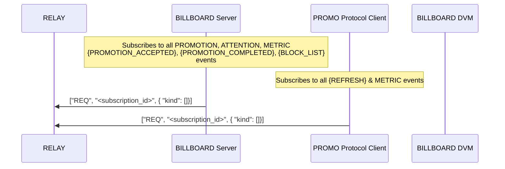
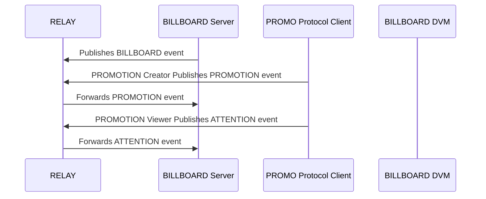
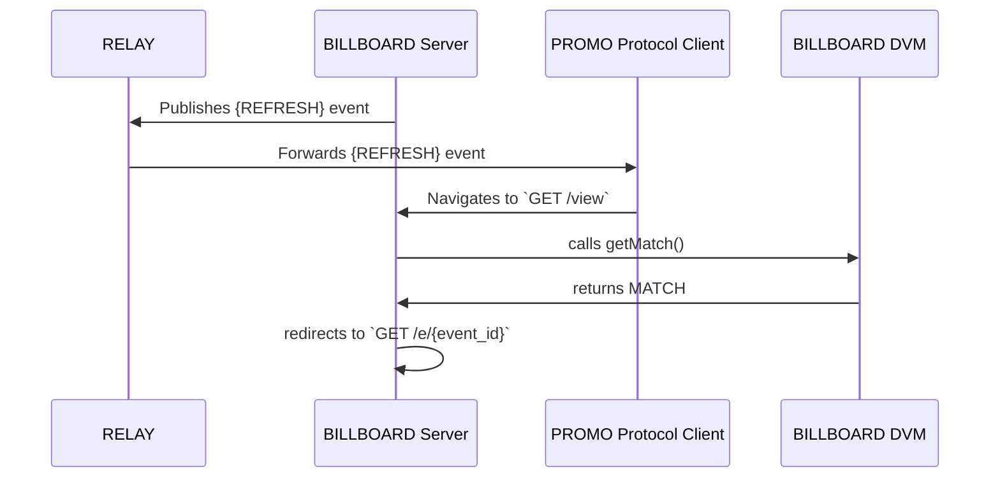
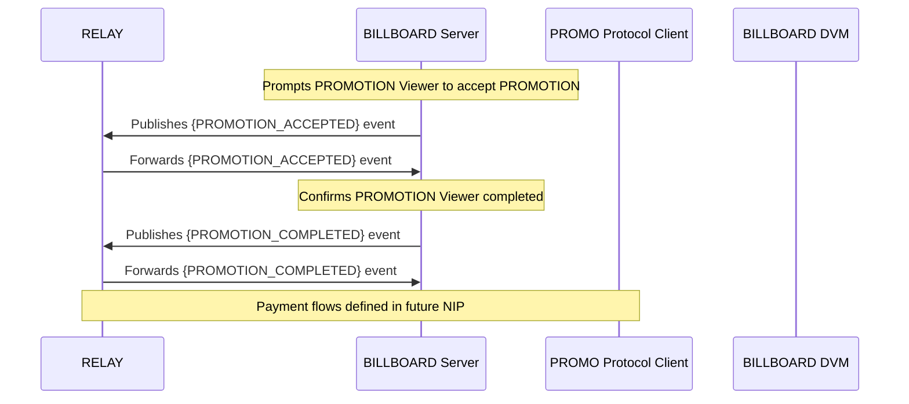
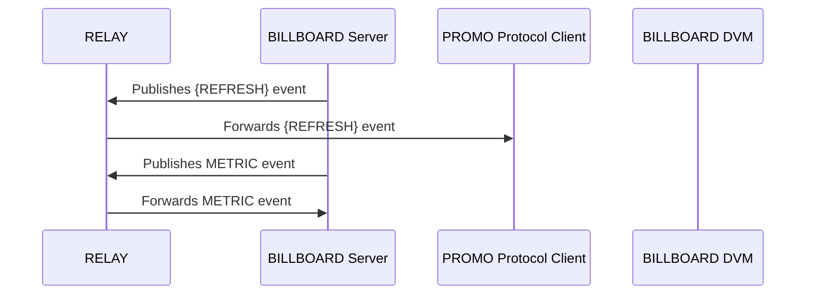
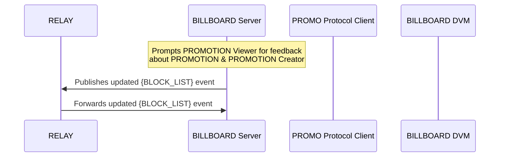

# The PROMO Protocol
## A Decentralized Content Promotion Framework for Nostr
#soveng

---

# What is PROMO Protocol?

## Core Innovation 🔥
- Decentralized content promotion on Nostr
- Pay-per-second attention economy
- Lightning-fast micropayments

## Key Features ⚡
- Market-driven pricing
- Transparent operations

## User Focus 👥
- Content filtering control
- Direct value capture
- Sovereign identity

<!-- This slide introduces the protocol's core value proposition and key features -->

---

# Why Decentralized Advertising?

## User Empowerment 💪
- Direct value exchange
- Self-sovereign identity
- User-controlled data

## Market Evolution 📈
- Transparent economics
- Fair value distribution
- Real-time settlements

## Network Resilience 🛡️
- No central authority
- Open standards

<!-- This slide explains the fundamental advantages of decentralized over traditional advertising -->

---

# Key Actors
1. PROMOTION Creators
   - Create PROMOTION events
2. PROMOTION Viewers
   - Create ATTENTION events
   - Create BLOCK LIST events
3. BILLBOARD Servers
   - Create BILLBOARD events
   - Create REFRESH events
   - Create METRIC events
   - Create PROMOTION ACCEPTED events
   - Create PROMOTION COMPLETED events
4. BILLBOARD DVMs
   - create MATCH events

<!-- This is a note for this slide -->
---

# Technical Implementation
- Kind:38088 - BILLBOARD event
- Kind:38188 - PROMOTION event
- Kind:38288 - ATTENTION event
- Kind:38388 - MATCH event
- Kind:38888 - REFRESH event
- Kind:38488 - PROMOTION ACCEPTED event
- Kind:38588 - PROMOTION COMPLETED event
- Kind:38688 - METRIC events

Supporting Events:
- Kind:30003 - BLOCK LIST events

---

# Workflow - Step 1
Connect To Network 

---

# Workflow - Step 2
Set Your Rules

---

# Workflow - Step 3
Get Matched

---

# Workflow - Step 4.a
Get Paid

---

# Workflow - Step 4.b
Verify the network

---

# Workflow - Step 5
Improve The Network

---

# Economic Model
- Bidirectional price setting
- Real-time supply/demand equilibrium
- Transparent price discovery

## Payment Innovation 💸
- Pay-per-second precision
- Instant micropayments

## Value Distribution 🔄
- Direct creator compensation
- Viewer attention rewards
- BILLBOARD service fees

<!-- This slide shows how the protocol creates a fair, efficient market for attention -->

---

# Trust Mechanisms

## Technical Trust 🔐
- Cryptographic verification
- Immutable event records
- Transparent audit trails

## Social Trust 🤝
- Reputation systems
- Community feedback
- Decentralized governance

## Economic Trust 💡
- Aligned incentives
- Real-time settlements

<!-- This slide explains how trust is built through technology, social dynamics, and economic design -->

---

# Content Intelligence System

## Smart Matching 🎯
- Bidirectional topic alignment
- Real-time adaptation

## User Control 🛡️
- Granular content filtering
- Personal block lists
- Economic thresholds
- No tracking required
- Explicit consent flows

<!-- This slide shows how the protocol enables intelligent content matching while preserving user control and privacy -->
---
   
# Block List System

## Filtering Options 🛡️
- Pubkey-based blocks
- Word-based blocks
- Category blocks

## Economic Enforcement 💰
- BILLBOARDs earn by respecting preferences
- Competitive advantage through trust
- Transparent compliance

## Personalized 🔒
- No centralized lists
- Granular control

<!-- This slide explains how economic incentives ensure BILLBOARDs honor user preferences -->

---

# Implementation Details

## Verification, Payment & Privacy 🔄
- BILLBOARD-specific implementations
- View verification methods flexible
- Payment coordination customizable

## Why This Matters 💡
- Enables innovation
- Future-proof architecture
- Competitive marketplace
- Progressive enhancement

<!-- This slide explains that verification and payment details are left to implementers -->

---

# Promotion Lifecycle
Creation:
- Event publication
- Activation requirements
- Active status

Conclusion:
- Natural completion
- Manual termination
- Forced termination

---

# Protocol Benefits

## For Users 👤
- Earn for your attention
- Transparent pricing

## For Creators 🎨
- Direct value capture
- Real-time analytics

## For Ecosystem 🌐
- Permissionless innovation
- Market efficiency
- Network effects

<!-- This slide shows the key benefits for different stakeholders in the ecosystem -->

---

# Future Vision

## Decentralized Attention Economy 🌍
- Attention fairly valued and compensated
- Global marketplace for promotion
- Transparent value exchange
- Sustainable creator economy

## Protocol Innovation Hub 🚀
- Extensible base layer
- Community-driven development
- Permissionless experimentation
- Cross-platform integration

<!-- This slide focuses on the two key transformative aspects of the protocol's future -->
---

# Join the Revolution 🚀

## Build the Future 
- Read the NIPs (X1-X7)
- Fork the repo
- Create your client
- Run a BILLBOARD

## Get Involved
- Join our community
- Contribute code
- Share feedback
- Shape the standard

<!-- This is your chance to be part of the attention economy revolution -->

---

https://github.com/joinnextblock/promo-protocol

<!-- End with QR code for immediate action -->